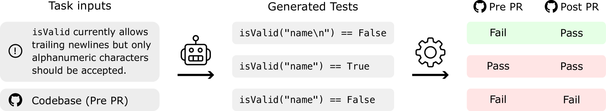
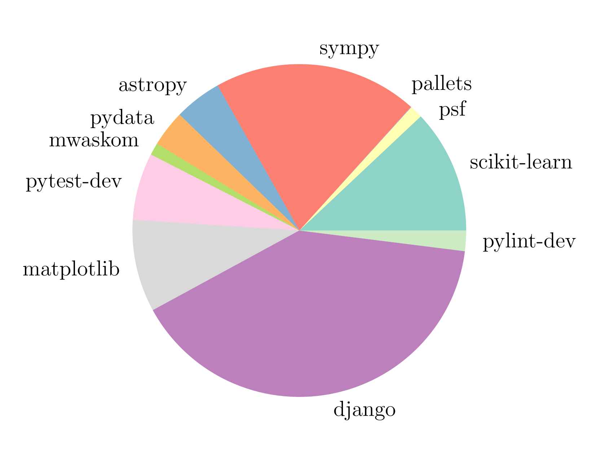
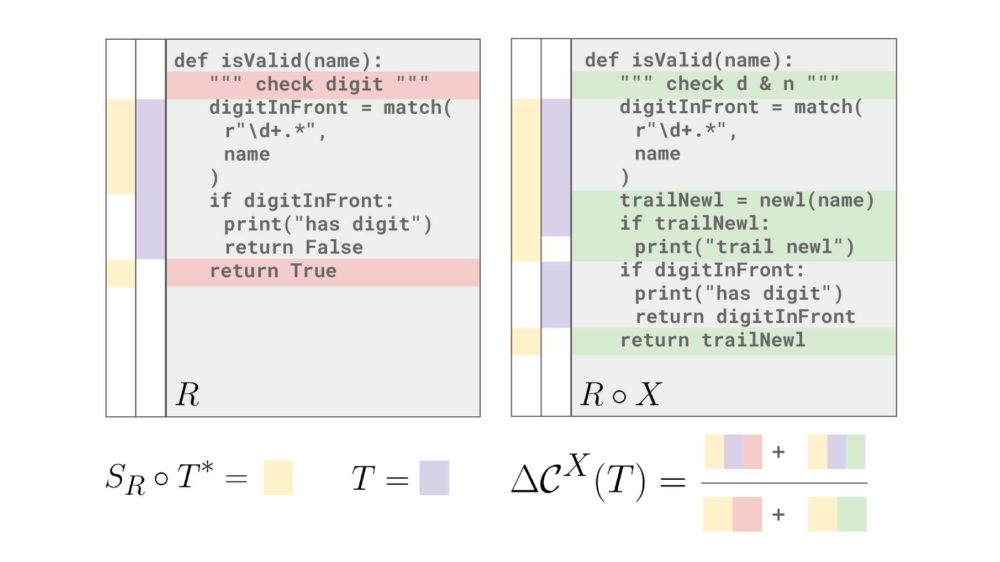
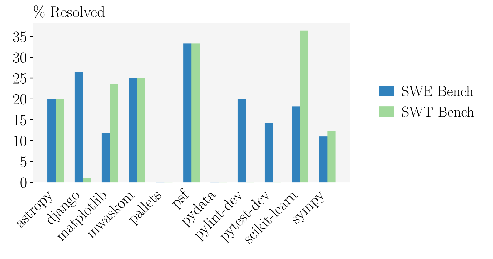
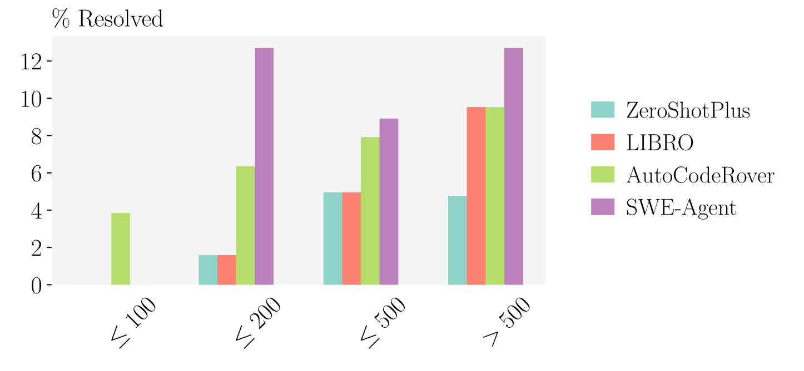
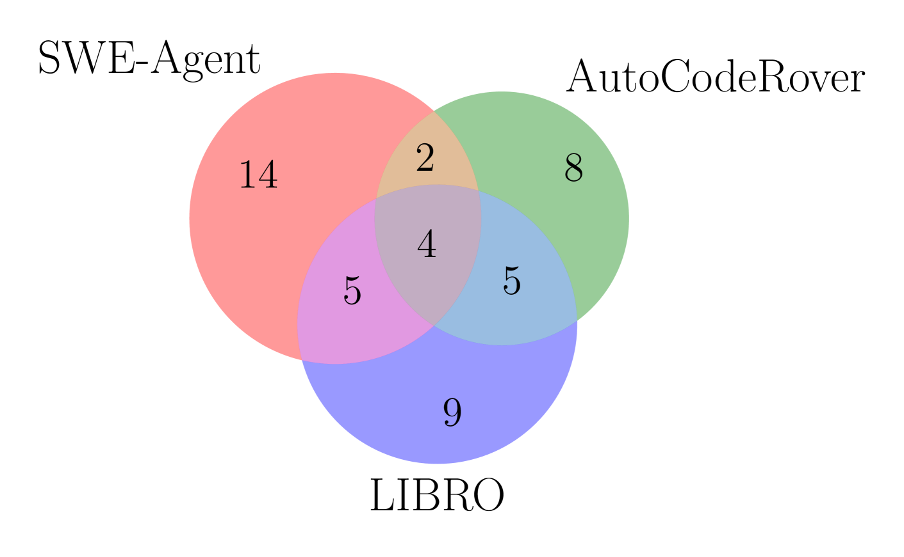

# 代码代理，作为顶尖的软件测试工具，正引领着技术的前沿。

发布时间：2024年06月18日

`Agent

理由：这篇论文主要探讨了基于大型语言模型（LLMs）的代码代理如何将用户问题转化为正式测试用例，并评估了其在生成相关测试用例上的表现。这涉及到使用LLMs来创建和优化代码代理，以提高软件测试的自动化水平和效率。因此，这篇论文更符合Agent分类，因为它专注于开发和应用智能代理来解决特定的软件工程问题。` `软件开发` `自动化测试`

> Code Agents are State of the Art Software Testers

# 摘要

> 严格的软件测试是确保代码质量的关键，自动化测试生成因此成为提升软件质量和代码生成效率的重要途径。尽管大型语言模型（LLMs）在代码生成领域研究活跃，但测试生成的研究却相对较少。我们针对这一问题，探索了基于LLM的代码代理如何将用户问题转化为正式测试用例。为此，我们基于热门GitHub仓库创建了一个新基准，包含真实问题、真实补丁和标准测试。结果显示，LLMs在生成相关测试用例上表现出色，尤其是专为代码修复设计的代码代理，其性能甚至超过了专为测试生成设计的系统。此外，由于测试生成任务比代码生成更具结构化，我们可以通过失败到通过率和覆盖率等指标进行更细致的分析，为代码修复系统的评估提供了双重标准。最后，我们发现生成的测试能有效筛选出代码修复建议，使SWE-Agent的精确度翻倍。

> Rigorous software testing is crucial for developing and maintaining high-quality code, making automated test generation a promising avenue for both improving software quality and boosting the effectiveness of code generation methods. However, while code generation with Large Language Models (LLMs) is an extraordinarily active research area, test generation remains relatively unexplored. We address this gap and investigate the capability of LLM-based Code Agents for formalizing user issues into test cases. To this end, we propose a novel benchmark based on popular GitHub repositories, containing real-world issues, ground-truth patches, and golden tests. We find that LLMs generally perform surprisingly well at generating relevant test cases with Code Agents designed for code repair exceeding the performance of systems designed specifically for test generation. Further, as test generation is a similar but more structured task than code generation, it allows for a more fine-grained analysis using fail-to-pass rate and coverage metrics, providing a dual metric for analyzing systems designed for code repair. Finally, we find that generated tests are an effective filter for proposed code fixes, doubling the precision of SWE-Agent.

[Arxiv](https://arxiv.org/abs/2406.12952)