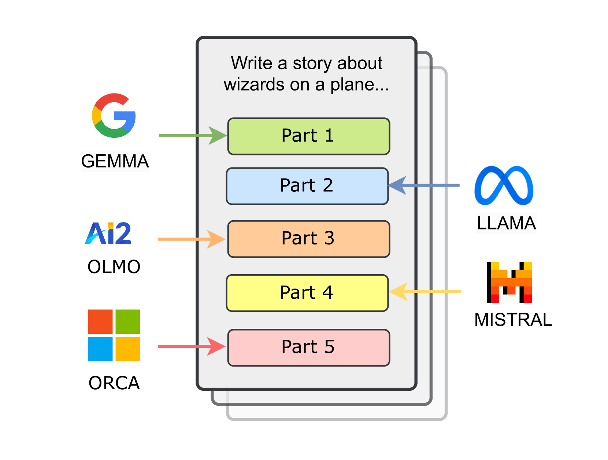

# 《协作故事：多LLM协同创作与作者分析》

发布时间：2024年06月18日

`LLM应用

这篇论文探讨了大型语言模型（LLMs）之间的协作写作，通过创建一个名为CollabStory的数据集，研究了多LLM协作生成故事的过程。这种研究不仅扩展了LLM的应用范围，还为理解LLM间的合作提供了新的视角和基准。因此，它属于LLM应用的范畴，因为它关注的是LLMs在实际应用中的协作和创作能力，而不是理论研究或Agent的设计与实现。`

> CollabStory: Multi-LLM Collaborative Story Generation and Authorship Analysis

# 摘要

> 随着统一框架的兴起，大型语言模型（LLMs）间的无缝协作已成为现实，为LLM间的合作开启了新篇章。然而，这种LLM间的协作写作尚未得到深入探索。我们通过创建首个完全由LLM合作生成的故事数据集CollabStory，迈出了人-LLM合作之外的一步，探索了多LLM协作的新领域。我们关注从单作者到多作者（最多五位作者）的场景，其中多个LLMs共同编织故事。我们借助开源指令调优的LLMs，创作了超过32,000个故事。受PAN任务启发，这些任务为人类间的多作者写作设定了标准，我们为多LLM环境扩展了作者身份相关的任务，并提供了LLM间合作的基准。遗憾的是，现有基准尚无法应对这一新兴挑战。因此，CollabStory不仅是一个资源，更是推动多LLM使用理解和相关技术发展的关键。在写作任务中，LLM间的合作可能对抄袭检测、信用分配、教育中的学术诚信及版权问题带来新的挑战，因此这一研究至关重要。我们的数据集和代码已公开于\texttt{\url{https://github.com/saranya-venkatraman/multi_llm_story_writing}}。

> The rise of unifying frameworks that enable seamless interoperability of Large Language Models (LLMs) has made LLM-LLM collaboration for open-ended tasks a possibility. Despite this, there have not been efforts to explore such collaborative writing. We take the next step beyond human-LLM collaboration to explore this multi-LLM scenario by generating the first exclusively LLM-generated collaborative stories dataset called CollabStory. We focus on single-author ($N=1$) to multi-author (up to $N=5$) scenarios, where multiple LLMs co-author stories. We generate over 32k stories using open-source instruction-tuned LLMs. Further, we take inspiration from the PAN tasks that have set the standard for human-human multi-author writing tasks and analysis. We extend their authorship-related tasks for multi-LLM settings and present baselines for LLM-LLM collaboration. We find that current baselines are not able to handle this emerging scenario. Thus, CollabStory is a resource that could help propel an understanding as well as the development of techniques to discern the use of multiple LLMs. This is crucial to study in the context of writing tasks since LLM-LLM collaboration could potentially overwhelm ongoing challenges related to plagiarism detection, credit assignment, maintaining academic integrity in educational settings, and addressing copyright infringement concerns. We make our dataset and code available at \texttt{\url{https://github.com/saranya-venkatraman/multi_llm_story_writing}}.

[Arxiv](https://arxiv.org/abs/2406.12665)