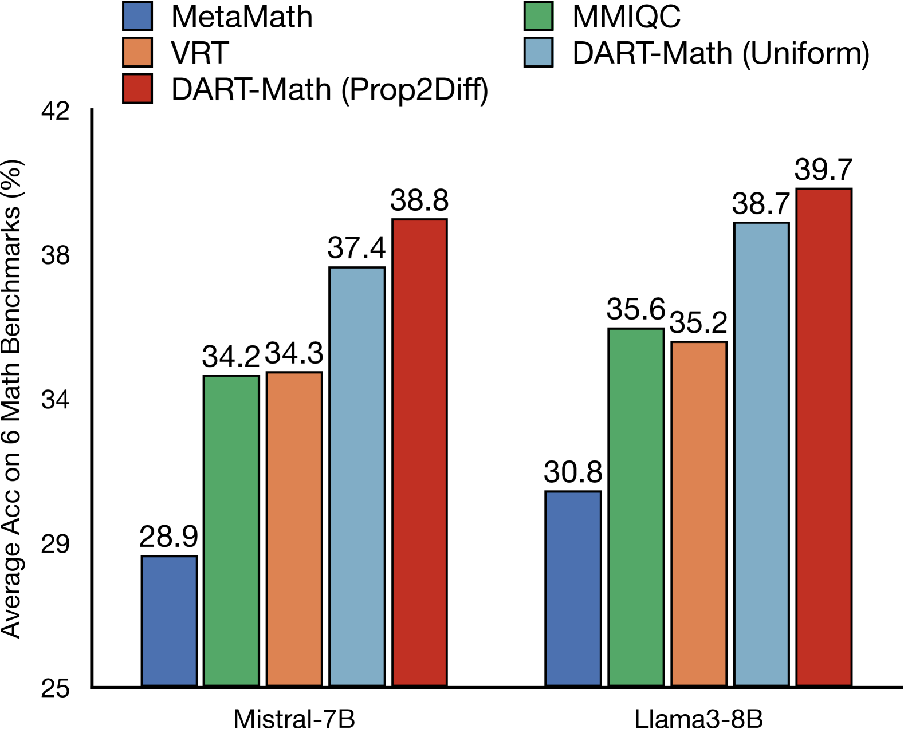

# DART-Math：一种针对数学问题解决难度进行智能拒绝调优的方法

发布时间：2024年06月18日

`LLM应用` `人工智能`

> DART-Math: Difficulty-Aware Rejection Tuning for Mathematical Problem-Solving

# 摘要

> 解决数学问题对大型语言模型来说极具挑战，需要高水平的推理能力。以往的研究多从专有模型中提取数据来扩充数据集，并通过指令调整追求卓越性能。但这些数据集往往偏爱简单问题，对于最难的题目却常常束手无策。我们推测，处理难题是掌握复杂推理的关键，因此提出了难度感知拒绝调整（DART）方法，该方法在数据合成阶段为难题分配更多尝试机会，从而加强对难题的训练。借助DART，我们生成了专注于难题的新数据集，规模远小于以往。特别的是，这一过程仅依赖于一个70亿参数的开放权重模型，而非通常使用的专有GPT-4。我们对不同规模的模型进行微调，从70亿到700亿参数不等，形成了名为DART-MATH的强大模型系列。在6个数学基准测试中，DART-MATH在域内外的评估中均显著超越了传统拒绝调整方法，性能卓越或与先前最佳成果相当，尽管所用数据集更小且未依赖专有模型。此外，我们的研究结果显示，这些合成数据集是推动数学问题解决领域进步的最有效且最具成本效益的公共资源。

> Solving mathematical problems requires advanced reasoning abilities and presents notable challenges for large language models. Previous works usually synthesize data from proprietary models to augment existing datasets, followed by instruction tuning to achieve top-tier results. However, our analysis of these datasets reveals severe biases towards easy queries, with frequent failures to generate any correct response for the most challenging queries. Hypothesizing that difficult queries are crucial to learn complex reasoning, we propose Difficulty-Aware Rejection Tuning (DART), a method that allocates difficult queries more trials during the synthesis phase, enabling more extensive training on difficult samples. Utilizing DART, we have created new datasets for mathematical problem-solving that focus more on difficult queries and are substantially smaller than previous ones. Remarkably, our synthesis process solely relies on a 7B-sized open-weight model, without reliance on the commonly used proprietary GPT-4. We fine-tune various base models on our datasets ranging from 7B to 70B in size, resulting in a series of strong models called DART-MATH. In comprehensive in-domain and out-of-domain evaluation on 6 mathematical benchmarks, DART-MATH outperforms vanilla rejection tuning significantly, being superior or comparable to previous arts, despite using much smaller datasets and no proprietary models. Furthermore, our results position our synthetic datasets as the most effective and cost-efficient publicly available resources for advancing mathematical problem-solving.

[Arxiv](https://arxiv.org/abs/2407.13690)