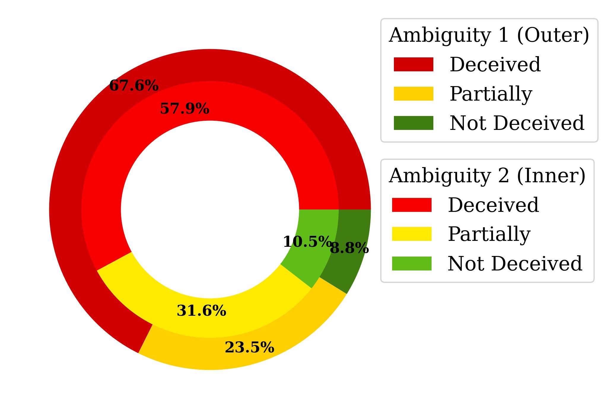

# 在大型语言模型盛行的当下，如何有效防御社会工程攻击？

发布时间：2024年06月18日

`LLM应用

这篇论文探讨了大型语言模型（LLMs）在数字欺骗检测和防范中的应用，特别是在基于聊天的社会工程（CSE）攻击中的角色。它不仅分析了LLMs作为攻击工具的潜力，还提出了一个名为ConvoSentinel的防御系统，该系统利用LLMs的能力来提高检测效率。因此，这篇论文属于LLM应用类别，因为它专注于LLMs在实际安全问题中的应用和解决方案。` `网络安全` `社会工程`

> Defending Against Social Engineering Attacks in the Age of LLMs

# 摘要

> 随着大型语言模型（LLMs）的普及，检测和防范数字欺骗变得更加复杂，因为这些模型能够模仿人类对话，助长基于聊天的社会工程（CSE）攻击。本研究深入探讨了LLMs在CSE攻击中的双重角色：既是攻击的推动者，也是防御者。我们创建了SEConvo数据集，模拟学术和招聘场景中的CSE攻击，以探究LLMs在这些情境中的潜在风险。研究发现，尽管LLMs能生成逼真的CSE内容，但其自身的检测能力却不足，增加了防御成本。为此，我们设计了ConvoSentinel，一种模块化防御系统，通过在消息和对话层面提升检测效率，实现了更高的适应性和成本效益。ConvoSentinel中的检索增强模块通过比对数据库中的相似对话，有效识别恶意意图，全面提升了CSE检测能力。本研究表明，在网络安全领域，我们需要更先进的策略来充分利用LLMs。

> The proliferation of Large Language Models (LLMs) poses challenges in detecting and mitigating digital deception, as these models can emulate human conversational patterns and facilitate chat-based social engineering (CSE) attacks. This study investigates the dual capabilities of LLMs as both facilitators and defenders against CSE threats. We develop a novel dataset, SEConvo, simulating CSE scenarios in academic and recruitment contexts, and designed to examine how LLMs can be exploited in these situations. Our findings reveal that, while off-the-shelf LLMs generate high-quality CSE content, their detection capabilities are suboptimal, leading to increased operational costs for defense. In response, we propose ConvoSentinel, a modular defense pipeline that improves detection at both the message and the conversation levels, offering enhanced adaptability and cost-effectiveness. The retrieval-augmented module in ConvoSentinel identifies malicious intent by comparing messages to a database of similar conversations, enhancing CSE detection at all stages. Our study highlights the need for advanced strategies to leverage LLMs in cybersecurity.

[Arxiv](https://arxiv.org/abs/2406.12263)