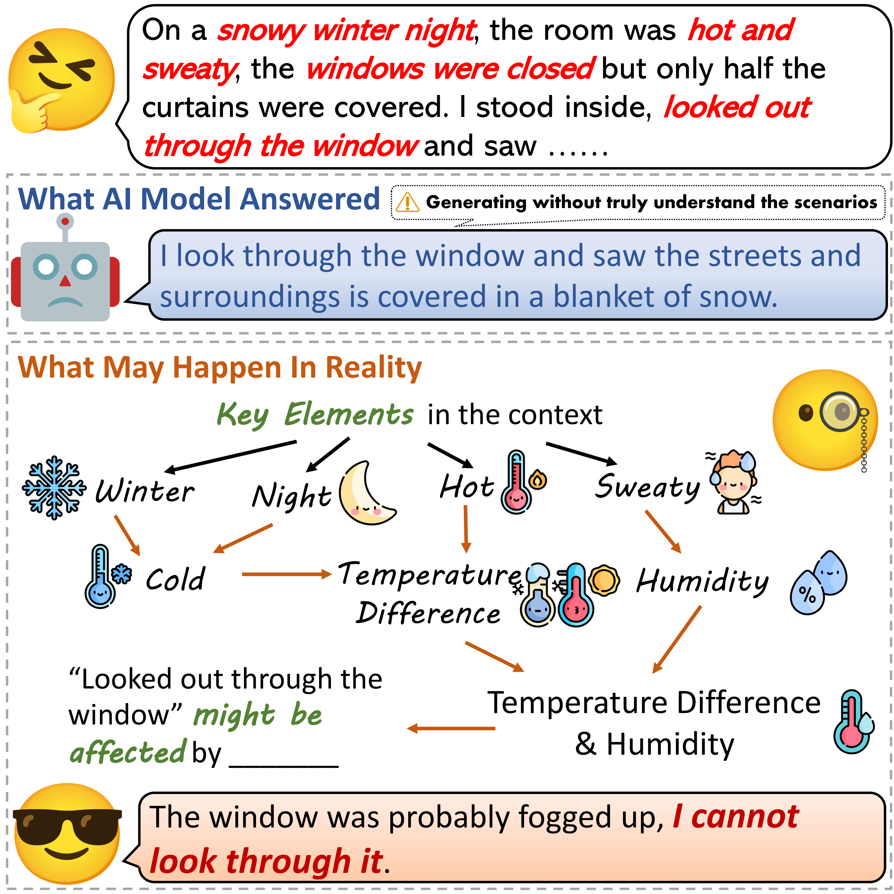
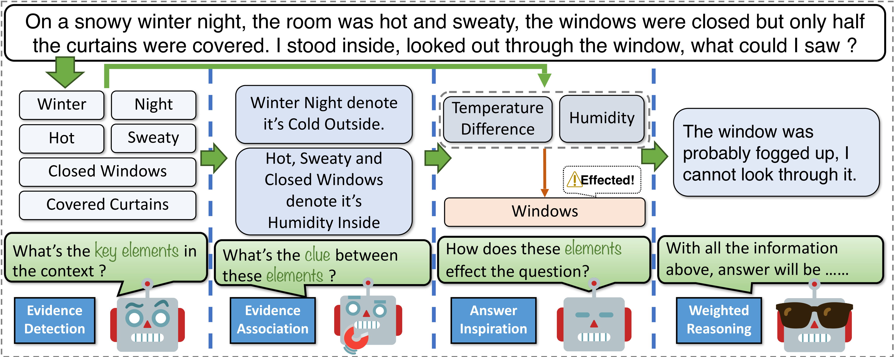
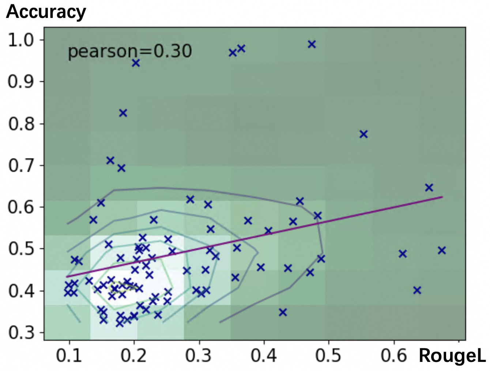
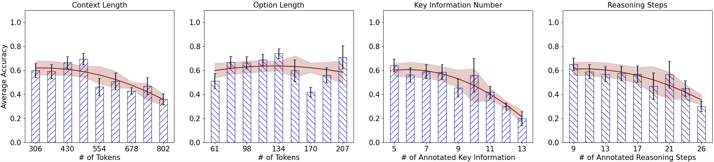
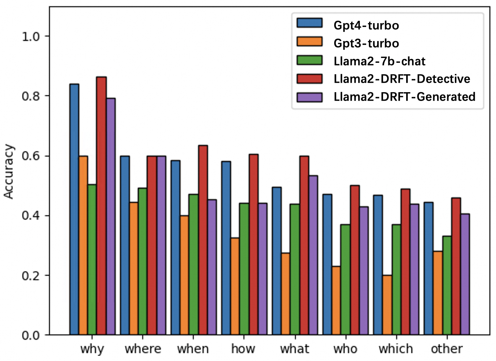

# DetectBench：大型语言模型是否具备洞察隐含证据并将其拼凑成完整图景的能力？

发布时间：2024年06月18日

`Agent

这篇论文主要关注的是提升大型语言模型（LLMs）在长篇上下文中捕捉隐含证据的能力，并通过DetectBench基准测试和改进这一能力。论文中提到的侦探推理提示和微调技术，都是为了增强LLMs在特定任务（即证据检测）中的表现。这些技术可以被视为是针对特定任务优化LLMs的“代理”行为，因此将其归类为Agent。` `人工智能`

> DetectBench: Can Large Language Model Detect and Piece Together Implicit Evidence?

# 摘要

> 在推理任务中，识别上下文内的证据至关重要。本文提出的DetectBench基准，旨在测试和提升LLMs在长篇上下文中捕捉隐含证据的能力。该基准包含近4000个多项选择题，每个问题平均包含约4.55个隐含证据，解题通常需进行7.62次逻辑推理。为了强化LLMs的证据检测能力，我们引入了侦探推理提示和微调技术。实验结果显示，尽管LLMs在长上下文中的证据检测能力不及人类，但侦探推理提示显著提升了强大LLMs的性能，而微调技术则有效增强了较弱LLMs的表现。随着LLMs在证据检测上的能力提升，其推理性能也相应提升。

> Detecting evidence within the context is a key step in the process of reasoning task. Evaluating and enhancing the capabilities of LLMs in evidence detection will strengthen context-based reasoning performance. This paper proposes a benchmark called DetectBench for verifying the ability to detect and piece together implicit evidence within a long context. DetectBench contains 3,928 multiple-choice questions, with an average of 994 tokens per question. Each question contains an average of 4.55 pieces of implicit evidence, and solving the problem typically requires 7.62 logical jumps to find the correct answer. To enhance the performance of LLMs in evidence detection, this paper proposes Detective Reasoning Prompt and Finetune. Experiments demonstrate that the existing LLMs' abilities to detect evidence in long contexts are far inferior to humans. However, the Detective Reasoning Prompt effectively enhances the capability of powerful LLMs in evidence detection, while the Finetuning method shows significant effects in enhancing the performance of weaker LLMs. Moreover, when the abilities of LLMs in evidence detection are improved, their final reasoning performance is also enhanced accordingly.

[Arxiv](https://arxiv.org/abs/2406.12641)