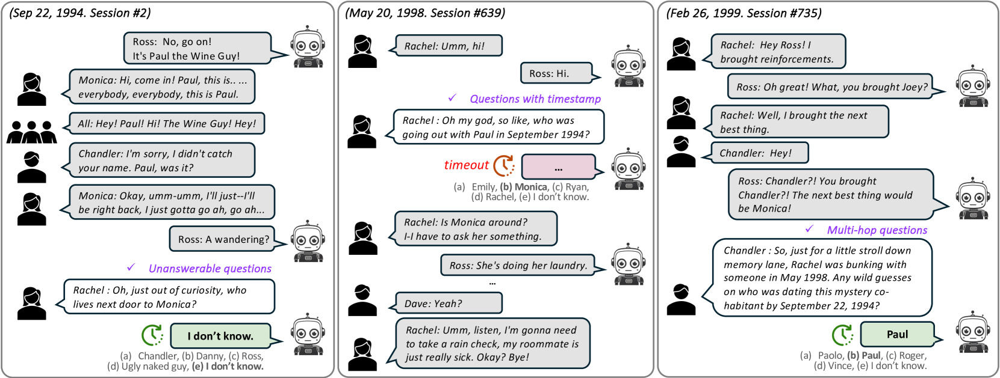

# DialSim：实时模拟器，专为评估对话代理在长期对话中的理解能力而设计。

发布时间：2024年06月18日

`Agent

这篇论文主要讨论了大型语言模型（LLMs）在对话代理中的应用，并开发了一个实时对话模拟器（DialSim）来评估这些代理在复杂对话环境中的表现。论文关注的是对话代理的实际应用和评估，而不是LLM的理论研究或RAG（Retrieval-Augmented Generation）相关的技术。因此，最合适的分类是Agent。` `对话系统`

> DialSim: A Real-Time Simulator for Evaluating Long-Term Dialogue Understanding of Conversational Agents

# 摘要

> 大型语言模型（LLMs）的最新进展极大地增强了对话代理的能力，使其广泛应用于教育等多个领域。然而，这些代理的评估往往忽略了现实对话的复杂性，如实时互动、多方交流和长期上下文依赖。为此，我们开发了DialSim，一个实时对话模拟器，其中代理需扮演热门电视剧角色，应对即兴提问并区分信息的新旧。DialSim评估代理的即时反应能力、处理多方长对话及应对角色名称交换等挑战，以检验其对预设知识的依赖。通过此模拟器，我们评估并分析了最新对话代理的优劣，为对话AI的未来发展提供了深刻洞见。DialSim的详细信息可访问https://github.com/jiho283/Simulator。

> Recent advancements in Large Language Models (LLMs) have significantly enhanced the capabilities of conversational agents, making them applicable to various fields (e.g., education). Despite their progress, the evaluation of the agents often overlooks the complexities of real-world conversations, such as real-time interactions, multi-party dialogues, and extended contextual dependencies. To bridge this gap, we introduce DialSim, a real-time dialogue simulator. In this simulator, an agent is assigned the role of a character from popular TV shows, requiring it to respond to spontaneous questions using past dialogue information and to distinguish between known and unknown information. Key features of DialSim include evaluating the agent's ability to respond within a reasonable time limit, handling long-term multi-party dialogues, and managing adversarial settings (e.g., swap character names) to challenge the agent's reliance on pre-trained knowledge. We utilized this simulator to evaluate the latest conversational agents and analyze their limitations. Our experiments highlight both the strengths and weaknesses of these agents, providing valuable insights for future improvements in the field of conversational AI. DialSim is available at https://github.com/jiho283/Simulator.

[Arxiv](https://arxiv.org/abs/2406.13144)