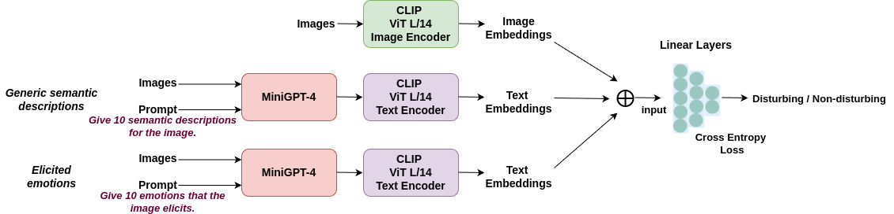

# 利用LMM诱导情感嵌入识别扰动图像

发布时间：2024年06月18日

`RAG

理由：这篇论文主要探讨了如何利用大型多模态模型（LMMs）来解决扰动图像检测（DID）任务。通过结合文本和图像的嵌入，论文提出了一种新的方法来提取语义信息和情感反应，从而在DID任务中取得了显著的性能提升。这种方法涉及到多模态信息的处理和应用，与RAG（Retrieval-Augmented Generation）的概念相符，后者通常涉及结合不同类型的信息（如文本和图像）来增强模型的性能。因此，这篇论文更适合归类为RAG。` `图像处理` `情感分析`

> Disturbing Image Detection Using LMM-Elicited Emotion Embeddings

# 摘要

> 本文探讨了扰动图像检测（DID）任务，巧妙地利用了大型多模态模型（LMMs）的知识。我们提出了一种双管齐下的策略：一方面提取通用语义信息，另一方面捕捉引发的情感反应。通过CLIP的文本编码器，我们获得了这些语义描述和情感的文本嵌入。结合相应的CLIP图像嵌入，我们的方法在DID任务中大放异彩，不仅显著提升了分类准确性，还在增强的扰动图像检测数据集上刷新了性能记录。

> In this paper we deal with the task of Disturbing Image Detection (DID), exploiting knowledge encoded in Large Multimodal Models (LMMs). Specifically, we propose to exploit LMM knowledge in a two-fold manner: first by extracting generic semantic descriptions, and second by extracting elicited emotions. Subsequently, we use the CLIP's text encoder in order to obtain the text embeddings of both the generic semantic descriptions and LMM-elicited emotions. Finally, we use the aforementioned text embeddings along with the corresponding CLIP's image embeddings for performing the DID task. The proposed method significantly improves the baseline classification accuracy, achieving state-of-the-art performance on the augmented Disturbing Image Detection dataset.

[Arxiv](https://arxiv.org/abs/2406.12668)