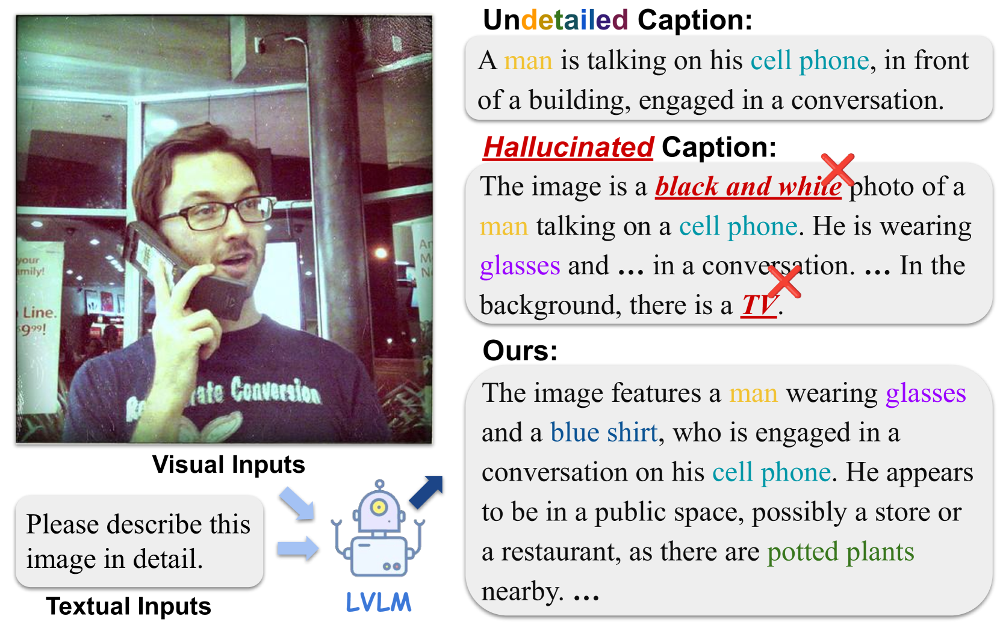
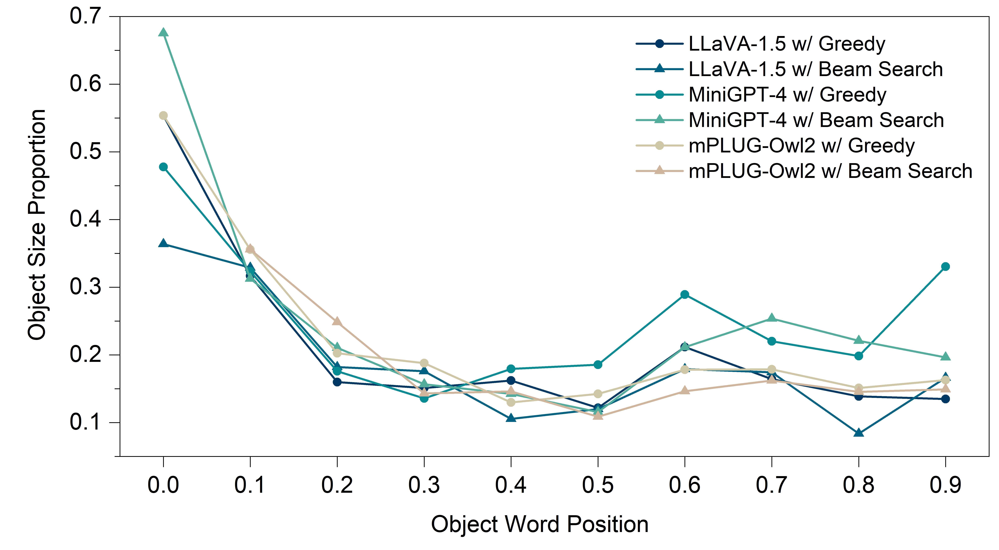
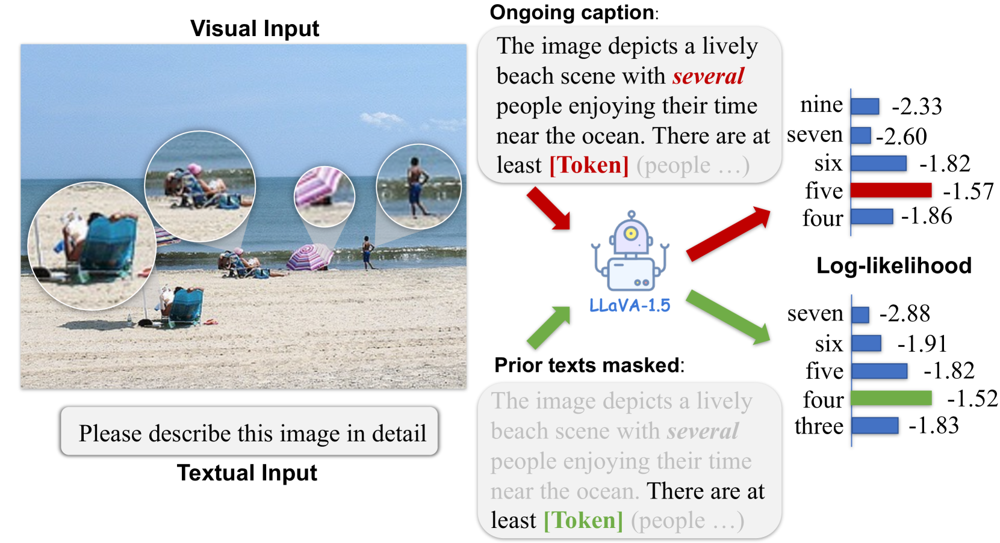
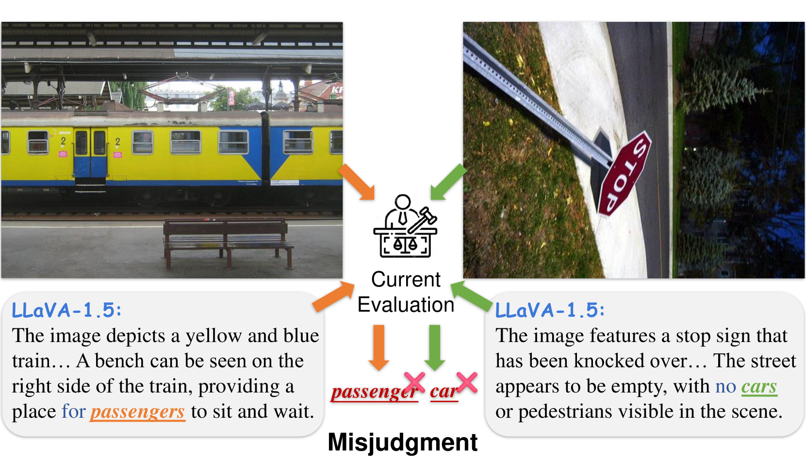
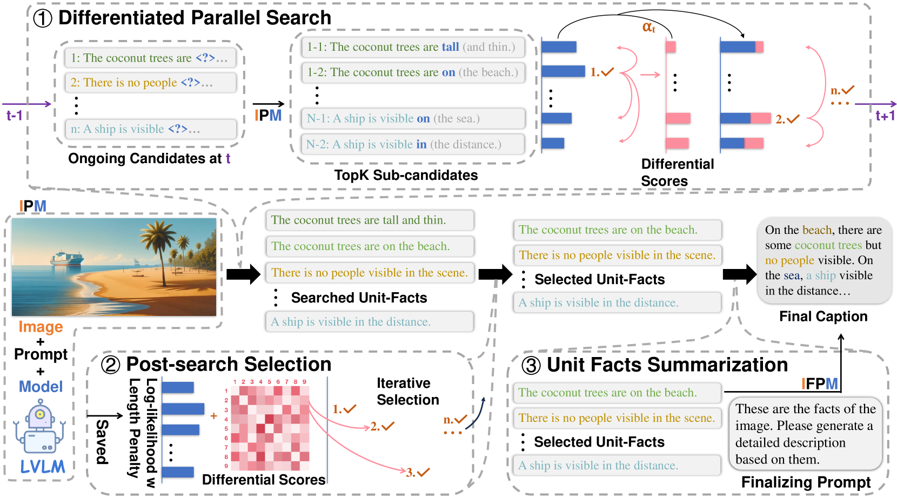
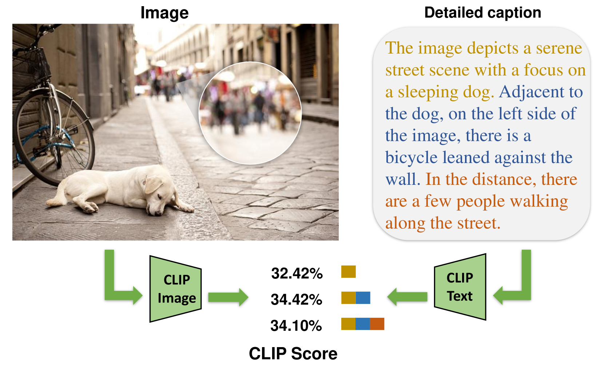
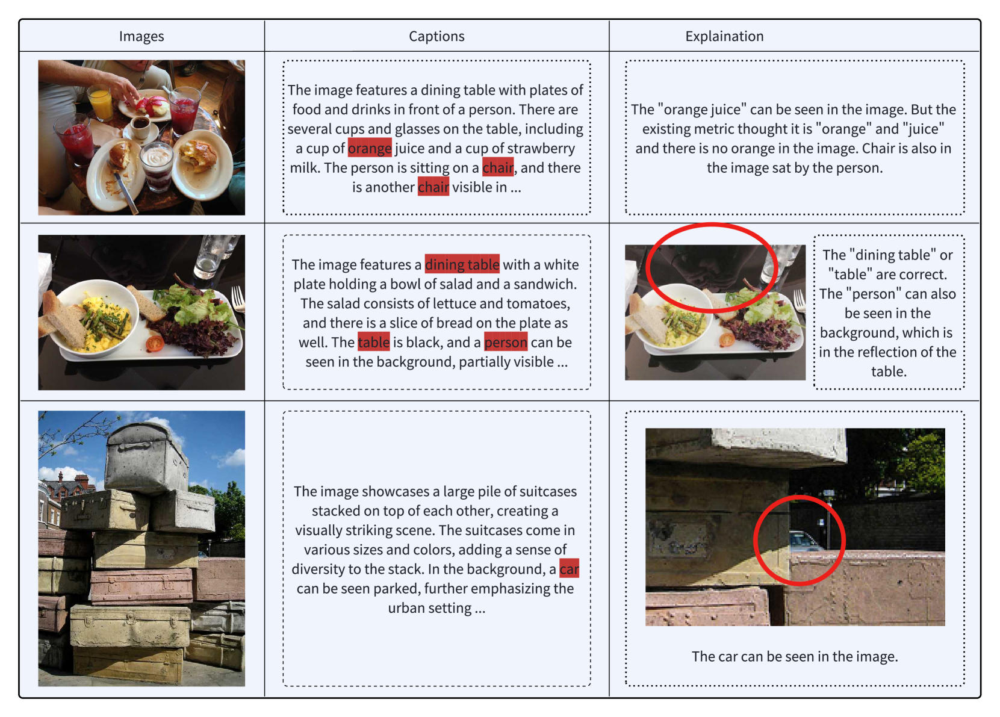
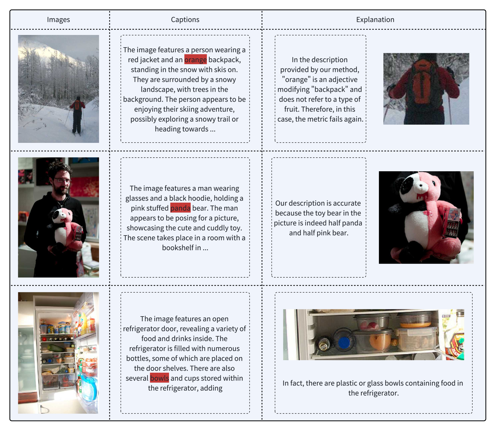

# 在LVLM驱动的图像描述任务中，细节的增加是否必然带来幻觉的增多？这一问题值得我们深入探讨。

发布时间：2024年06月18日

`LLM应用

这篇论文探讨了大型视觉-语言模型（LVLMs）在图像描述生成中的物体幻觉问题，并提出了一种新的解码策略和评估指标来改善这一问题。虽然涉及模型的应用和评估，但主要关注的是模型在特定应用场景下的性能优化和评估方法的改进，因此属于LLM应用类别。` `图像描述` `视觉-语言模型`

> Do More Details Always Introduce More Hallucinations in LVLM-based Image Captioning?

# 摘要

> 大型视觉-语言模型（LVLMs）在整合视觉与语言上下文以生成详细内容方面表现出色，尤其在图像描述等应用中。然而，这些模型在描述生成时常遭遇物体幻觉（OH）问题，即输出的文本错误地描绘了图像中的实际物体。尽管以往研究认为OH源于细节的增加，我们的研究揭示了现有评估指标的技术缺陷，导致对模型性能和OH问题的评估不可靠。这引发了一个问题：在LVLM的图像描述中，细节的增加是否必然导致更多幻觉？为解答这一问题，本文提出了一种创新的解码策略——差异化波束解码（DBD），以及一组新的评估指标：CLIP-精确度、CLIP-召回率和CLIP-F1。DBD策略通过一个精心设计的差异分数，将视觉输入中的信息并行解码为独特的语言单元事实，进而筛选并整合这些事实以生成最终描述。我们的新指标通过比较真实图像区域与生成文本的嵌入组，全面且准确地评估了描述的质量。在Visual Genome数据集上的实验结果表明，我们的方法能在保持低幻觉水平的同时，生成详尽的图像描述。

> Large Vision-Language Models (LVLMs) excel in integrating visual and linguistic contexts to produce detailed content, facilitating applications such as image captioning. However, using LVLMs to generate descriptions often faces the challenge of object hallucination (OH), where the output text misrepresents actual objects in the input image. While previous studies attribute the occurrence of OH to the inclusion of more details, our study finds technical flaws in existing metrics, leading to unreliable evaluations of models and conclusions about OH. This has sparked a debate on the question: Do more details always introduce more hallucinations in LVLM-based image captioning?
  In this paper, we address this debate by proposing a novel decoding strategy, Differentiated Beam Decoding (DBD), along with a reliable new set of evaluation metrics: CLIP-Precision, CLIP-Recall, and CLIP-F1. DBD decodes the wealth of information hidden in visual input into distinct language representations called unit facts in parallel. This decoding is achieved via a well-designed differential score that guides the parallel search and candidate screening. The selected unit facts are then aggregated to generate the final caption. Our proposed metrics evaluate the comprehensiveness and accuracy of image captions by comparing the embedding groups of ground-truth image regions and generated text partitions. Extensive experiments on the Visual Genome dataset validate the effectiveness of our approach, demonstrating that it produces detailed descriptions while maintaining low hallucination levels.

[Arxiv](https://arxiv.org/abs/2406.12663)