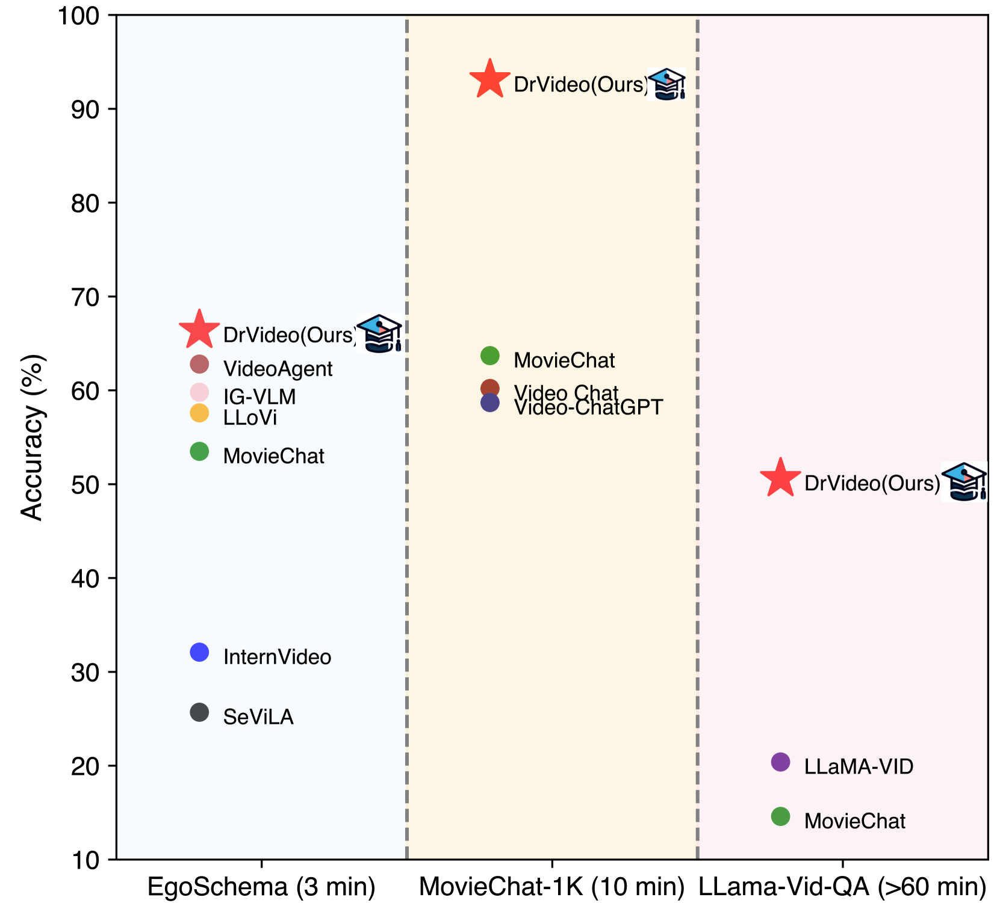
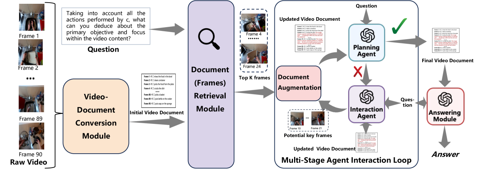
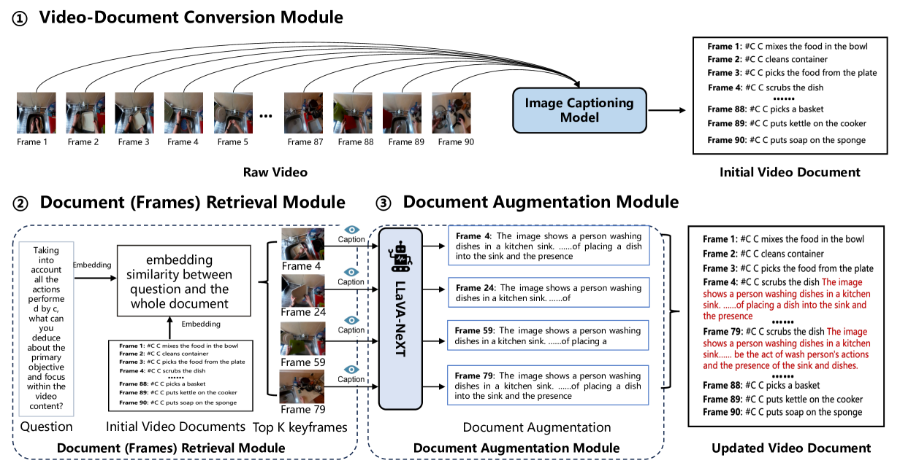
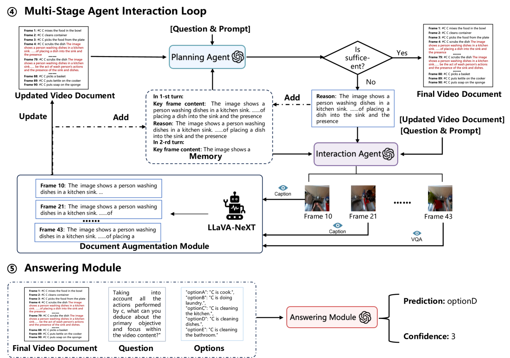

# DrVideo：借助文档检索深化长视频理解

发布时间：2024年06月18日

`Agent

理由：这篇论文介绍了一个名为 DrVideo 的系统，该系统通过代理的迭代循环来处理长视频理解问题。这里的“代理”指的是系统内部的机制，它通过迭代循环来搜索遗漏信息并增强相关数据，最终以思维链的方式给出预测。这种使用代理来处理复杂任务的方法符合Agent分类的定义，即使用自主或半自主的实体（在这里是系统内部的代理）来执行任务或解决问题。因此，这篇论文应归类于Agent。` `视频理解` `人工智能`

> DrVideo: Document Retrieval Based Long Video Understanding

# 摘要

> 当前的长视频理解方法多局限于处理数十秒的视频，对更长视频的处理技术探索不足。长视频中帧数的增多带来了两大挑战：关键信息的定位困难和长距离推理的复杂性。为此，我们开发了DrVideo系统，它基于文档检索技术，专为长视频理解而生。我们的创新之处在于将长视频理解问题转化为长文档理解任务，从而充分利用大型语言模型的强大能力。DrVideo首先将长视频转化为文本形式的长文档，提取关键帧并增强其信息，以此为起点。随后，系统通过代理的迭代循环，不断搜索遗漏信息，增强相关数据，并在收集到足够的问题相关信息后，以思维链的方式给出最终预测。实验结果显示，DrVideo在多个长视频基准测试中表现卓越，准确率显著提升，例如在EgoSchema基准上提升了+3.8，在MovieChat-1K的两种模式中分别提升了+17.9和+38.0，以及在LLama-Vid QA数据集上提升了+30.2。

> Existing methods for long video understanding primarily focus on videos only lasting tens of seconds, with limited exploration of techniques for handling longer videos. The increased number of frames in longer videos presents two main challenges: difficulty in locating key information and performing long-range reasoning. Thus, we propose DrVideo, a document-retrieval-based system designed for long video understanding. Our key idea is to convert the long-video understanding problem into a long-document understanding task so as to effectively leverage the power of large language models. Specifically, DrVideo transforms a long video into a text-based long document to initially retrieve key frames and augment the information of these frames, which is used this as the system's starting point. It then employs an agent-based iterative loop to continuously search for missing information, augment relevant data, and provide final predictions in a chain-of-thought manner once sufficient question-related information is gathered. Extensive experiments on long video benchmarks confirm the effectiveness of our method. DrVideo outperforms existing state-of-the-art methods with +3.8 accuracy on EgoSchema benchmark (3 minutes), +17.9 in MovieChat-1K break mode, +38.0 in MovieChat-1K global mode (10 minutes), and +30.2 on the LLama-Vid QA dataset (over 60 minutes).

[Arxiv](https://arxiv.org/abs/2406.12846)