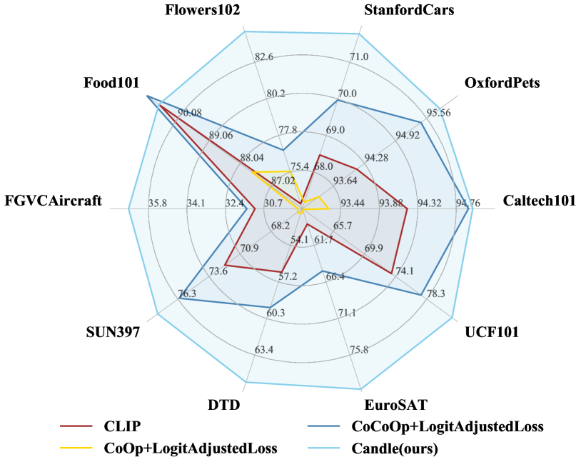
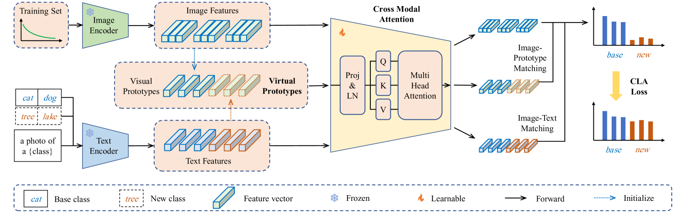
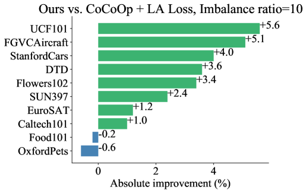
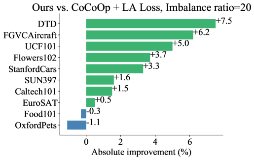
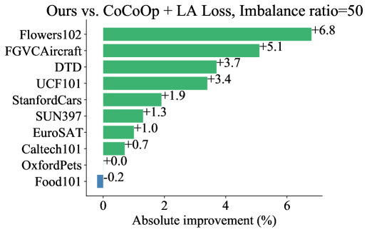
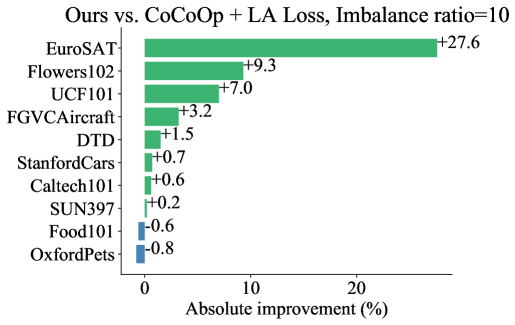
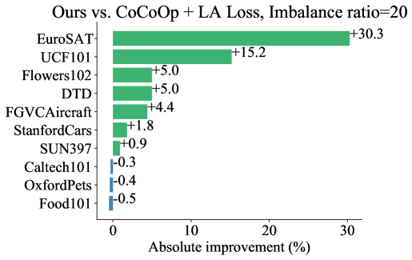
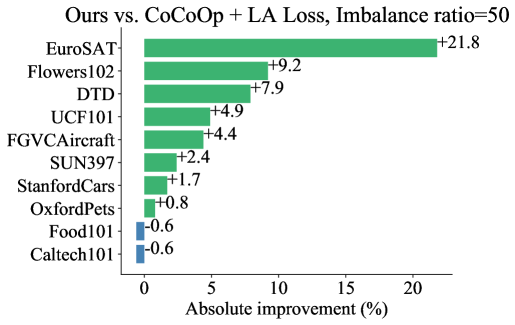
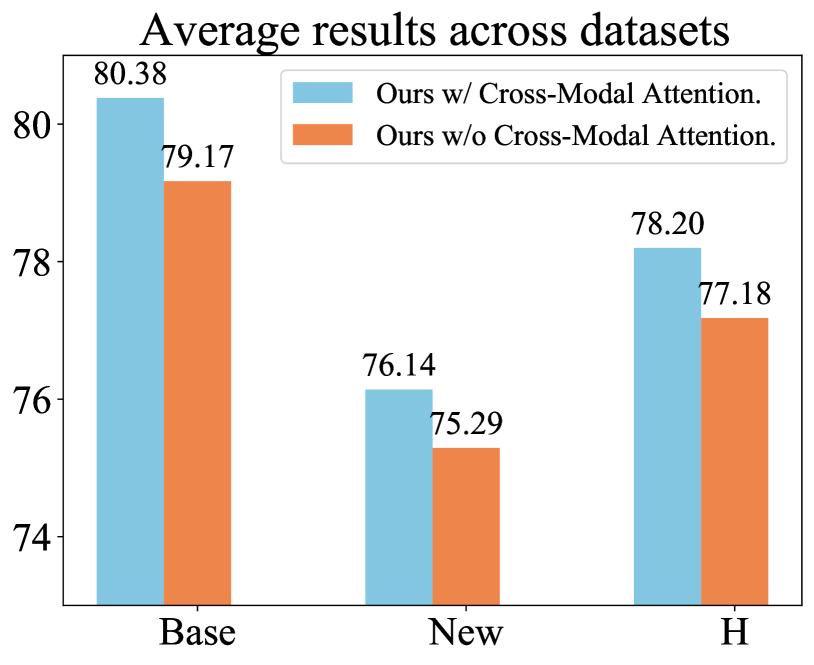
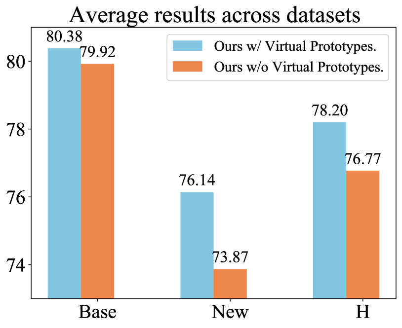

# 预训练视觉-语言模型的效率与长尾泛化能力研究

发布时间：2024年06月18日

`Agent

理由：这篇论文介绍了一个名为 Candle 的新框架，该框架旨在解决预训练视觉-语言模型（如 CLIP）在实际应用中遇到的问题，特别是数据长尾分布和新兴任务中无样本新类别的挑战。Candle 框架通过采用补偿对数调整损失、构建视觉与文本原型、引入跨模态注意力机制等方法，实现了高效且适应长尾分布的泛化。这些特性表明，Candle 框架可以被视为一个智能代理（Agent），因为它能够处理复杂的数据分布问题，并在多种下游任务中进行有效的学习和预测。此外，论文中提到的“将CLIP视为黑盒，利用其特征提取能力”也符合Agent的设计理念，即利用外部资源（如CLIP）来增强自身的能力。因此，将这篇论文归类为Agent是合适的。` `计算机视觉`

> Efficient and Long-Tailed Generalization for Pre-trained Vision-Language Model

# 摘要

> CLIP等预训练视觉-语言模型展现了卓越的零样本推理能力，并在多种下游任务中成为高效的少量样本学习者。但在实际应用中，将CLIP应用于下游任务面临两大挑战：一是数据呈现长尾分布，某些类别样本稀缺；二是新兴任务中可能出现无样本的新类别。为此，我们开发了名为Candle的新框架，旨在实现高效且适应长尾分布的泛化。在训练中，我们采用补偿对数调整损失，增强原型间的区分度，并平衡基础类别与新类别间的数据分布。我们将CLIP视为黑盒，利用其特征提取能力，构建视觉与文本原型以进行预测。同时，引入跨模态注意力机制，深化多模态信息的融合。对于缺乏训练样本的新类别，我们创造虚拟原型以弥补不足。Candle在11个数据集上的实验中取得了顶尖性能，大幅缩短了训练时间，充分展现了其优越性。源代码已公开于https://github.com/shijxcs/Candle。

> Pre-trained vision-language models like CLIP have shown powerful zero-shot inference ability via image-text matching and prove to be strong few-shot learners in various downstream tasks. However, in real-world scenarios, adapting CLIP to downstream tasks may encounter the following challenges: 1) data may exhibit long-tailed data distributions and might not have abundant samples for all the classes; 2) There might be emerging tasks with new classes that contain no samples at all. To overcome them, we propose a novel framework to achieve efficient and long-tailed generalization, which can be termed as Candle. During the training process, we propose compensating logit-adjusted loss to encourage large margins of prototypes and alleviate imbalance both within the base classes and between the base and new classes. For efficient adaptation, we treat the CLIP model as a black box and leverage the extracted features to obtain visual and textual prototypes for prediction. To make full use of multi-modal information, we also propose cross-modal attention to enrich the features from both modalities. For effective generalization, we introduce virtual prototypes for new classes to make up for their lack of training images. Candle achieves state-of-the-art performance over extensive experiments on 11 diverse datasets while substantially reducing the training time, demonstrating the superiority of our approach. The source code is available at https://github.com/shijxcs/Candle.

[Arxiv](https://arxiv.org/abs/2406.12638)