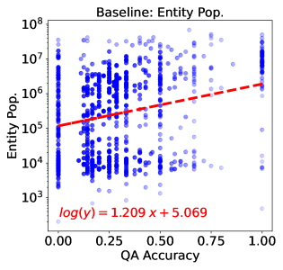

# 无需生成任何令牌，即可在大规模语言模型中评估知识

发布时间：2024年06月18日

`LLM理论

理由：该论文研究的是如何通过分析大型语言模型（LLMs）的内部计算来预估其知识水平，特别是对特定实体的了解程度。这涉及到对模型内部机制的理解和评估，属于对LLMs理论层面的探讨。论文中提出的KEEN探针及其变体，旨在揭示模型知识的盲点和集中区域，这些都是对LLMs理论理解的深化，而非直接的应用或Agent行为，也不是RAG（Retrieval-Augmented Generation）相关的研究。因此，将其归类为LLM理论是合适的。` `知识评估`

> Estimating Knowledge in Large Language Models Without Generating a Single Token

# 摘要

> 在评估大型语言模型（LLMs）的知识时，传统方法是通过提问并评估其回答。本研究提出一个新思路：能否在模型生成文本前预估其知识水平？具体而言，我们能否仅通过分析模型的内部计算来判断其对特定实体的了解程度？为此，我们设计了两个任务：一是预测模型回答关于特定实体的常见问题的能力；二是评估模型关于该实体回答的事实性。实验涵盖多种LLMs，结果显示，KEEN——一个基于内部主题表示训练的简单探针——在这两项任务中表现出色，与模型的QA准确率和FActScore（一种开放式生成中的事实性度量）高度相关。此外，KEEN与模型的保守行为自然契合，并准确反映了微调后模型知识的变化。最后，我们提出一个更具解释性的KEEN变体，它聚焦于与模型知识缺乏相关的一小部分令牌。由于其简洁轻便，KEEN可用于揭示LLMs中实体知识的盲点和集中区域，并为决策提供指导，例如通过检索增强查询。

> To evaluate knowledge in large language models (LLMs), current methods query the model and then evaluate its generated responses. In this work, we ask whether evaluation can be done $\textit{before}$ the model has generated any text. Concretely, is it possible to estimate how knowledgeable a model is about a certain entity, only from its internal computation? We study this question with two tasks: given a subject entity, the goal is to predict (a) the ability of the model to answer common questions about the entity, and (b) the factuality of responses generated by the model about the entity. Experiments with a variety of LLMs show that KEEN, a simple probe trained over internal subject representations, succeeds at both tasks - strongly correlating with both the QA accuracy of the model per-subject and FActScore, a recent factuality metric in open-ended generation. Moreover, KEEN naturally aligns with the model's hedging behavior and faithfully reflects changes in the model's knowledge after fine-tuning. Lastly, we show a more interpretable yet equally performant variant of KEEN, which highlights a small set of tokens that correlates with the model's lack of knowledge. Being simple and lightweight, KEEN can be leveraged to identify gaps and clusters of entity knowledge in LLMs, and guide decisions such as augmenting queries with retrieval.

[Arxiv](https://arxiv.org/abs/2406.12673)