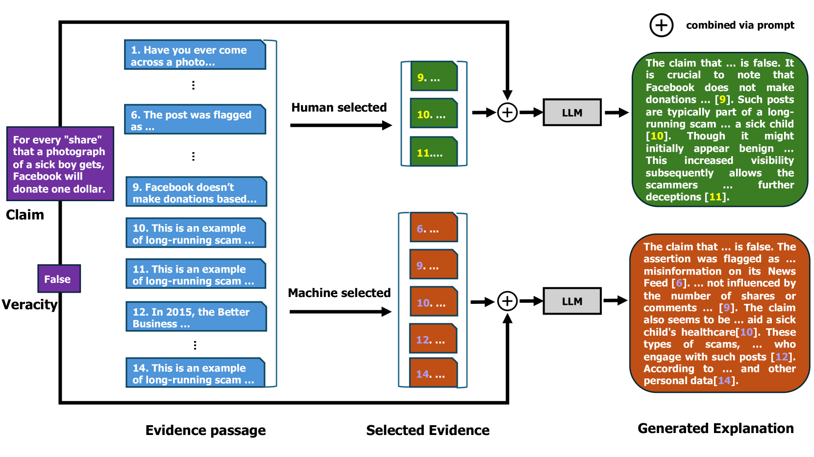

# 探究机器生成的事实核查解释的透明度

发布时间：2024年06月18日

`RAG

理由：这篇论文关注的是在事实核查解释生成中，如何选择证据以提高解释质量。它比较了人工筛选和机器选择的证据在大型语言模型中的应用效果，并评估了解释的透明度和实用性。这种研究属于检索增强生成（Retrieval-Augmented Generation, RAG）的范畴，因为它涉及到如何从大量信息中检索相关证据来增强语言模型的生成能力。RAG模型通常结合了检索机制和生成模型，以提高生成内容的准确性和相关性。因此，这篇论文适合归类为RAG。` `事实核查` `语言模型`

> Evaluating Transparency of Machine Generated Fact Checking Explanations

# 摘要

> 在事实核查解释的生成中，证据的选择至关重要：高质量的解释依赖于正确的证据。本研究对比了人工筛选与机器选择的证据在大型语言模型中的应用效果。我们通过透明度和实用性两个维度评估解释质量，发现机器选择的证据足以生成高质量解释，甚至有时优于人工筛选。然而，即便是最优模型，其解释也未必完全忠实于原始来源，揭示了事实核查解释生成领域的进一步改进空间。

> An important factor when it comes to generating fact-checking explanations is the selection of evidence: intuitively, high-quality explanations can only be generated given the right evidence. In this work, we investigate the impact of human-curated vs. machine-selected evidence for explanation generation using large language models. To assess the quality of explanations, we focus on transparency (whether an explanation cites sources properly) and utility (whether an explanation is helpful in clarifying a claim). Surprisingly, we found that large language models generate similar or higher quality explanations using machine-selected evidence, suggesting carefully curated evidence (by humans) may not be necessary. That said, even with the best model, the generated explanations are not always faithful to the sources, suggesting further room for improvement in explanation generation for fact-checking.

[Arxiv](https://arxiv.org/abs/2406.12645)