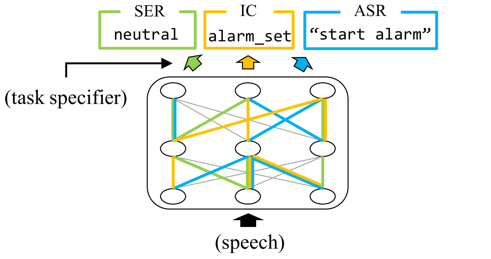
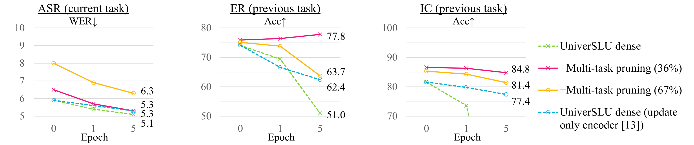
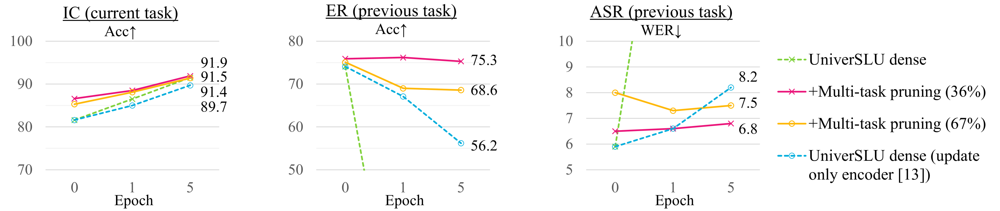
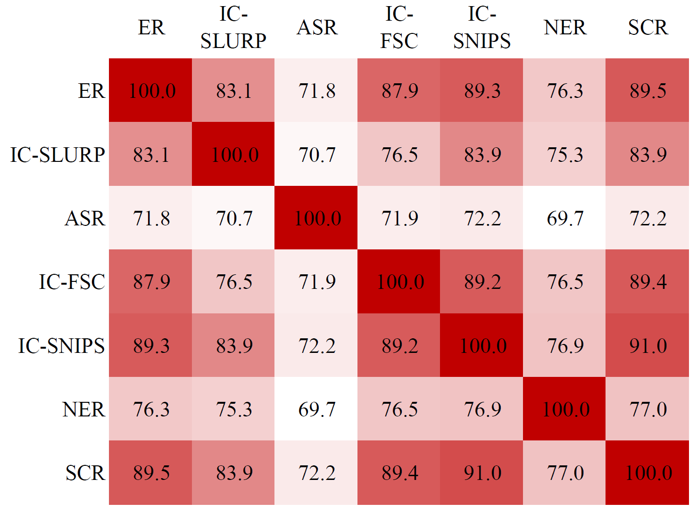

# 探索多任务口语理解模型中特定任务的子网络

发布时间：2024年06月18日

`Agent

理由：这篇论文主要讨论了在多任务口语理解模型中应用神经网络剪枝技术，以挖掘特定任务的子网络，并减少模型参数，同时缓解灾难性遗忘问题。这种方法涉及到模型的优化和适应性调整，更偏向于Agent的范畴，即如何使模型（或Agent）更有效地适应和处理多任务环境。虽然涉及到了模型的应用，但其核心在于模型的自我优化和适应，而不是直接的应用场景或理论探讨。` `语音处理`

> Finding Task-specific Subnetworks in Multi-task Spoken Language Understanding Model

# 摘要

> 近期，多任务口语理解模型崭露头角，旨在应对多样化的语音处理挑战。但这些模型往往参数繁多，且在适应新任务数据时，易遭遇先前任务知识的灾难性遗忘。本研究提出，通过神经网络剪枝技术，在多任务SLU模型中挖掘特定任务的子网络，不仅实现模型瘦身，更期望通过子网络的针对性更新，缓解遗忘问题。我们在顶尖的“UniverSLU”模型上进行了实验，该模型针对情绪识别、意图分类及自动语音识别等多项任务进行了训练。实验结果表明，经过剪枝的模型在适应新增的ASR或IC数据时，对原有任务的性能影响微乎其微。

> Recently, multi-task spoken language understanding (SLU) models have emerged, designed to address various speech processing tasks. However, these models often rely on a large number of parameters. Also, they often encounter difficulties in adapting to new data for a specific task without experiencing catastrophic forgetting of previously trained tasks. In this study, we propose finding task-specific subnetworks within a multi-task SLU model via neural network pruning. In addition to model compression, we expect that the forgetting of previously trained tasks can be mitigated by updating only a task-specific subnetwork. We conduct experiments on top of the state-of-the-art multi-task SLU model ``UniverSLU'', trained for several tasks such as emotion recognition (ER), intent classification (IC), and automatic speech recognition (ASR). We show that pruned models were successful in adapting to additional ASR or IC data with minimal performance degradation on previously trained tasks.

[Arxiv](https://arxiv.org/abs/2406.12317)