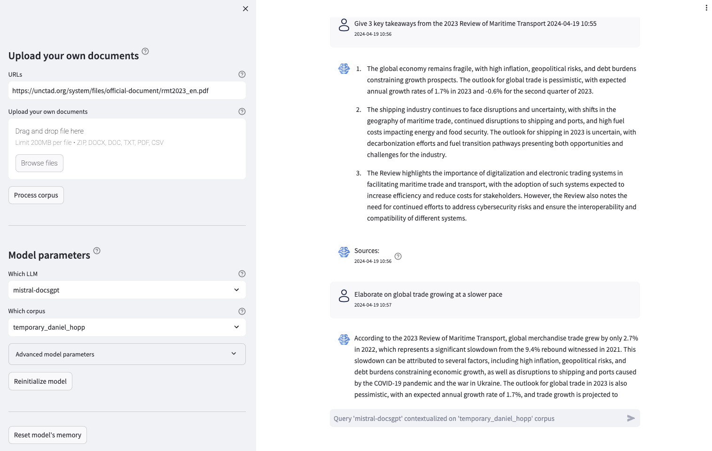

# 联合国贸易和发展会议在开发开源的检索增强生成大型语言模型应用上，展现了自由探索的精神与实践经验。

发布时间：2024年06月18日

`RAG` `国际组织` `官方统计`

> Free to play: UN Trade and Development's experience with developing its own open-source Retrieval Augmented Generation Large Language Model application

# 摘要

> 自ChatGPT的GPT-3.5模型于2022年11月面世以来，生成式AI，尤其是大型语言模型（LLMs），迅速成为热门话题。这些通用模型因其强大的自然语言处理能力，在官方统计和国际组织等多个领域展现出应用潜力。然而，这种新兴技术对许多组织来说，似乎是一个难以捉摸、只能旁观的现象。加之专有解决方案的高昂且不确定的成本，对预算有限的国家组织构成了挑战。为此，联合国贸易和发展会议（UNCTAD）的全球危机响应小组（GCRG）开发了开源的RAG LLM应用，旨在使LLMs更好地服务于特定领域。内部解决方案虽有成本、灵活性及知识积累等优势，但也需面对时间、技能及应用完善等方面的挑战。相关开发库如nlp_pipeline、local_rag_llm和streamlit_rag已公开，而local_llm_finetune库则支持对LLMs进行微调，以增强应用性能。

> Generative artificial intelligence (AI), and in particular Large Language Models (LLMs), have exploded in popularity and attention since the release to the public of ChatGPT's Generative Pre-trained Transformer (GPT)-3.5 model in November of 2022. Due to the power of these general purpose models and their ability to communicate in natural language, they can be useful in a range of domains, including the work of official statistics and international organizations. However, with such a novel and seemingly complex technology, it can feel as if generative AI is something that happens to an organization, something that can be talked about but not understood, that can be commented on but not contributed to. Additionally, the costs of adoption and operation of proprietary solutions can be both uncertain and high, a barrier for often cost-constrained international organizations. In the face of these challenges, United Nations Trade and Development (UNCTAD), through its Global Crisis Response Group (GCRG), has explored and developed its own open-source Retrieval Augmented Generation (RAG) LLM application. RAG makes LLMs aware of and more useful for the organization's domain and work. Developing in-house solutions comes with pros and cons, with pros including cost, flexibility, and fostering institutional knowledge. Cons include time and skill investments and gaps and application polish and power. The three libraries developed to produce the app, nlp_pipeline for document processing and statistical analysis, local_rag_llm for running a local RAG LLM, and streamlit_rag for the user interface, are publicly available on PyPI and GitHub with Dockerfiles. A fourth library, local_llm_finetune, is also available for fine-tuning existing LLMs which can then be used in the application.

[Arxiv](https://arxiv.org/abs/2407.16896)