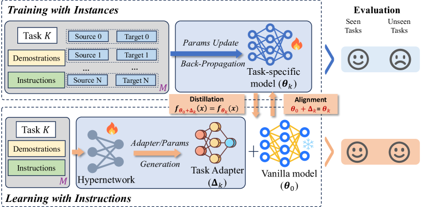
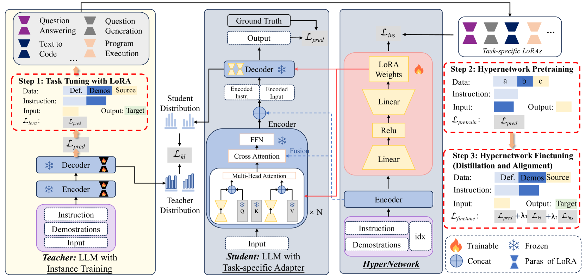
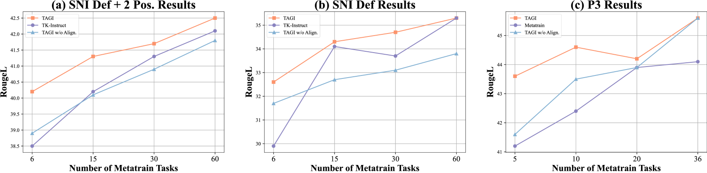
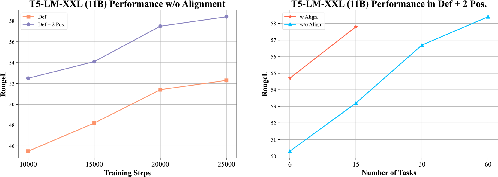

# 从实例训练转向指令学习：依据指令打造任务适配器

发布时间：2024年06月18日

`LLM应用

这篇论文探讨了大型语言模型（LLMs）通过指令微调（IFT）来提升处理各类任务的能力，并提出了基于指令的任务适配器生成（TAGI）方法。这种方法模拟了人类通过理解指导来学习技能的方式，而不是依赖于大量任务数据的实例训练。TAGI方法能够在无需重新训练的情况下，根据任务指令自动生成特定模型，并通过知识蒸馏和两阶段训练来确保其跨任务泛化能力。实验结果表明，TAGI在减少计算需求的同时，性能可媲美甚至超越传统元训练模型。因此，这篇论文属于LLM应用类别，因为它关注的是LLMs在实际应用中的改进和优化。` `人工智能` `机器学习`

> From Instance Training to Instruction Learning: Task Adapters Generation from Instructions

# 摘要

> 大型语言模型（LLMs）通过指令微调（IFT）掌握了处理各类任务的能力，但IFT仍依赖于大量任务数据的实例训练，这限制了LLMs在标记实例稀缺的现实世界中的适应性。相比之下，人类通过理解指导而非单纯重复练习来掌握技能。本文模拟人类学习方式，旨在通过指令学习提升跨任务泛化能力，并提出了基于指令的任务适配器生成（TAGI），该方法根据任务指令自动生成特定模型，无需重新训练。我们通过知识蒸馏确保TAGI与特定任务模型的一致性，并通过两阶段训练赋予TAGI跨任务泛化能力。实验在Super-Natural Instructions和P3数据集上进行，结果显示TAGI在减少计算需求的同时，性能可媲美甚至超越传统元训练模型。

> Large language models (LLMs) have acquired the ability to solve general tasks by utilizing instruction finetuning (IFT). However, IFT still relies heavily on instance training of extensive task data, which greatly limits the adaptability of LLMs to real-world scenarios where labeled task instances are scarce and broader task generalization becomes paramount. Contrary to LLMs, humans acquire skills and complete tasks not merely through repeated practice but also by understanding and following instructional guidelines. This paper is dedicated to simulating human learning to address the shortcomings of instance training, focusing on instruction learning to enhance cross-task generalization. Within this context, we introduce Task Adapters Generation from Instructions (TAGI), which automatically constructs the task-specific model in a parameter generation manner based on the given task instructions without retraining for unseen tasks. Specifically, we utilize knowledge distillation to enhance the consistency between TAGI developed through Learning with Instruction and task-specific models developed through Training with Instance, by aligning the labels, output logits, and adapter parameters between them. TAGI is endowed with cross-task generalization capabilities through a two-stage training process that includes hypernetwork pretraining and finetuning. We evaluate TAGI on the Super-Natural Instructions and P3 datasets. The experimental results demonstrate that TAGI can match or even outperform traditional meta-trained models and other hypernetwork models, while significantly reducing computational requirements.

[Arxiv](https://arxiv.org/abs/2406.12382)