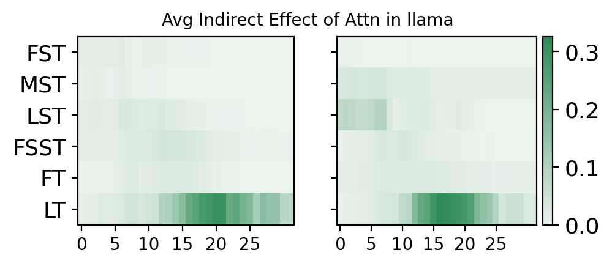
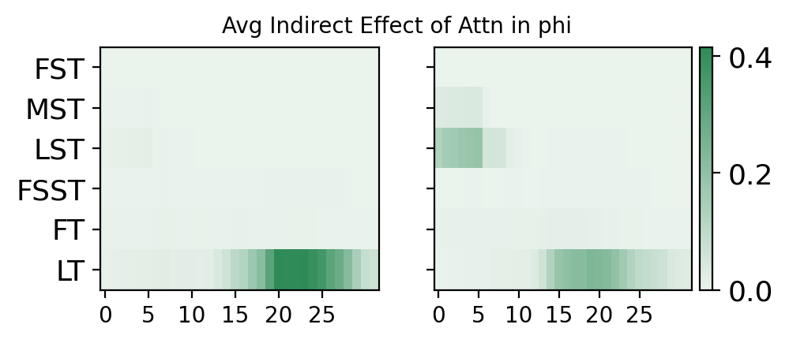

# 从RAG到参数的丰富化：探索语言模型如何借助外部知识，而非仅依赖参数信息，来精准回答事实查询问题

发布时间：2024年06月18日

`RAG

理由：这篇论文主要探讨了Retrieval Augmented Generation（RAG）的工作流程和机制，特别是在语言模型中的应用。它分析了RAG如何通过引入外部上下文来增强语言模型的推理能力，并揭示了模型在处理信息时的一些行为模式。因此，这篇论文更符合RAG分类，因为它专注于RAG技术的分析和理解。` `聊天机器人`

> From RAGs to rich parameters: Probing how language models utilize external knowledge over parametric information for factual queries

# 摘要

> Retrieval Augmented Generation (RAG) 通过引入外部上下文，提升了语言模型在推理时的能力，使其能更丰富地响应用户提示。这种方法在语言模型的搜索、问答和聊天机器人等应用中日益流行，但其确切机制尚不明晰。本文深入分析了 RAG 的工作流程，揭示了语言模型倾向于仅依赖上下文信息快速回答问题，而几乎不利用其内部参数记忆。我们通过因果中介分析和注意力机制分析，发现语言模型在回答问题时极少调用参数记忆，且其注意力主要集中在上下文中的其他信息而非问题本身。这种捷径行为在 LLaMa 和 Phi 系列模型中均有体现。

> Retrieval Augmented Generation (RAG) enriches the ability of language models to reason using external context to augment responses for a given user prompt. This approach has risen in popularity due to practical applications in various applications of language models in search, question/answering, and chat-bots. However, the exact nature of how this approach works isn't clearly understood. In this paper, we mechanistically examine the RAG pipeline to highlight that language models take shortcut and have a strong bias towards utilizing only the context information to answer the question, while relying minimally on their parametric memory. We probe this mechanistic behavior in language models with: (i) Causal Mediation Analysis to show that the parametric memory is minimally utilized when answering a question and (ii) Attention Contributions and Knockouts to show that the last token residual stream do not get enriched from the subject token in the question, but gets enriched from other informative tokens in the context. We find this pronounced shortcut behaviour true across both LLaMa and Phi family of models.

[Arxiv](https://arxiv.org/abs/2406.12824)