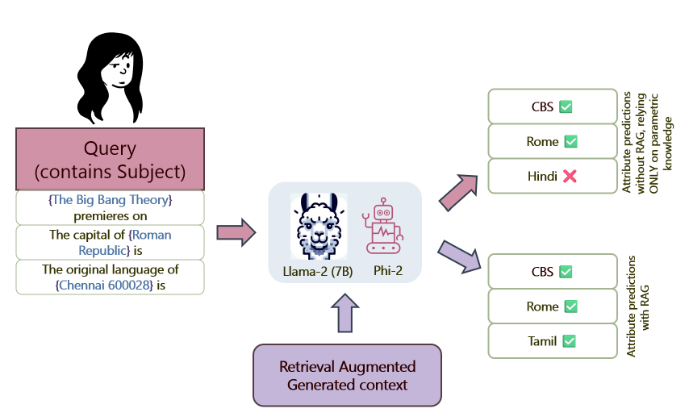
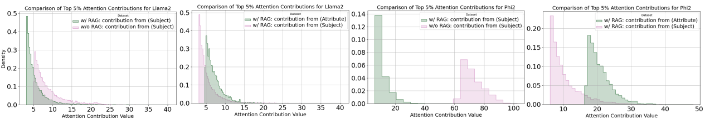

# 从 RAG 到参数的丰富化：探索语言模型如何借助外部知识，而非仅依赖参数信息，来解答事实性查询。

发布时间：2024年06月18日

`RAG

这篇论文主要探讨了Retrieval Augmented Generation (RAG) 的工作机制，特别是其在语言模型中的应用，以及如何通过外部上下文提升模型的推理能力。论文通过分析RAG的工作流程，揭示了语言模型在回答问题时对上下文信息的依赖性，以及参数记忆的有限利用。这些发现有助于理解RAG在语言模型中的具体运作方式，因此将其归类为RAG。` `聊天机器人`

> From RAGs to rich parameters: Probing how language models utilize external knowledge over parametric information for factual queries

# 摘要

> Retrieval Augmented Generation (RAG) 通过利用外部上下文，提升了语言模型在推理上的能力，使其能更丰富地响应用户提示。这种方法在语言模型的搜索、问答和聊天机器人等应用中日益流行。然而，其具体运作机制尚不明晰。本文深入分析了 RAG 的工作流程，揭示了语言模型倾向于依赖上下文信息快速回答问题，而较少依赖其内部参数记忆。我们通过因果中介分析和注意力机制分析，发现语言模型在回答问题时，参数记忆的利用有限，且最后一个令牌的残差流更多地受到上下文中其他信息令牌的影响，而非问题中的主题令牌。这种捷径行为在 LLaMa 和 Phi 系列模型中普遍存在。

> Retrieval Augmented Generation (RAG) enriches the ability of language models to reason using external context to augment responses for a given user prompt. This approach has risen in popularity due to practical applications in various applications of language models in search, question/answering, and chat-bots. However, the exact nature of how this approach works isn't clearly understood. In this paper, we mechanistically examine the RAG pipeline to highlight that language models take shortcut and have a strong bias towards utilizing only the context information to answer the question, while relying minimally on their parametric memory. We probe this mechanistic behavior in language models with: (i) Causal Mediation Analysis to show that the parametric memory is minimally utilized when answering a question and (ii) Attention Contributions and Knockouts to show that the last token residual stream do not get enriched from the subject token in the question, but gets enriched from other informative tokens in the context. We find this pronounced shortcut behaviour true across both LLaMa and Phi family of models.

[Arxiv](https://arxiv.org/abs/2406.12824)