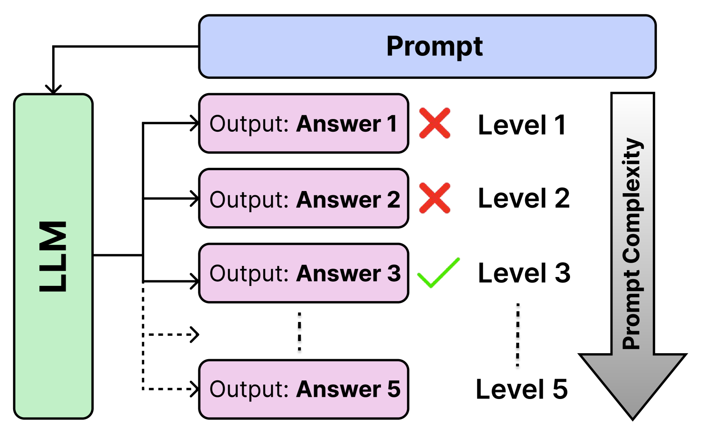
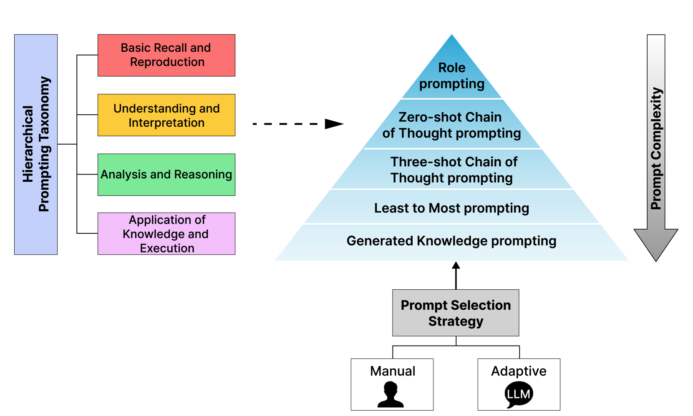
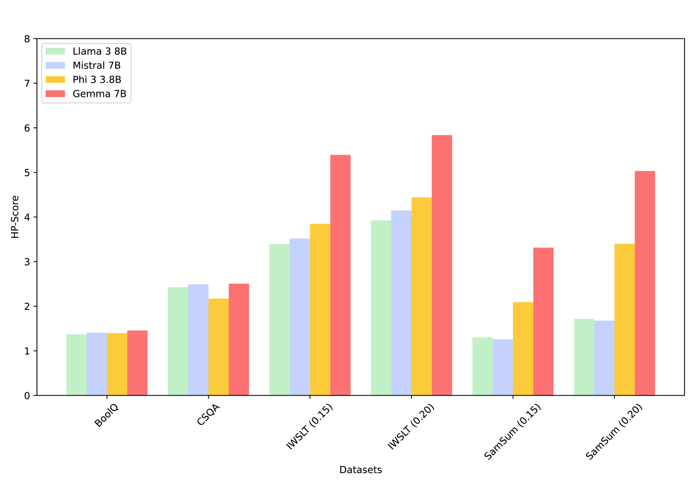
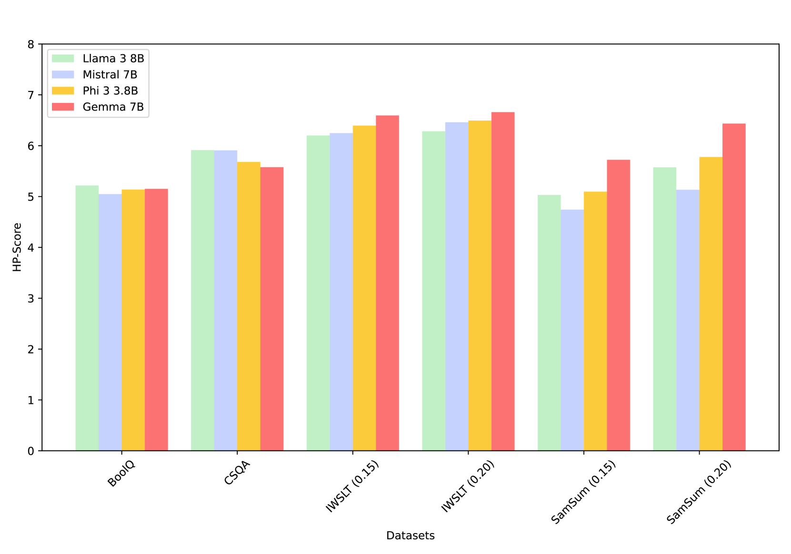
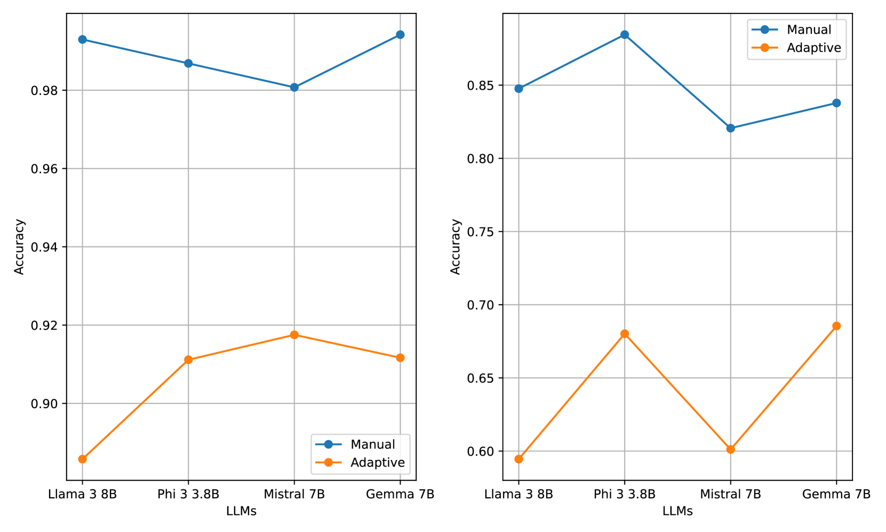
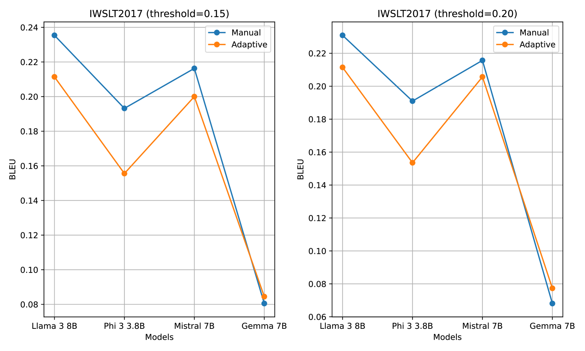
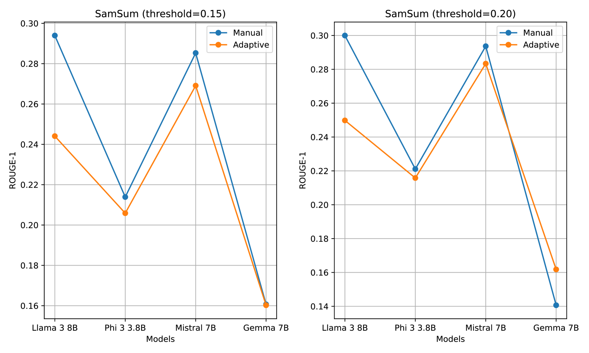
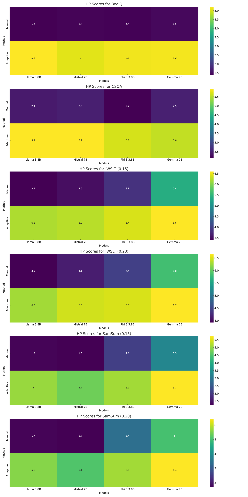
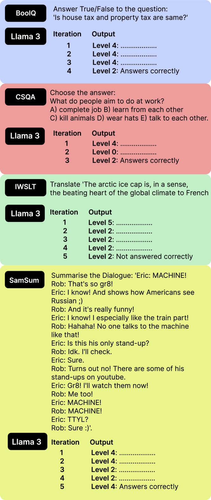

# 层次提示分类法：大型语言模型的通用评估体系

发布时间：2024年06月18日

`LLM理论

这篇论文主要探讨了大型语言模型（LLMs）的评估方法，提出了层次提示分类法（HPT）和层次提示框架（HPF），旨在更精确地评估LLMs在处理不同复杂度任务时的表现。这种方法不仅评估了模型的能力，还提供了一个衡量任务复杂度的通用标准。因此，这篇论文属于LLM理论分类，因为它关注的是LLMs的理论评估和性能分析，而不是直接的应用或Agent行为。` `机器学习评估`

> Hierarchical Prompting Taxonomy: A Universal Evaluation Framework for Large Language Models

# 摘要

> 为了深入理解大型语言模型（LLMs）的强项与短板，评估它们在处理各类任务时的表现至关重要。传统评估方法往往采用单一提示策略，忽视了任务复杂度的多样性。我们提出的层次提示分类法（HPT），通过一个包含五种独特提示策略的层次提示框架（HPF），从简至繁，更精准地评估LLMs，并提供更透彻的视角。HPT根据其规则为数据集和LLMs打分，即层次提示分数（HP-Score），这不仅揭示了它们解决多任务的能力，还提供了一个衡量任务复杂度的通用标准。此外，我们还开发了自适应层次提示框架，它能自动为各任务挑选最合适的提示策略。通过在四个数据集上对比四种LLMs（Llama 3 8B、Phi 3 3.8B、Mistral 7B和Gemma 7B）使用手动与自适应提示框架的效果，实验验证了HPT的有效性，为比较不同任务和LLM性能提供了一种可靠手段。本文推动了通用评估指标的建立，该指标既能评估数据集的复杂度，也能衡量LLMs的能力。手动与自适应HPF的实现均已公开。

> Assessing the effectiveness of large language models (LLMs) in addressing diverse tasks is essential for comprehending their strengths and weaknesses. Conventional evaluation techniques typically apply a single prompting strategy uniformly across datasets, not considering the varying degrees of task complexity. We introduce the Hierarchical Prompting Taxonomy (HPT), a taxonomy that employs a Hierarchical Prompt Framework (HPF) composed of five unique prompting strategies, arranged from the simplest to the most complex, to assess LLMs more precisely and to offer a clearer perspective. This taxonomy assigns a score, called the Hierarchical Prompting Score (HP-Score), to datasets as well as LLMs based on the rules of the taxonomy, providing a nuanced understanding of their ability to solve diverse tasks and offering a universal measure of task complexity. Additionally, we introduce the Adaptive Hierarchical Prompt framework, which automates the selection of appropriate prompting strategies for each task. This study compares manual and adaptive hierarchical prompt frameworks using four instruction-tuned LLMs, namely Llama 3 8B, Phi 3 3.8B, Mistral 7B, and Gemma 7B, across four datasets: BoolQ, CommonSenseQA (CSQA), IWSLT-2017 en-fr (IWSLT), and SamSum. Experiments demonstrate the effectiveness of HPT, providing a reliable way to compare different tasks and LLM capabilities. This paper leads to the development of a universal evaluation metric that can be used to evaluate both the complexity of the datasets and the capabilities of LLMs. The implementation of both manual HPF and adaptive HPF is publicly available.

[Arxiv](https://arxiv.org/abs/2406.12644)