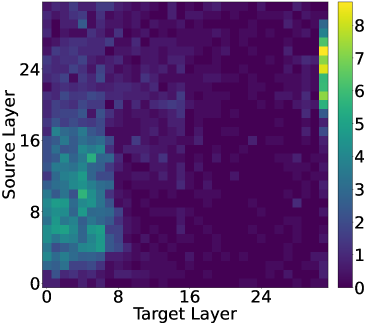

# 迟缓的跳跃：揭示大型语言模型应对多跳查询的挑战

发布时间：2024年06月18日

`LLM理论

这篇论文主要探讨了大型语言模型（LLMs）在处理复杂多步骤查询时的内部计算机制，特别是如何识别和处理桥梁实体以解决多跳查询。研究通过分析模型在不同层次上的处理过程，并提出了“反向修补”方法来优化模型性能。这一研究加深了对LLMs内部推理机制的理解，并提出了改进模型性能的新方法，因此属于LLM理论分类。` `人工智能`

> Hopping Too Late: Exploring the Limitations of Large Language Models on Multi-Hop Queries

# 摘要

> 大型语言模型（LLMs）虽能解决复杂的多步骤问题，但其内部计算机制仍是个谜。我们研究了LLMs如何处理如“Imagine的表演者的配偶是谁”这样的多跳查询，这类查询需经历两个信息提取阶段：首先确定“Imagine的表演者”为桥梁实体约翰·列侬，再确定“约翰·列侬的配偶”为目标实体小野洋子。关键在于理解模型如何处理这潜在的第一步。我们的分析揭示，桥梁实体的识别发生在模型的早期层，而两跳查询的解决则在后续层进行。然而，后续层可能因缺乏必要信息而无法正确预测答案。为此，我们创新性地提出了“反向修补”方法，将后续层的隐藏信息反馈至早期层。结果显示，高达57%的错误案例通过此方法得以纠正，证明后续层有时确实功能不足。我们的研究不仅增进了对LLMs内部推理机制的理解，也为优化其性能开辟了新途径。

> Large language models (LLMs) can solve complex multi-step problems, but little is known about how these computations are implemented internally. Motivated by this, we study how LLMs answer multi-hop queries such as "The spouse of the performer of Imagine is". These queries require two information extraction steps: a latent one for resolving the first hop ("the performer of Imagine") into the bridge entity (John Lennon), and one for resolving the second hop ("the spouse of John Lennon") into the target entity (Yoko Ono). Understanding how the latent step is computed internally is key to understanding the overall computation. By carefully analyzing the internal computations of transformer-based LLMs, we discover that the bridge entity is resolved in the early layers of the model. Then, only after this resolution, the two-hop query is solved in the later layers. Because the second hop commences in later layers, there could be cases where these layers no longer encode the necessary knowledge for correctly predicting the answer. Motivated by this, we propose a novel "back-patching" analysis method whereby a hidden representation from a later layer is patched back to an earlier layer. We find that in up to 57% of previously incorrect cases there exists a back-patch that results in the correct generation of the answer, showing that the later layers indeed sometimes lack the needed functionality. Overall our methods and findings open further opportunities for understanding and improving latent reasoning in transformer-based LLMs.

[Arxiv](https://arxiv.org/abs/2406.12775)