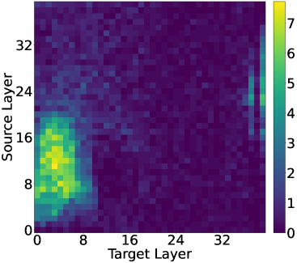

# 迟缓的跳跃：揭示大型语言模型应对多步骤查询的挑战

发布时间：2024年06月18日

`LLM理论

理由：这篇论文主要探讨了大型语言模型（LLMs）在处理多步骤查询时的内部计算机制，特别是关于如何解析桥梁实体和目标实体的过程。论文通过分析基于变压器的LLMs的内部运作，并提出了一种创新的“回补”分析方法来改进模型的推理能力。这些内容主要关注LLMs的理论和内部工作机制，而不是它们的应用、代理行为或检索增强生成（RAG）技术，因此最适合归类为LLM理论。` `知识推理`

> Hopping Too Late: Exploring the Limitations of Large Language Models on Multi-Hop Queries

# 摘要

> 大型语言模型（LLMs）能解决复杂的多步骤问题，但其内部计算机制尚不为人所知。为此，我们研究了LLMs如何处理多跳查询，如“Imagine的表演者的配偶是谁”，这类查询需经历两个信息提取阶段：首先，潜在步骤将“Imagine的表演者”解析为桥梁实体约翰·列侬；其次，将“约翰·列侬的配偶”解析为目标实体小野洋子。理解这一潜在步骤的内部计算机制至关重要。通过深入分析基于变压器的LLMs的内部运作，我们发现桥梁实体的解析发生在模型的早期层。随后，两跳查询在后续层中得以解决。然而，由于第二跳始于后续层，可能存在这些层缺乏正确预测答案所需知识的情况。基于此，我们提出了一种创新的“回补”分析方法，将后续层的隐藏表示回补至早期层。结果显示，高达57%的先前错误案例通过回补得以正确生成答案，表明后续层有时确实功能不足。我们的研究方法和发现为进一步理解和提升基于变压器的LLMs中的潜在推理能力开辟了新途径。

> Large language models (LLMs) can solve complex multi-step problems, but little is known about how these computations are implemented internally. Motivated by this, we study how LLMs answer multi-hop queries such as "The spouse of the performer of Imagine is". These queries require two information extraction steps: a latent one for resolving the first hop ("the performer of Imagine") into the bridge entity (John Lennon), and one for resolving the second hop ("the spouse of John Lennon") into the target entity (Yoko Ono). Understanding how the latent step is computed internally is key to understanding the overall computation. By carefully analyzing the internal computations of transformer-based LLMs, we discover that the bridge entity is resolved in the early layers of the model. Then, only after this resolution, the two-hop query is solved in the later layers. Because the second hop commences in later layers, there could be cases where these layers no longer encode the necessary knowledge for correctly predicting the answer. Motivated by this, we propose a novel "back-patching" analysis method whereby a hidden representation from a later layer is patched back to an earlier layer. We find that in up to 57% of previously incorrect cases there exists a back-patch that results in the correct generation of the answer, showing that the later layers indeed sometimes lack the needed functionality. Overall our methods and findings open further opportunities for understanding and improving latent reasoning in transformer-based LLMs.

[Arxiv](https://arxiv.org/abs/2406.12775)