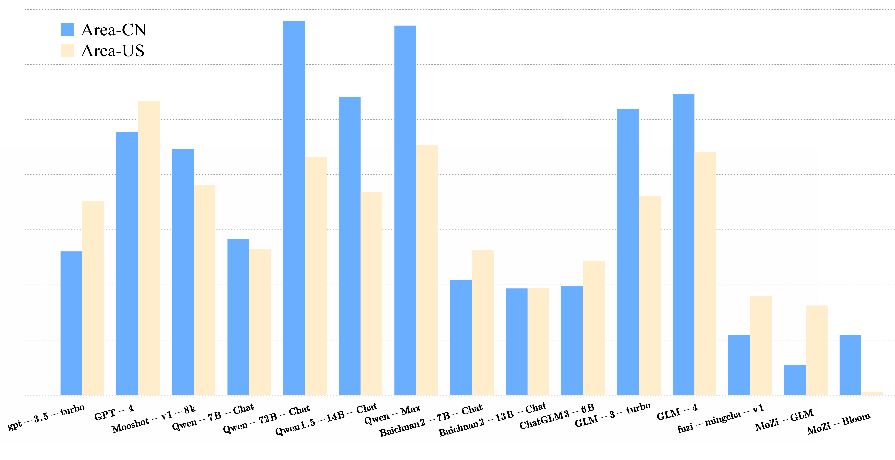

# IPEval：大型语言模型双语知识产权咨询评估新基准

发布时间：2024年06月18日

`Agent

这篇论文介绍了IPEval，这是一个专为知识产权（IP）领域的代理和咨询任务设计的评估基准。它旨在评估大型语言模型（LLMs）在理解、应用和推理方面的能力，特别是在知识产权领域。该评估基准包含多个选择题，覆盖了知识产权的多个方面，并采用了不同的评估方法（零-shot、5-few-shot和思维链（CoT））来测试七种LLM。这表明论文主要关注的是如何通过特定的评估工具来衡量和提升LLMs在特定领域（如知识产权）的代理能力，因此属于Agent分类。` `知识产权` `评估基准`

> IPEval: A Bilingual Intellectual Property Agency Consultation Evaluation Benchmark for Large Language Models

# 摘要

> 随着大型语言模型（LLMs）在知识产权（IP）等垂直领域的迅猛发展，目前尚缺乏一个专门的评估基准来衡量这些模型在理解、应用和推理方面的能力。为此，我们推出了IPEval，这是首个专为IP领域的代理和咨询任务设计的评估基准。IPEval包含2657个多选题，覆盖IP的创造、应用、保护和管理四大维度，涉及专利、商标、版权、商业秘密及相关法律。评估采用零-shot、5-few-shot和思维链（CoT）方法，针对七种LLM，主要使用英语或中文。结果表明，GPT系列和Qwen系列模型在英语测试中表现突出，而以中文为中心的LLMs在中文测试中同样出色，尽管专业IP LLMs在通用模型之后。IP的地域及时效性要求LLMs深入理解法律的细微差别和动态变化。IPEval的目标是精确评估LLM在IP领域的性能，并推动专业模型的发展。详情请访问：\url{https://ipeval.github.io/}

> The rapid development of Large Language Models (LLMs) in vertical domains, including intellectual property (IP), lacks a specific evaluation benchmark for assessing their understanding, application, and reasoning abilities. To fill this gap, we introduce IPEval, the first evaluation benchmark tailored for IP agency and consulting tasks. IPEval comprises 2657 multiple-choice questions across four major dimensions: creation, application, protection, and management of IP. These questions span patent rights (inventions, utility models, designs), trademarks, copyrights, trade secrets, and other related laws. Evaluation methods include zero-shot, 5-few-shot, and Chain of Thought (CoT) for seven LLM types, predominantly in English or Chinese. Results show superior English performance by models like GPT series and Qwen series, while Chinese-centric LLMs excel in Chinese tests, albeit specialized IP LLMs lag behind general-purpose ones. Regional and temporal aspects of IP underscore the need for LLMs to grasp legal nuances and evolving laws. IPEval aims to accurately gauge LLM capabilities in IP and spur development of specialized models. Website: \url{https://ipeval.github.io/}

[Arxiv](https://arxiv.org/abs/2406.12386)