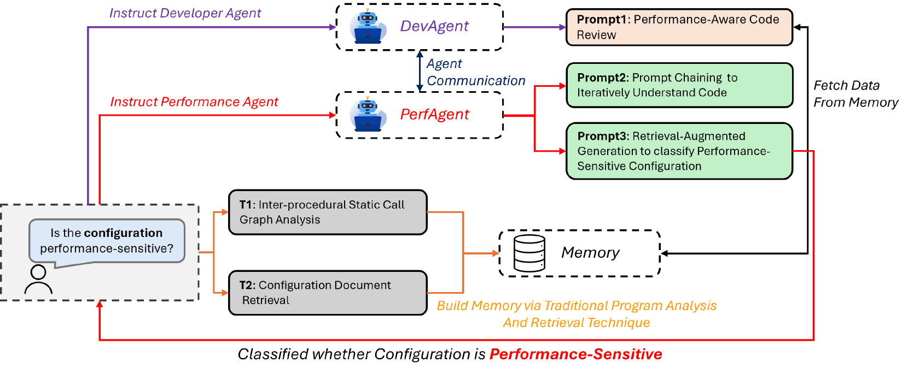
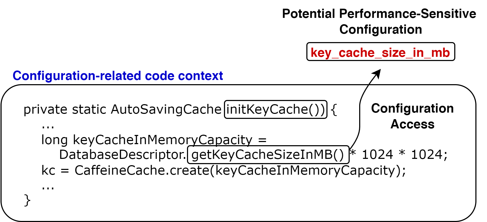

# 利用LLM代理深入代码分析，精准定位软件系统中影响性能的关键配置。

发布时间：2024年06月18日

`Agent

理由：该论文摘要描述了一个名为 PerfSense 的框架，它利用大型语言模型（LLMs）来识别关键的性能配置。这个框架通过一个LLM代理来实现，该代理使用了高级提示技术如提示链和检索增强生成。这里的“LLM代理”指的是一个系统或机制，它使用LLM来执行特定的任务，即识别和优化软件性能配置。因此，这个工作更符合Agent分类，因为它涉及使用LLM作为智能代理来处理特定问题。` `软件开发` `性能优化`

> Identifying Performance-Sensitive Configurations in Software Systems through Code Analysis with LLM Agents

# 摘要

> 配置设置是定制软件性能的关键，但错误的配置却屡见不鲜，且由于配置选项的繁多与复杂，找出那些影响性能的配置极具挑战。为此，我们开发了PerfSense框架，它巧妙地利用大型语言模型（LLMs），以极低的开销精准识别关键的性能配置。该框架通过LLM代理，采用如提示链和检索增强生成等高级提示技术，模拟了开发与性能工程的交互。在七个开源Java系统上的测试显示，PerfSense的平均准确率高达64.77%，超越了LLM基线（50.36%）及现有最佳方法（61.75%）。特别是，提示链技术在保持精确度的同时，将召回率提升了10%至30%。对362个误分类的深入分析揭示了LLMs对需求理解的不足（26.8%）。综上所述，PerfSense极大地减轻了人工分类的负担，并为基于LLM的代码分析研究指明了方向。

> Configuration settings are essential for tailoring software behavior to meet specific performance requirements. However, incorrect configurations are widespread, and identifying those that impact system performance is challenging due to the vast number and complexity of possible settings. In this work, we present PerfSense, a lightweight framework that leverages Large Language Models (LLMs) to efficiently identify performance-sensitive configurations with minimal overhead. PerfSense employs LLM agents to simulate interactions between developers and performance engineers using advanced prompting techniques such as prompt chaining and retrieval-augmented generation (RAG). Our evaluation of seven open-source Java systems demonstrates that PerfSense achieves an average accuracy of 64.77% in classifying performance-sensitive configurations, outperforming both our LLM baseline (50.36%) and the previous state-of-the-art method (61.75%). Notably, our prompt chaining technique improves recall by 10% to 30% while maintaining similar precision levels. Additionally, a manual analysis of 362 misclassifications reveals common issues, including LLMs' misunderstandings of requirements (26.8%). In summary, PerfSense significantly reduces manual effort in classifying performance-sensitive configurations and offers valuable insights for future LLM-based code analysis research.

[Arxiv](https://arxiv.org/abs/2406.12806)