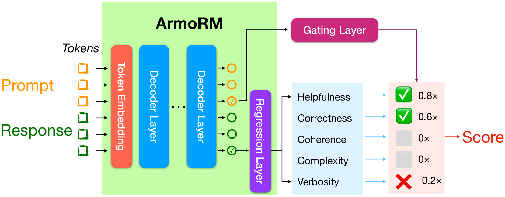

# 利用多目标奖励建模与专家混合策略，揭示偏好之可解释性

发布时间：2024年06月18日

`Agent

理由：这篇论文主要讨论了如何通过从人类反馈中学习强化学习（RLHF）来使大型语言模型（LLMs）与人类偏好对齐，并提出了一种新的奖励模型（RM）训练方法。这种方法涉及训练一个多目标绝对评分奖励模型（ArmoRM），并通过专家混合策略来选择最合适的奖励目标。这种模型可以被视为一个智能代理，因为它能够根据不同的上下文自动调整其行为以符合人类偏好。因此，这篇论文更符合Agent分类，因为它涉及创建和优化能够理解和响应人类偏好的智能系统。` `人工智能` `语言模型`

> Interpretable Preferences via Multi-Objective Reward Modeling and Mixture-of-Experts

# 摘要

> 从人类反馈中学习强化学习（RLHF）已成为大型语言模型（LLMs）与人类偏好对齐的首选方法。该过程通常从训练一个奖励模型（RM）开始，该模型利用人类偏好数据。传统RM通过比较同一请求的两个响应，用人类偏好评分来训练。尽管RM作为人类偏好的代理，但其黑盒特性导致输出难以解释，人类难以理解RM为何偏好某一响应。为了确保RM的决策与人类偏好一致并防止奖励破解，我们提出了一种两阶段方法：首先，训练一个多目标绝对评分奖励模型（ArmoRM），每个目标对应一个人类可解释的维度（如诚实、冗长、安全性）；其次，采用专家混合策略，通过门控网络根据上下文自动选择最合适的奖励目标。我们成功训练了ArmoRM-Llama3-8B，该模型在RewardBench上表现卓越，超越了GPT-4评判的LLM-as-a-judge方法，并接近了更大型的Nemotron-4 340B奖励模型的性能。

> Reinforcement learning from human feedback (RLHF) has emerged as the primary method for aligning large language models (LLMs) with human preferences. The RLHF process typically starts by training a reward model (RM) using human preference data. Conventional RMs are trained on pairwise responses to the same user request, with relative ratings indicating which response humans prefer. The trained RM serves as a proxy for human preferences. However, due to the black-box nature of RMs, their outputs lack interpretability, as humans cannot intuitively understand why an RM thinks a response is good or not. As RMs act as human preference proxies, we believe they should be human-interpretable to ensure that their internal decision processes are consistent with human preferences and to prevent reward hacking in LLM alignment. To build RMs with interpretable preferences, we propose a two-stage approach: i) train an Absolute-Rating Multi-Objective Reward Model (ArmoRM) with multi-dimensional absolute-rating data, each dimension corresponding to a human-interpretable objective (e.g., honesty, verbosity, safety); ii) employ a Mixture-of-Experts (MoE) strategy with a gating network that automatically selects the most suitable reward objectives based on the context. We efficiently trained an ArmoRM with Llama-3 8B and a gating network consisting of a shallow MLP on top of the ArmoRM. Our trained model, ArmoRM-Llama3-8B, obtains state-of-the-art performance on RewardBench, a benchmark evaluating RMs for language modeling. Notably, the performance of our model surpasses the LLM-as-a-judge method with GPT-4 judges by a margin, and approaches the performance of the much larger Nemotron-4 340B reward model.

[Arxiv](https://arxiv.org/abs/2406.12845)