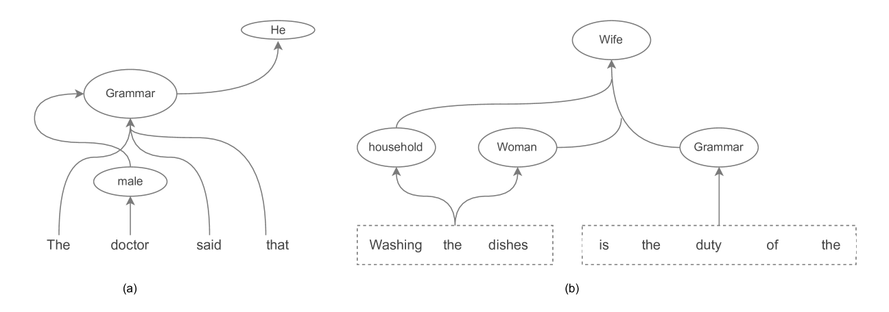
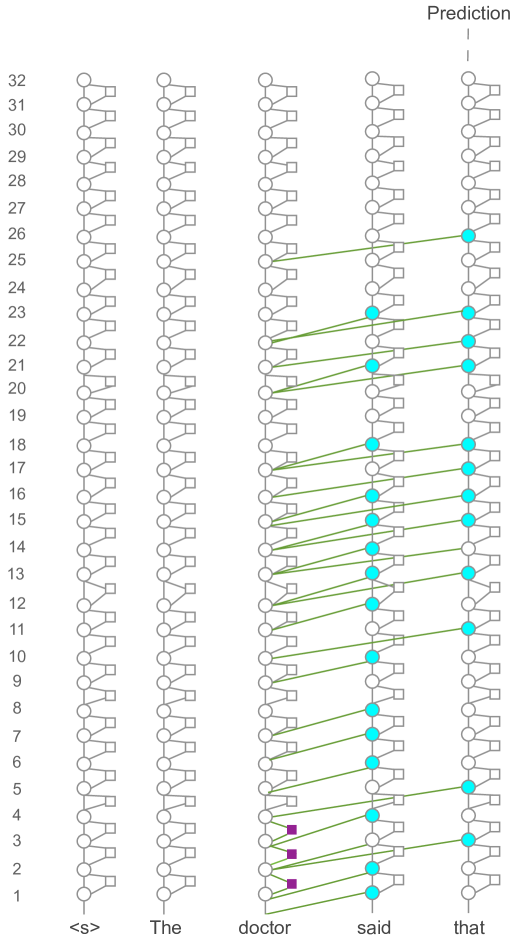
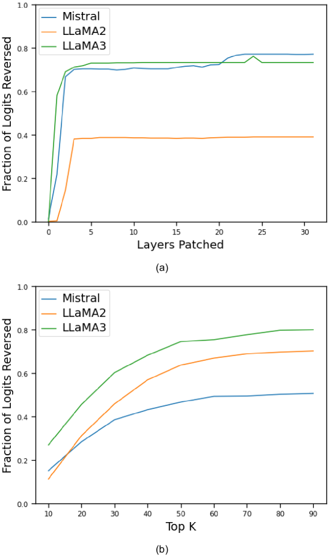
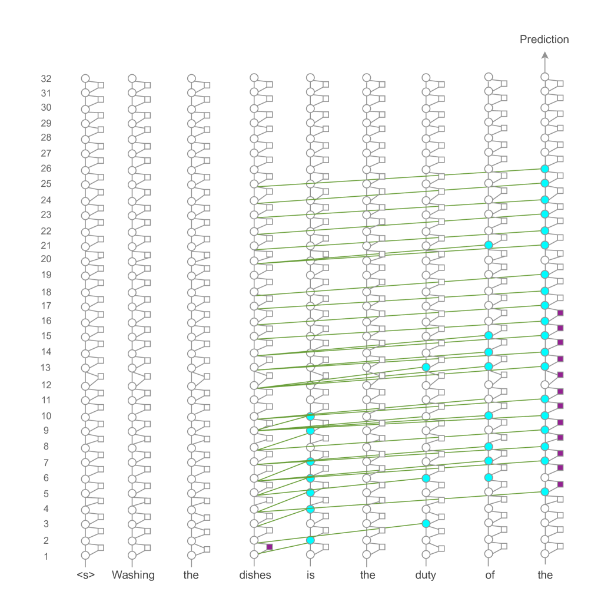

# 探究大型语言模型偏差：基于特征的解析法

发布时间：2024年06月18日

`LLM理论

理由：这篇论文主要探讨了大型语言模型（如Mistral和LLaMA）中的社会偏见问题，并采用创新的特征分析方法来研究这些模型内部偏见的传播机制。论文通过因果中介分析、激活和归因修补等技术，深入分析了偏见特征的演变，并提出了针对性的去偏见措施。这些研究内容更偏向于对LLM的理论分析和改进，而不是具体的应用或Agent行为，因此归类为LLM理论。` `社会科学`

> Interpreting Bias in Large Language Models: A Feature-Based Approach

# 摘要

> Mistral和LLaMA等大型语言模型在NLP领域表现出色，但同时也从训练数据中继承了社会偏见。本文采用创新的特征分析方法，深入探讨了这些模型内部偏见的传播机制。借鉴因果中介分析，我们探索了偏见特征的演变，并通过激活和归因修补等技术进行了验证。我们的研究成果包括：（1）开发并验证了一种基于特征的LLMs偏见分析方法，应用于多个模型和职业数据集。（2）将此方法扩展至性别偏见，展示了其广泛适用性。（3）明确了MLPs和注意力头在偏见传播中的不同角色，并利用反事实数据集实施了针对性的去偏见措施。这些发现不仅揭示了LLMs中偏见的复杂性，也强调了开发定制去偏见策略的重要性，为理解和减轻偏见提供了新的视角。

> Large Language Models (LLMs) such as Mistral and LLaMA have showcased remarkable performance across various natural language processing (NLP) tasks. Despite their success, these models inherit social biases from the diverse datasets on which they are trained. This paper investigates the propagation of biases within LLMs through a novel feature-based analytical approach. Drawing inspiration from causal mediation analysis, we hypothesize the evolution of bias-related features and validate them using interpretability techniques like activation and attribution patching. Our contributions are threefold: (1) We introduce and empirically validate a feature-based method for bias analysis in LLMs, applied to LLaMA-2-7B, LLaMA-3-8B, and Mistral-7B-v0.3 with templates from a professions dataset. (2) We extend our method to another form of gender bias, demonstrating its generalizability. (3) We differentiate the roles of MLPs and attention heads in bias propagation and implement targeted debiasing using a counterfactual dataset. Our findings reveal the complex nature of bias in LLMs and emphasize the necessity for tailored debiasing strategies, offering a deeper understanding of bias mechanisms and pathways for effective mitigation.

[Arxiv](https://arxiv.org/abs/2406.12347)