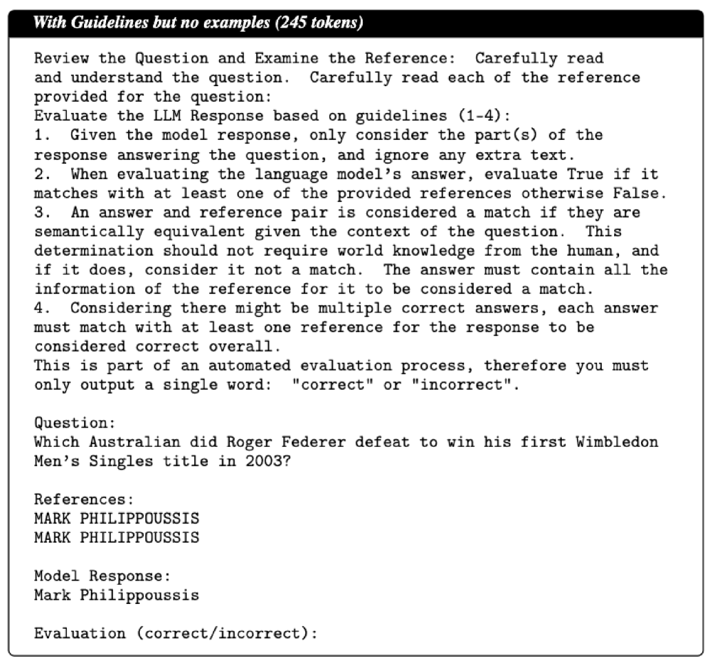

# 法官之鉴：探究大型语言模型担任法官时的校准与脆弱点

发布时间：2024年06月18日

`LLM应用

这篇论文探讨了大型语言模型（LLMs）作为评判者的应用，特别是在评估其他模型的表现时的效能和潜在偏见。研究通过使用TriviaQA基准测试，分析了不同LLMs在客观知识推理上的能力，并与人类注释进行对比。这种研究属于LLM应用的范畴，因为它关注的是LLMs在特定任务（即评估其他模型）中的实际应用和表现，而不是LLMs的理论基础或Agent的设计与实现。此外，这项研究也不涉及检索增强生成（RAG）技术。因此，最合适的分类是LLM应用。` `评估系统`

> Judging the Judges: Evaluating Alignment and Vulnerabilities in LLMs-as-Judges

# 摘要

> LLM-as-a-judge范式为解决人类评估的可扩展性问题提供了希望，正迅速成为评估大型语言模型的流行方法。尽管如此，关于其优劣及潜在偏见的问题仍悬而未决。本文深入探讨了多种LLMs作为评判者的表现，以TriviaQA为基准，评估了它们在客观知识推理上的能力，并与高一致性的人类注释进行了对比。研究涵盖了9种评判模型和9种应试者模型，包括基础与指令调整版本，分析了不同模型规模、家族及评判提示下的对齐情况。研究发现，Cohen's kappa比简单的百分比一致性更能准确衡量对齐度，揭示了高百分比一致性的评判者仍可能给出差异巨大的评分。尽管Llama-3 70B和GPT-4 Turbo与人类对齐度极高，但在应试者模型排名上，JudgeLM-7B和词汇评判Contains表现更佳，后者的人类对齐度领先34分。通过错误分析和其他研究，如指令长度和宽容偏差的影响，本文旨在为未来LLMs作为评判者的应用提供深刻洞见。

> Offering a promising solution to the scalability challenges associated with human evaluation, the LLM-as-a-judge paradigm is rapidly gaining traction as an approach to evaluating large language models (LLMs). However, there are still many open questions about the strengths and weaknesses of this paradigm, and what potential biases it may hold. In this paper, we present a comprehensive study of the performance of various LLMs acting as judges. We leverage TriviaQA as a benchmark for assessing objective knowledge reasoning of LLMs and evaluate them alongside human annotations which we found to have a high inter-annotator agreement. Our study includes 9 judge models and 9 exam taker models -- both base and instruction-tuned. We assess the judge model's alignment across different model sizes, families, and judge prompts. Among other results, our research rediscovers the importance of using Cohen's kappa as a metric of alignment as opposed to simple percent agreement, showing that judges with high percent agreement can still assign vastly different scores. We find that both Llama-3 70B and GPT-4 Turbo have an excellent alignment with humans, but in terms of ranking exam taker models, they are outperformed by both JudgeLM-7B and the lexical judge Contains, which have up to 34 points lower human alignment. Through error analysis and various other studies, including the effects of instruction length and leniency bias, we hope to provide valuable lessons for using LLMs as judges in the future.

[Arxiv](https://arxiv.org/abs/2406.12624)