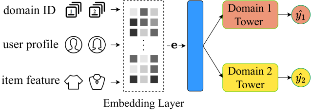
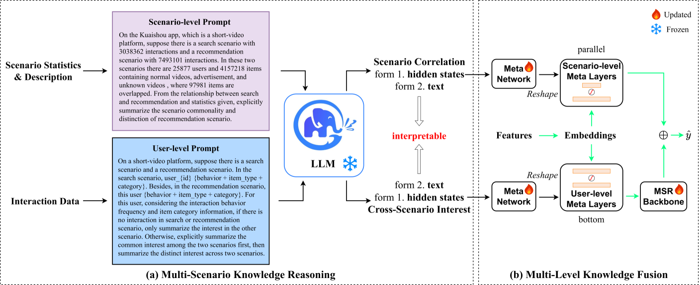
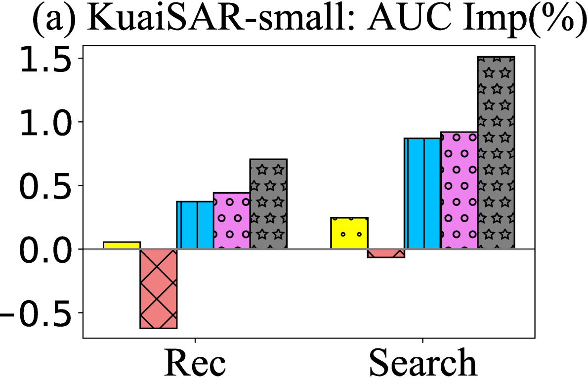
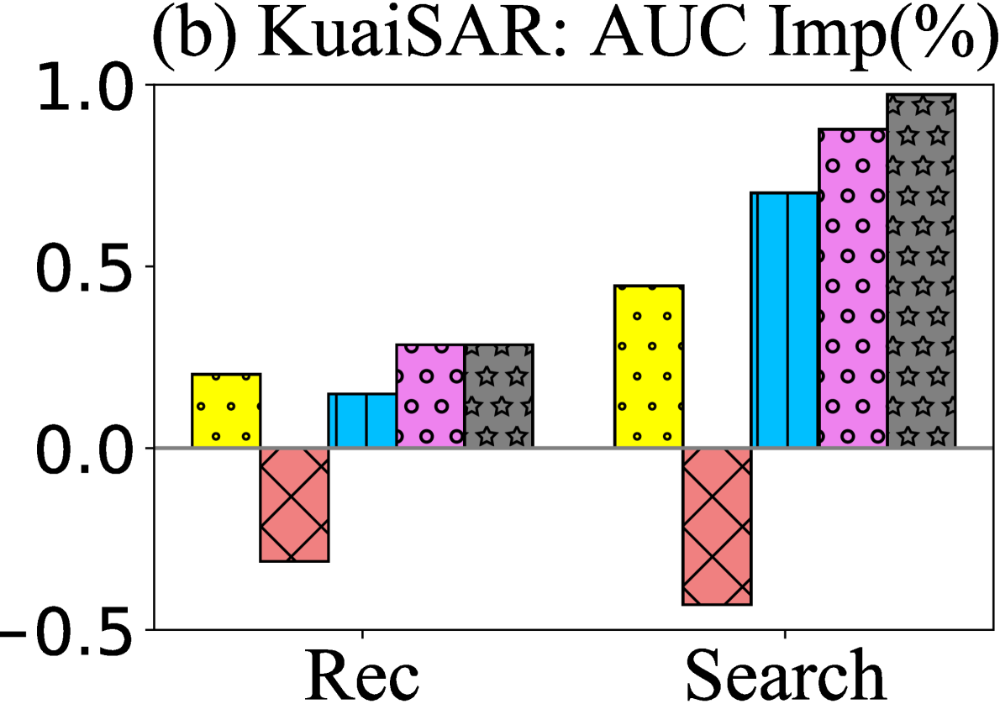
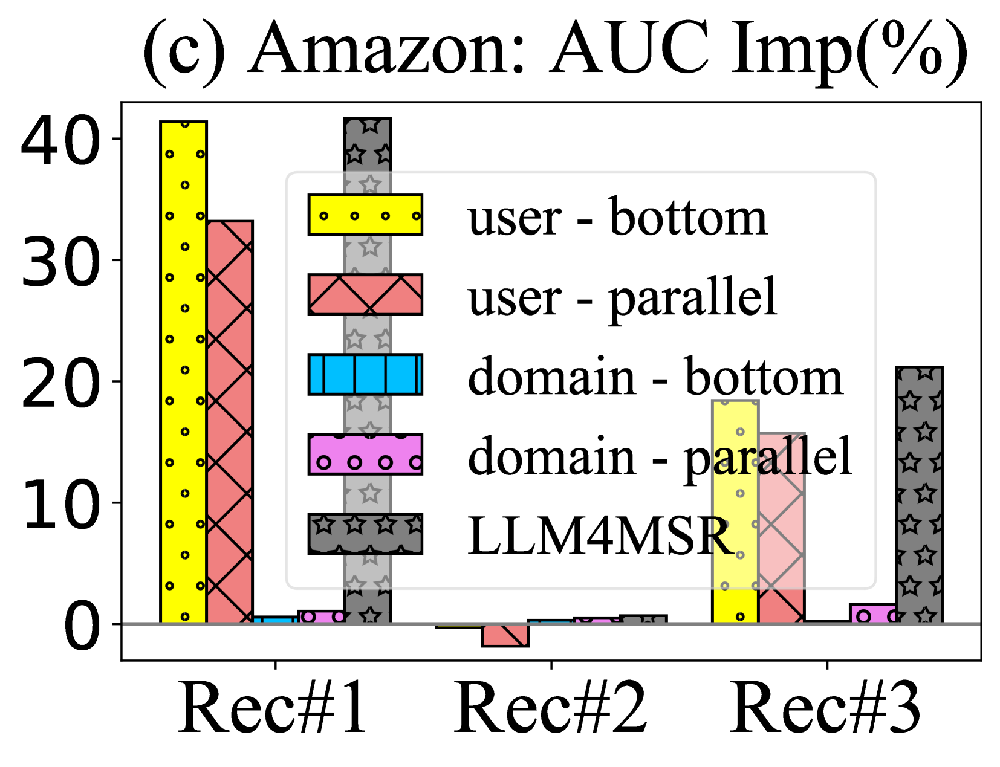
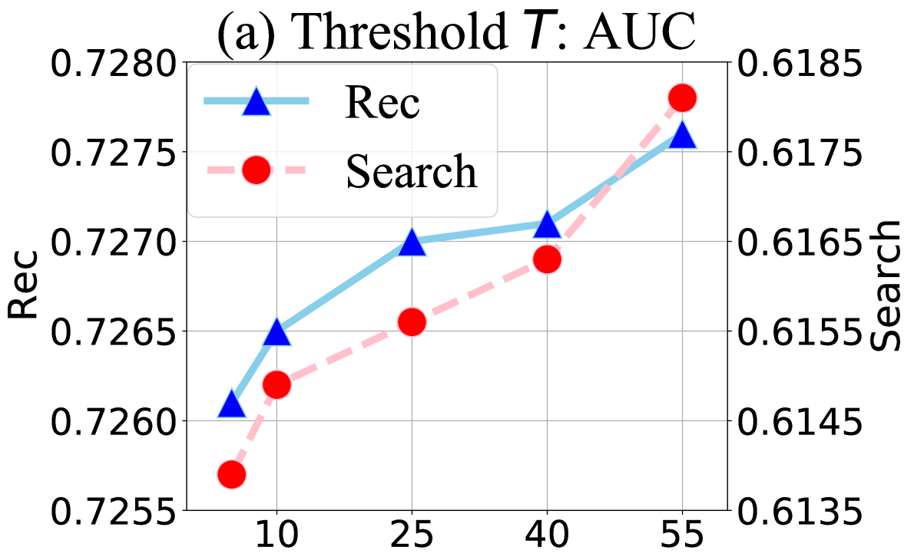
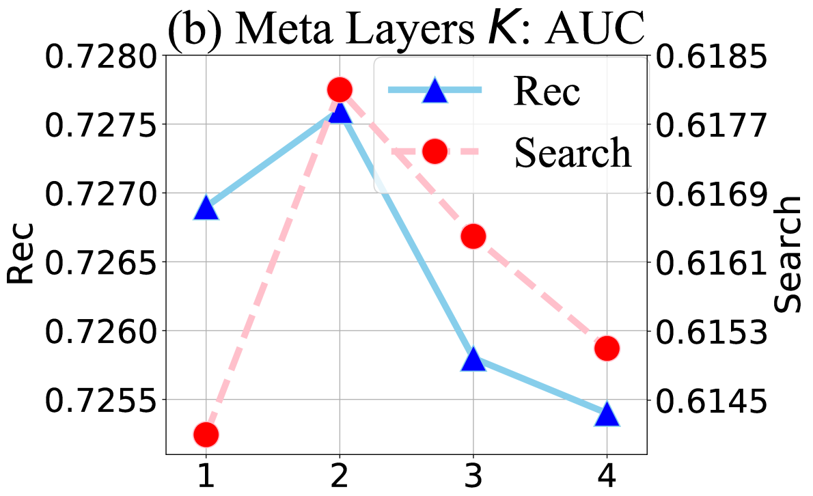
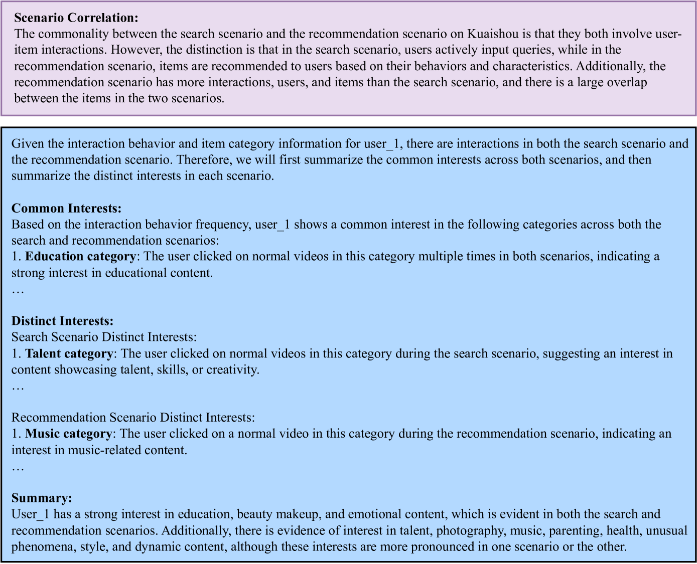

# LLM4MSR：大型语言模型赋能的多场景推荐新范式

发布时间：2024年06月18日

`LLM应用

理由：这篇论文介绍了一种名为LLM4MSR的框架，该框架利用大型语言模型（LLM）来增强多场景推荐系统的效果。论文中提到，该框架通过提取场景关联和用户跨场景兴趣等多级知识，并构建多级元网络来提升推荐系统的性能。这种方法直接应用了LLM技术来解决实际的推荐系统问题，因此属于LLM应用类别。` `电子商务` `推荐系统`

> LLM4MSR: An LLM-Enhanced Paradigm for Multi-Scenario Recommendation

# 摘要

> 随着个性化推荐需求的激增，以及商业场景的蓬勃发展，多场景推荐（MSR）研究备受瞩目，旨在通过整合多场景数据提升推荐效果。然而，现有方法未能充分挖掘场景间的关联，也未深入探索跨场景的个性化需求，导致推荐效果不尽如人意，且缺乏足够的解释性。同时，尽管大型语言模型（LLM）在推理和语义理解方面表现卓越，但其高昂的推理成本和计算开销限制了其在工业推荐系统中的应用。为此，我们提出了一种高效且可解释的LLM增强框架LLM4MSR。该框架首先利用LLM从定制的提示中提取场景关联和用户跨场景兴趣等多级知识，无需对LLM进行微调；随后，通过分层元网络构建多级元层，显著增强了场景感知和个性化推荐能力。我们在KuaiSAR-small、KuaiSAR和Amazon数据集上的实验表明，LLM4MSR不仅提升了推荐效果（分别提高了1.5%、1%和40%的AUC），还增强了系统的效率和可部署性，并提升了推荐的可解释性。相关代码和数据已公开，便于复现实验。

> As the demand for more personalized recommendation grows and a dramatic boom in commercial scenarios arises, the study on multi-scenario recommendation (MSR) has attracted much attention, which uses the data from all scenarios to simultaneously improve their recommendation performance. However, existing methods tend to integrate insufficient scenario knowledge and neglect learning personalized cross-scenario preferences, thus leading to suboptimal performance and inadequate interpretability. Meanwhile, though large language model (LLM) has shown great capability of reasoning and capturing semantic information, the high inference latency and high computation cost of tuning hinder its implementation in industrial recommender systems. To fill these gaps, we propose an effective efficient interpretable LLM-enhanced paradigm LLM4MSR in this work. Specifically, we first leverage LLM to uncover multi-level knowledge including scenario correlations and users' cross-scenario interests from the designed scenario- and user-level prompt without fine-tuning the LLM, then adopt hierarchical meta networks to generate multi-level meta layers to explicitly improves the scenario-aware and personalized recommendation capability. Our experiments on KuaiSAR-small, KuaiSAR, and Amazon datasets validate two significant advantages of LLM4MSR: (i) the effectiveness and compatibility with different multi-scenario backbone models (achieving 1.5%, 1%, and 40% AUC improvement on three datasets), (ii) high efficiency and deployability on industrial recommender systems, and (iii) improved interpretability. The implemented code and data is available to ease reproduction.

[Arxiv](https://arxiv.org/abs/2406.12529)