# LLMatDesign：借助大型语言模型实现材料发现的自主探索

发布时间：2024年06月18日

`Agent

这篇论文介绍了一种基于大型语言模型（LLMs）的全新语言驱动材料设计框架，名为LLMatDesign。该框架通过LLM代理，将人类指令转化为行动，对材料进行调整，并利用特定工具评估效果。这种代理能够自我审视过往决策，迅速适应新任务和环境，无需预先训练。因此，这篇论文更符合Agent分类，因为它主要讨论了如何通过LLM代理来实现材料设计的自动化和智能化。` `新材料开发` `自动驾驶实验室`

> LLMatDesign: Autonomous Materials Discovery with Large Language Models

# 摘要

> 发现新材料对科学和技术具有深远影响，但面对庞大的化学空间，这一挑战依旧艰巨。机器学习的最新进展虽已使数据驱动方法能够迅速筛选或创造有潜力的材料，但这些方法仍依赖于庞大的训练数据集，且往往缺乏材料发现所需的灵活性与化学洞察。我们推出了LLMatDesign，一种基于大型语言模型（LLMs）的全新语言驱动材料设计框架。该框架通过LLM代理，将人类指令转化为行动，对材料进行调整，并利用特定工具评估效果。借助对过往决策的自我审视，LLMatDesign能迅速适应新任务和环境，无需预先训练。通过在多个材料设计任务上的系统评估，我们证实了LLMatDesign在小数据环境下，根据用户设定的目标属性开发新材料的高效性。这一框架不仅展示了计算领域中自主LLM引导材料发现的巨大潜力，也为未来自动驾驶实验室的发展指明了方向。

> Discovering new materials can have significant scientific and technological implications but remains a challenging problem today due to the enormity of the chemical space. Recent advances in machine learning have enabled data-driven methods to rapidly screen or generate promising materials, but these methods still depend heavily on very large quantities of training data and often lack the flexibility and chemical understanding often desired in materials discovery. We introduce LLMatDesign, a novel language-based framework for interpretable materials design powered by large language models (LLMs). LLMatDesign utilizes LLM agents to translate human instructions, apply modifications to materials, and evaluate outcomes using provided tools. By incorporating self-reflection on its previous decisions, LLMatDesign adapts rapidly to new tasks and conditions in a zero-shot manner. A systematic evaluation of LLMatDesign on several materials design tasks, in silico, validates LLMatDesign's effectiveness in developing new materials with user-defined target properties in the small data regime. Our framework demonstrates the remarkable potential of autonomous LLM-guided materials discovery in the computational setting and towards self-driving laboratories in the future.

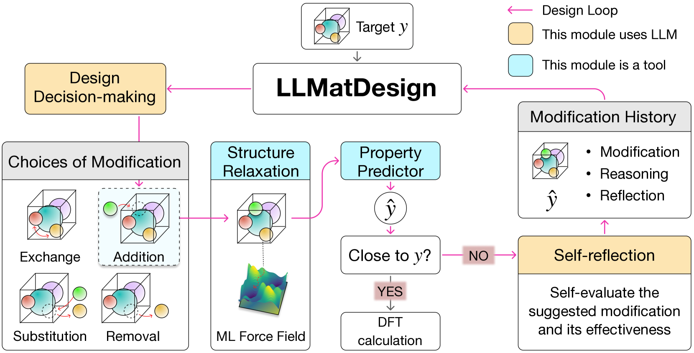

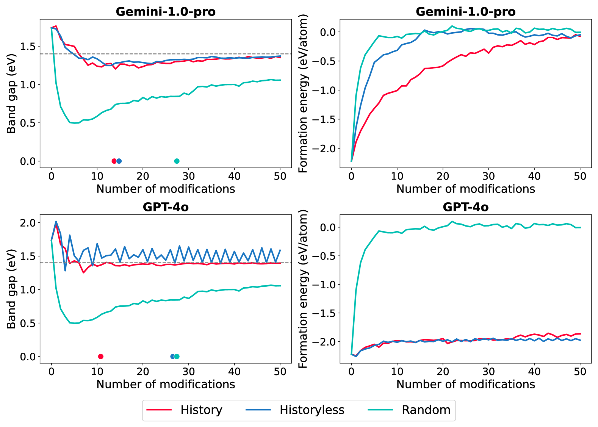

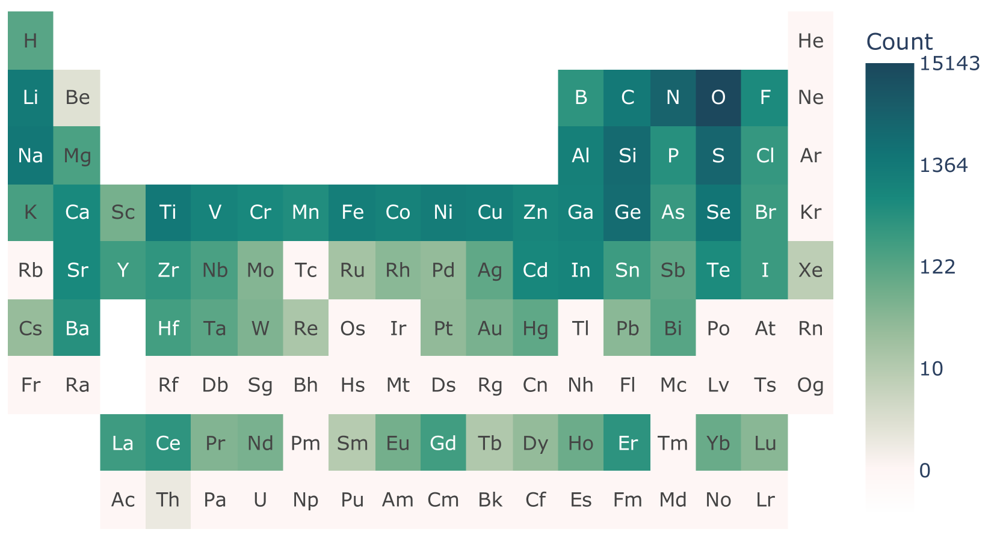

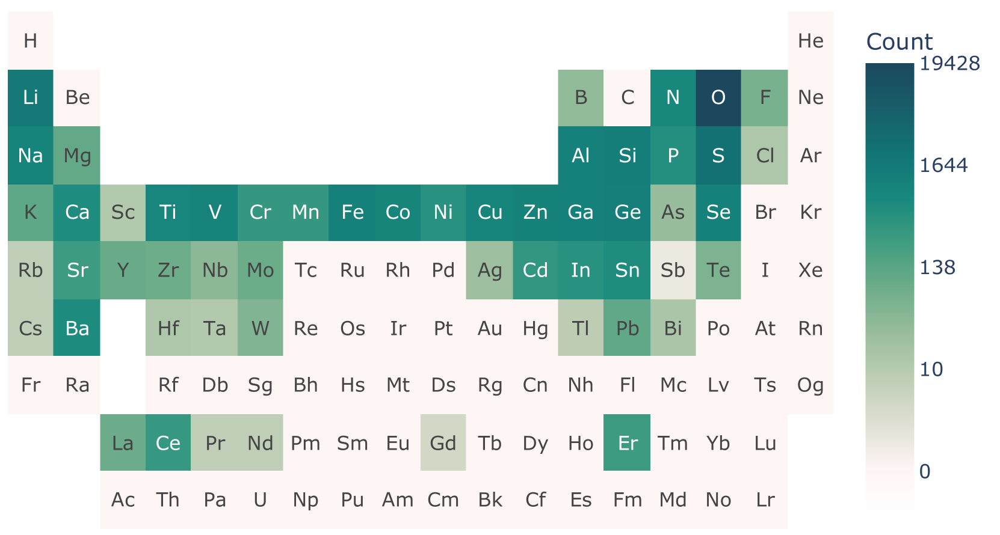

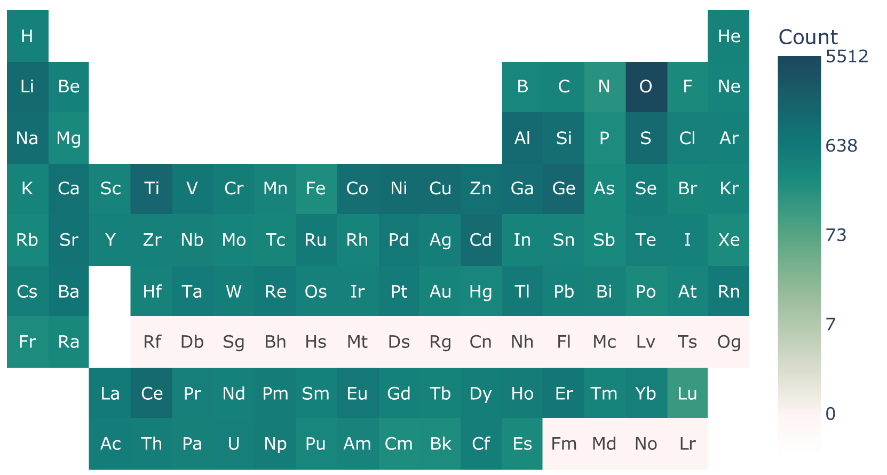

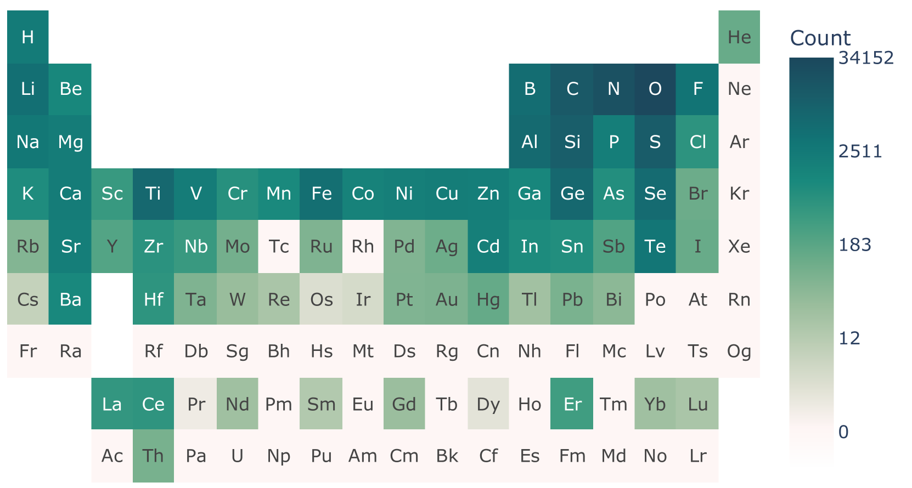

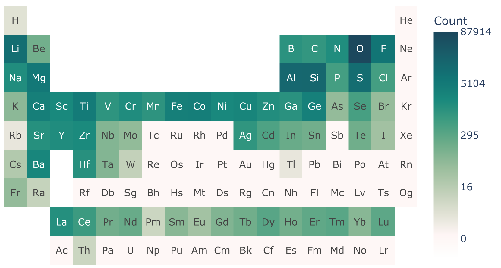

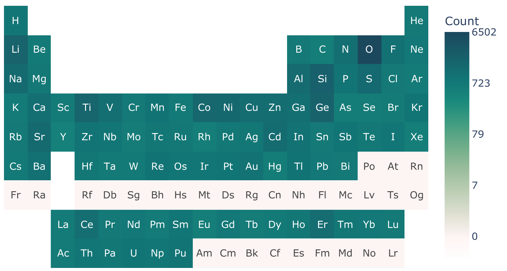

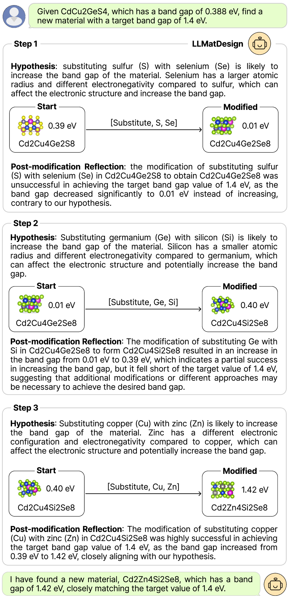

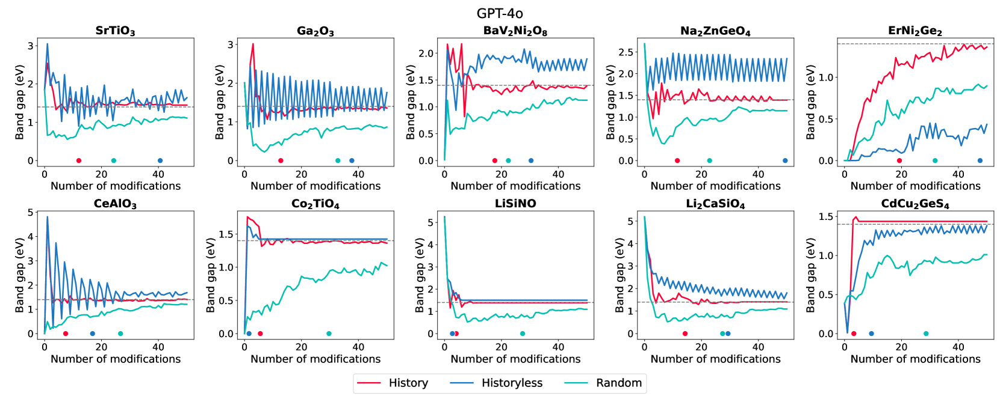

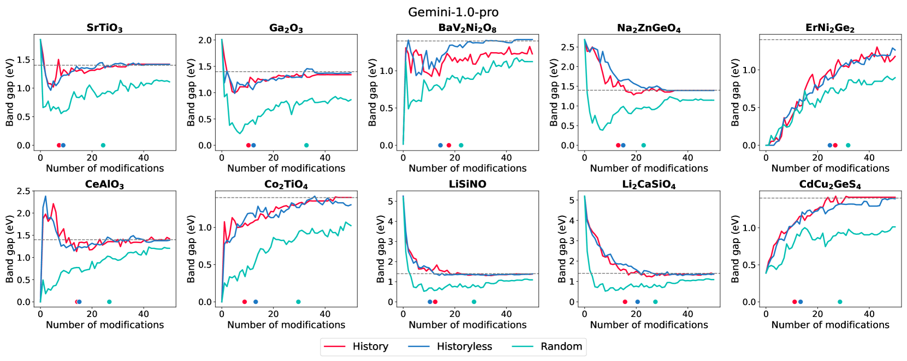

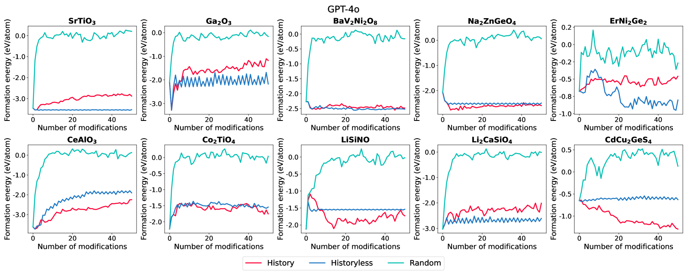

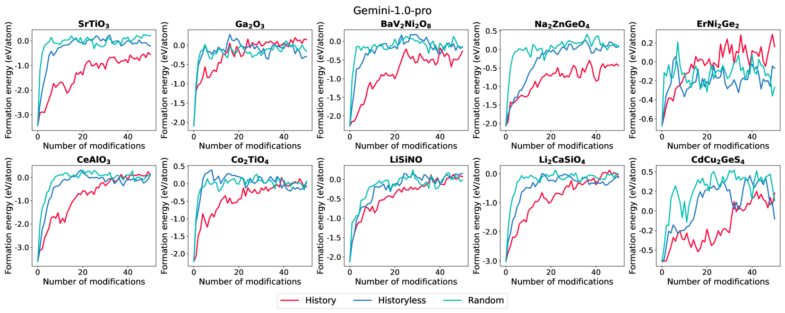

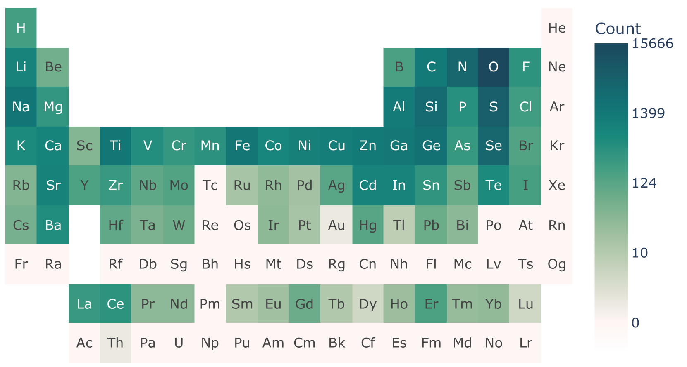

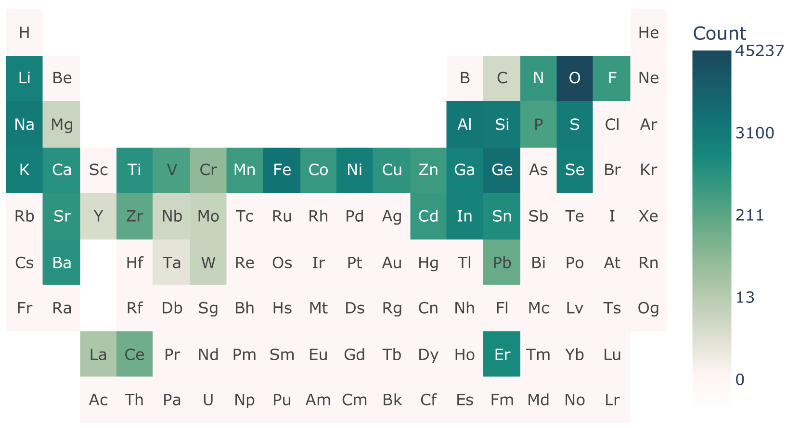

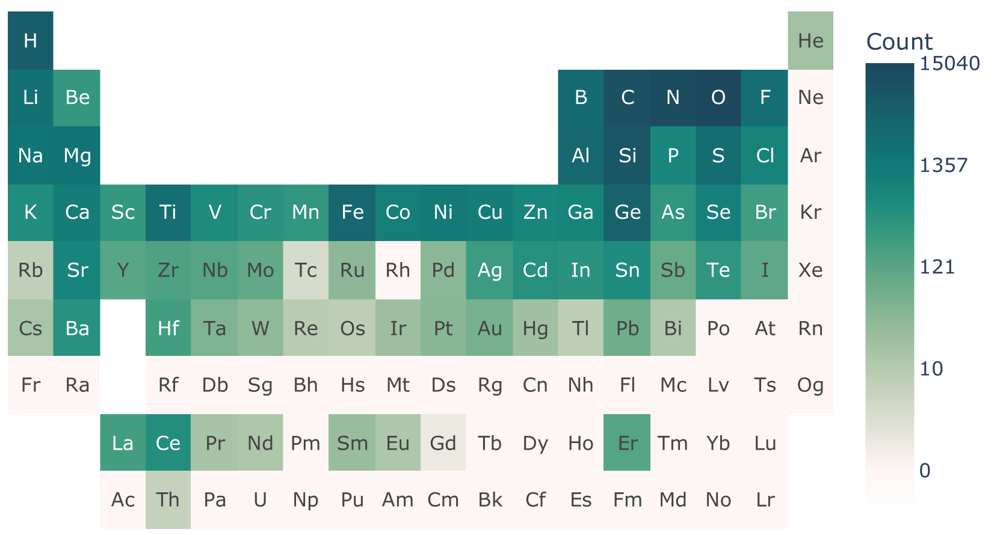

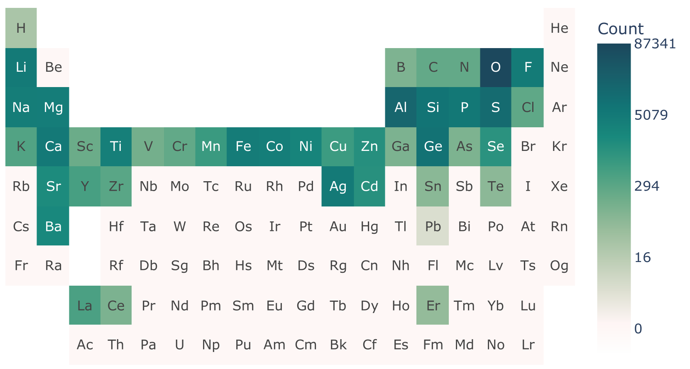

[Arxiv](https://arxiv.org/abs/2406.13163)