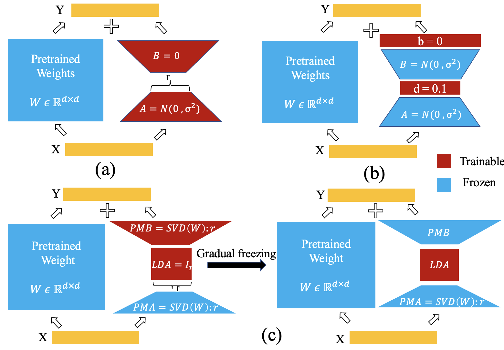
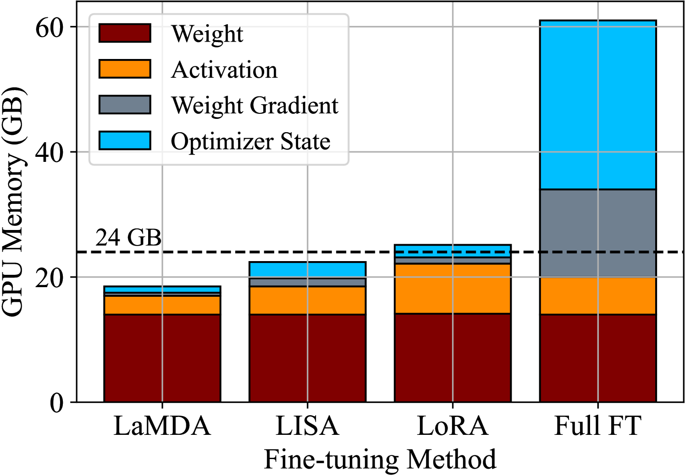
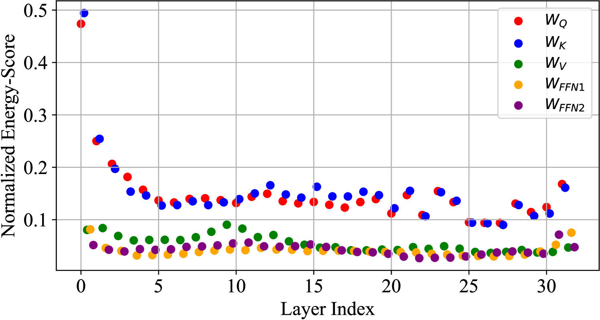
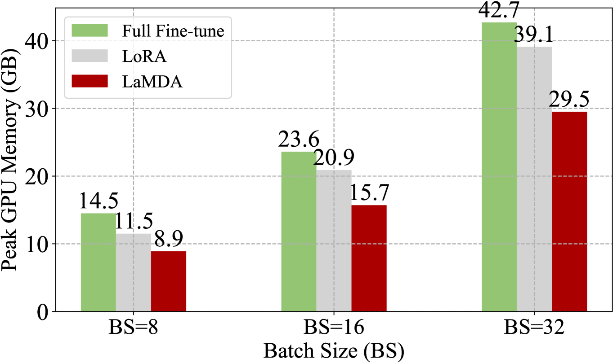
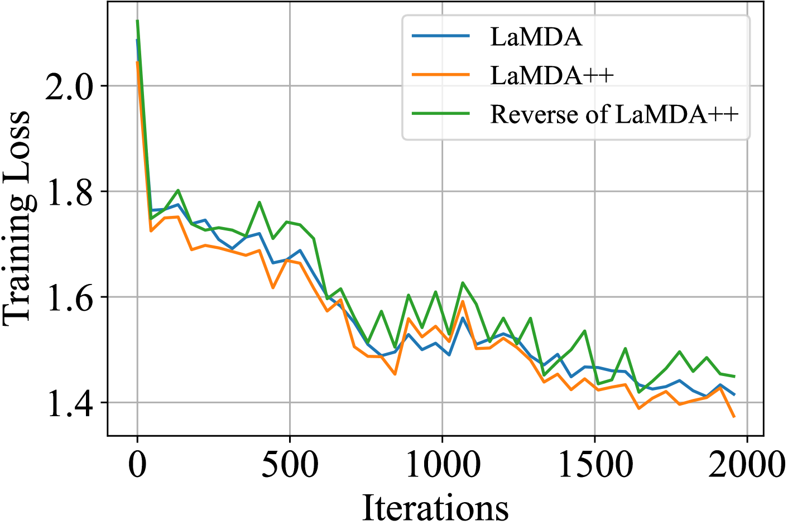

# LaMDA：大型模型微调新策略——频谱分解下的低维适应性调整

发布时间：2024年06月18日

`LLM理论

这篇论文主要探讨了大型语言模型（LLMs）的微调方法，特别是通过提出一种名为LaMDA的新方法来减少可训练参数和GPU内存的需求。这种方法通过光谱分解实现低维适应，有效地降低了计算成本和内存需求。论文的内容涉及LLM的理论改进和优化，因此属于LLM理论分类。` `模型优化`

> LaMDA: Large Model Fine-Tuning via Spectrally Decomposed Low-Dimensional Adaptation

# 摘要

> 低秩适应（LoRA）因其显著减少可训练参数而成为微调大型语言模型（LLMs）的首选方法。但随着模型嵌入维度的增加，LoRA的计算成本也随之攀升，且反向传播过程中对高维中间变量和优化器状态的存储需求也极大。本文提出了一种名为LaMDA的新方法，通过光谱分解实现低维适应，有效降低了可训练参数和GPU内存的峰值需求。LaMDA在微调过程中冻结部分投影矩阵，并引入低维可训练矩阵，大幅削减了参数和内存需求。此外，LaMDA在微调初期逐步冻结另一投影矩阵，进一步降低了计算成本，提升了参数效率。我们还推出了增强版LaMDA++，通过预训练模型权重的光谱分析，实现了LoRA路径的“轻量级”秩自适应。在自然语言理解、文本摘要、自然语言生成及复杂推理等多项任务中，LaMDA/LaMDA++展现了与现有技术相媲美甚至更优的性能，同时微调过程中的参数更新和GPU内存使用大幅减少。相关代码将公开发布。

> Low-rank adaptation (LoRA) has become the default approach to fine-tune large language models (LLMs) due to its significant reduction in trainable parameters. However, trainable parameter demand for LoRA increases with increasing model embedding dimensions, leading to high compute costs. Additionally, its backward updates require storing high-dimensional intermediate activations and optimizer states, demanding high peak GPU memory. In this paper, we introduce large model fine-tuning via spectrally decomposed low-dimensional adaptation (LaMDA), a novel approach to fine-tuning large language models, which leverages low-dimensional adaptation to achieve significant reductions in trainable parameters and peak GPU memory footprint. LaMDA freezes a first projection matrix (PMA) in the adaptation path while introducing a low-dimensional trainable square matrix, resulting in substantial reductions in trainable parameters and peak GPU memory usage. LaMDA gradually freezes a second projection matrix (PMB) during the early fine-tuning stages, reducing the compute cost associated with weight updates to enhance parameter efficiency further. We also present an enhancement, LaMDA++, incorporating a ``lite-weight" adaptive rank allocation for the LoRA path via normalized spectrum analysis of pre-trained model weights. We evaluate LaMDA/LaMDA++ across various tasks, including natural language understanding with the GLUE benchmark, text summarization, natural language generation, and complex reasoning on different LLMs. Results show that LaMDA matches or surpasses the performance of existing alternatives while requiring up to 17.7x fewer parameter updates and up to 1.32x lower peak GPU memory usage during fine-tuning. Code will be publicly available.

[Arxiv](https://arxiv.org/abs/2406.12832)