# 大型语言模型：通用临床多任务解码器

发布时间：2024年06月18日

`Agent

这篇论文提出了一种利用预训练的大型语言模型作为通用临床多任务解码器的新策略，以应对多样化的临床任务。这种方法通过语言的灵活性和多样性来适应任务的变化，并且能够通过更新指令模板来适应新增任务。论文强调了该框架在多任务预测上的稳健表现，以及对新任务的强适应性和在零-shot和少数-shot场景下的数据效率。这种策略可以被视为一个智能Agent，因为它能够自主地处理和适应不同的临床任务，提供了一种一体化的解决方案。因此，这篇论文最适合归类为Agent。` `机器学习`

> Large Language Model as a Universal Clinical Multi-task Decoder

# 摘要

> 提升临床系统效率与准确性的机器学习方法开发至关重要。尽管研究众多，但应对多样化临床任务及新兴任务的挑战依旧艰巨。本文提出一种新策略，利用预训练的大型语言模型作为通用临床多任务解码器，通过语言的灵活性与多样性应对任务变化及其相关参数。新增任务仅需更新指令模板。经过数百项任务验证，该框架在多任务预测上表现稳健，与传统方法并驾齐驱，且对新任务适应性强，零-shot性能出众，少数-shot场景下数据效率卓越。此创新方法为临床领域的新兴任务提供了一体化解决方案。

> The development of effective machine learning methodologies for enhancing the efficiency and accuracy of clinical systems is crucial. Despite significant research efforts, managing a plethora of diversified clinical tasks and adapting to emerging new tasks remain significant challenges. This paper presents a novel paradigm that employs a pre-trained large language model as a universal clinical multi-task decoder. This approach leverages the flexibility and diversity of language expressions to handle task topic variations and associated arguments. The introduction of a new task simply requires the addition of a new instruction template. We validate this framework across hundreds of tasks, demonstrating its robustness in facilitating multi-task predictions, performing on par with traditional multi-task learning and single-task learning approaches. Moreover, it shows exceptional adaptability to new tasks, with impressive zero-shot performance in some instances and superior data efficiency in few-shot scenarios. This novel approach offers a unified solution to manage a wide array of new and emerging tasks in clinical applications.

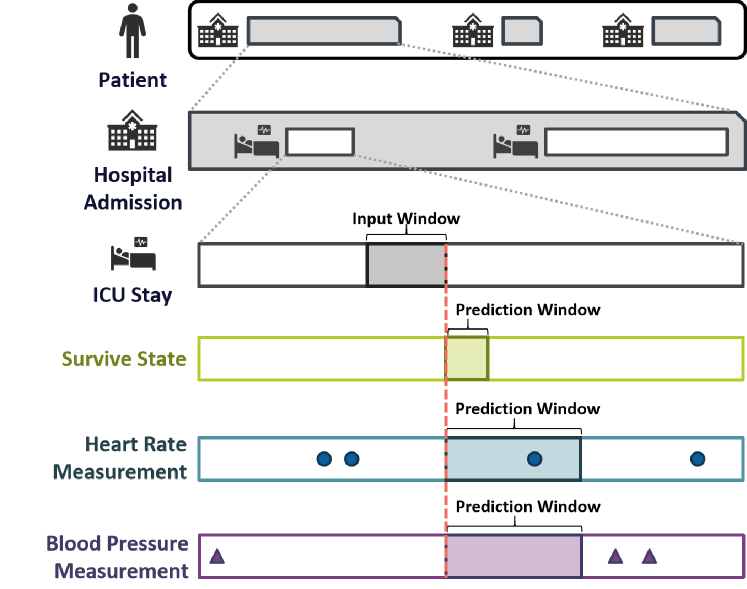

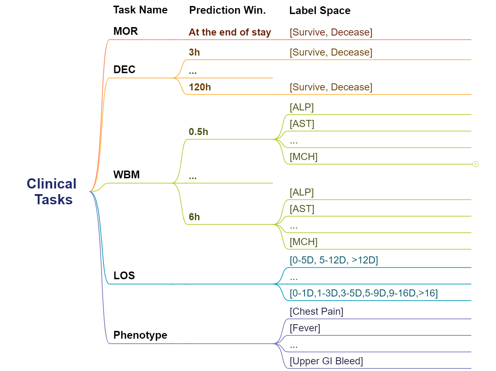

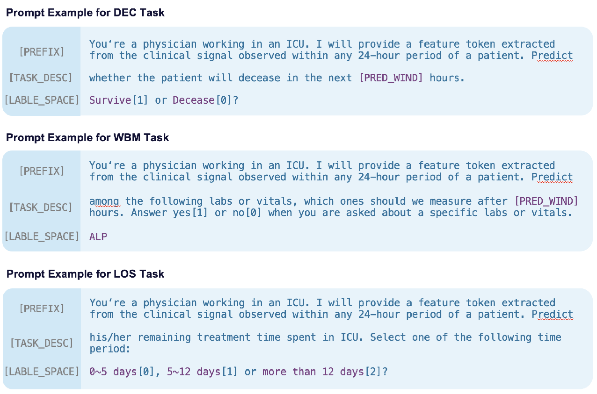

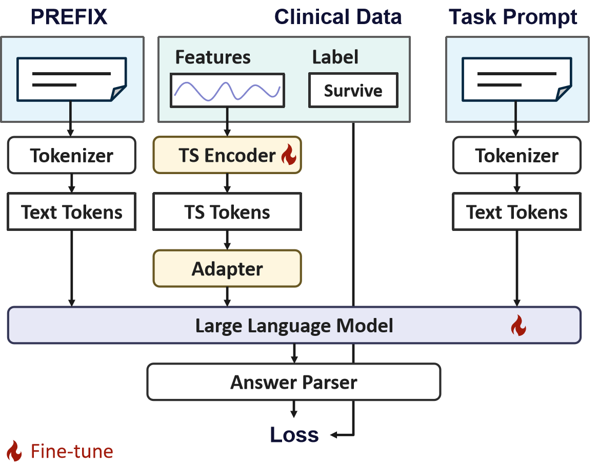

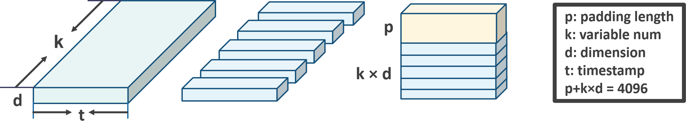

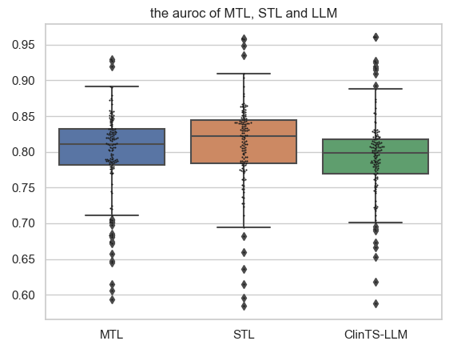

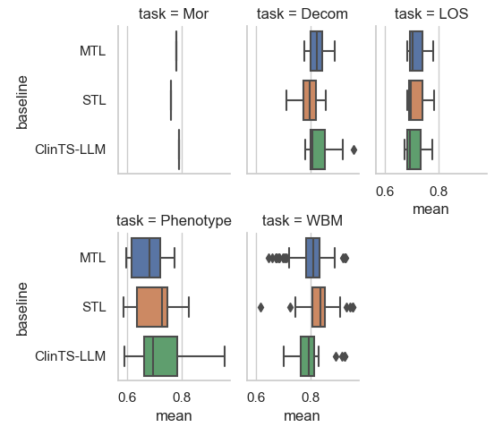

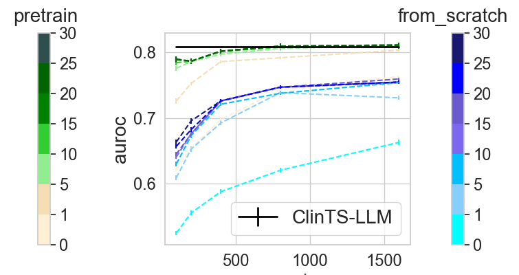

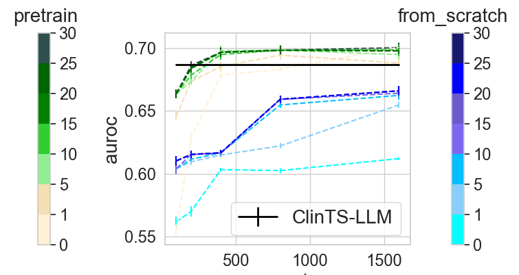

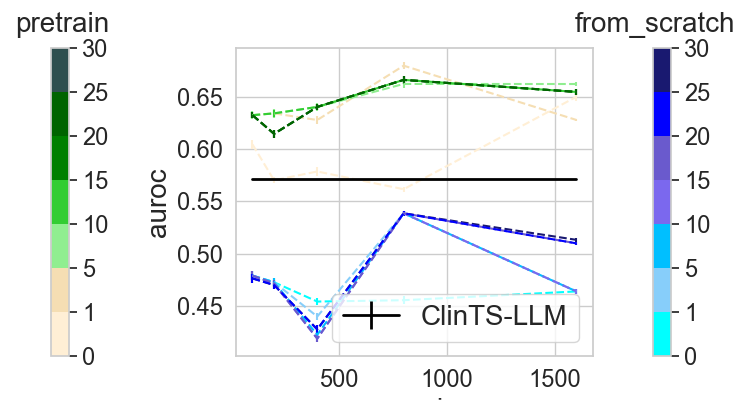

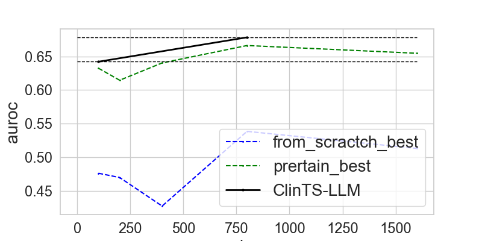

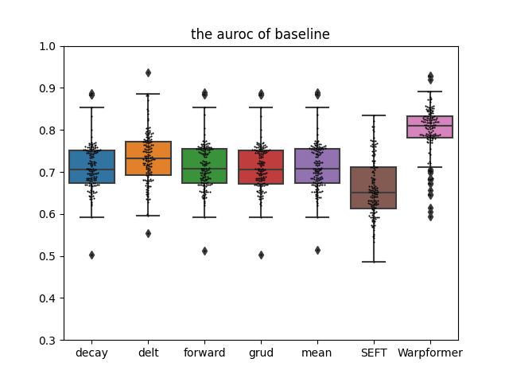

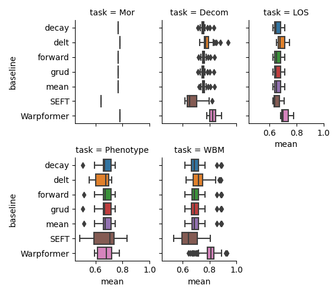

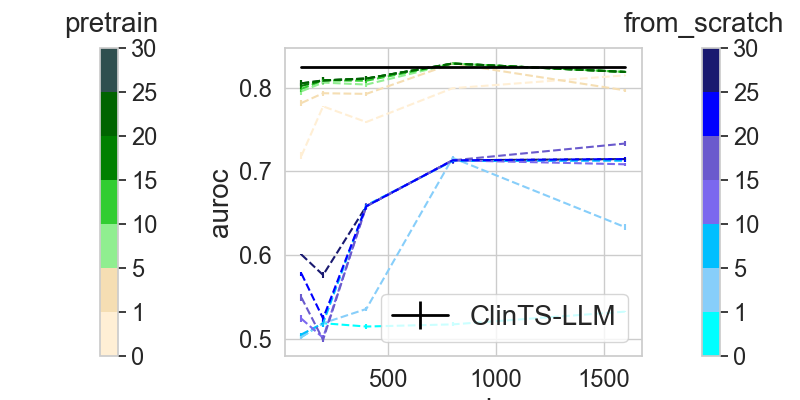

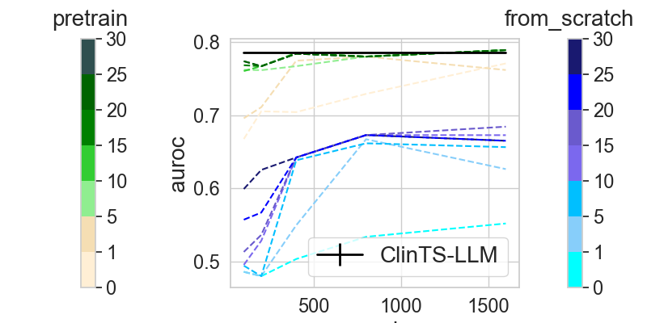

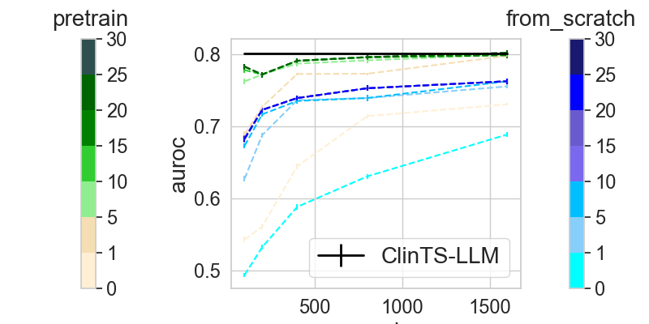

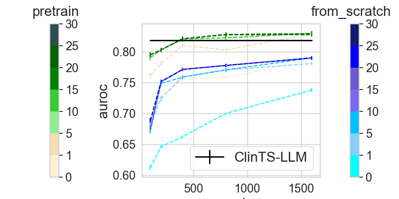

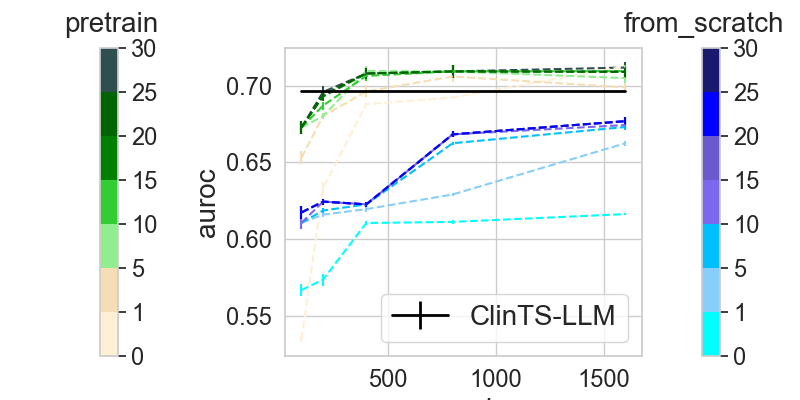

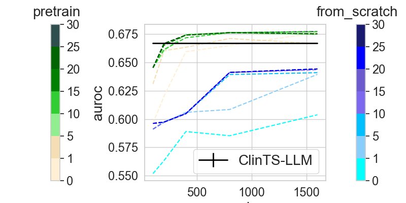

[Arxiv](https://arxiv.org/abs/2406.12738)