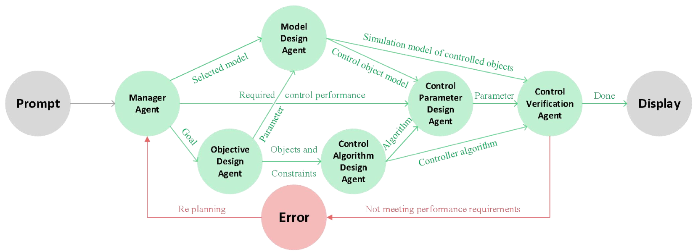

# 大型语言模型驱动的多代理框架，专为电力电子领域的目标导向控制设计而生

发布时间：2024年06月18日

`Agent

这篇论文提出了一种基于大型语言模型的多代理框架，用于优化功率电子学的控制设计。该框架利用LLMs的推理能力和多代理协作，实现了一个高效自主的控制器设计流程。这种基于代理的方法特别强调了代理的理解和执行自然语言指令的能力，以及根据任务需求和实际操作限制灵活调整策略的能力。因此，这篇论文更适合归类在Agent分类中，因为它主要探讨了如何使用代理（特别是基于LLM的代理）来解决实际问题。` `电力系统` `控制工程`

> Large Language Models based Multi-Agent Framework for Objective Oriented Control Design in Power Electronics

# 摘要

> 功率电子学在现代电力系统中扮演着至关重要的角色，但其控制设计却面临模型不确定性和高成本长周期的挑战。本文提出了一种基于大型语言模型的多代理框架，旨在优化功率电子学的控制设计。该框架通过整合LLMs的推理能力与多代理协作，实现了高效自主的控制器设计流程。LLM代理能理解并执行自然语言中的高级指令，根据任务需求和实际操作限制灵活调整策略。这一创新方法有望为功率电子领域带来更灵活、适应性更强的控制器设计，极大提升实践效率。

> Power electronics, a critical component in modern power systems, face several challenges in control design, including model uncertainties, and lengthy and costly design cycles. This paper is aiming to propose a Large Language Models (LLMs) based multi-agent framework for objective-oriented control design in power electronics. The framework leverages the reasoning capabilities of LLMs and a multi-agent workflow to develop an efficient and autonomous controller design process. The LLM agent is able to understand and respond to high-level instructions in natural language, adapting its behavior based on the task's specific requirements and constraints from a practical implementation point of view. This novel and efficient approach promises a more flexible and adaptable controller design process in power electronics that will largely facilitate the practitioners.

[Arxiv](https://arxiv.org/abs/2406.12628)