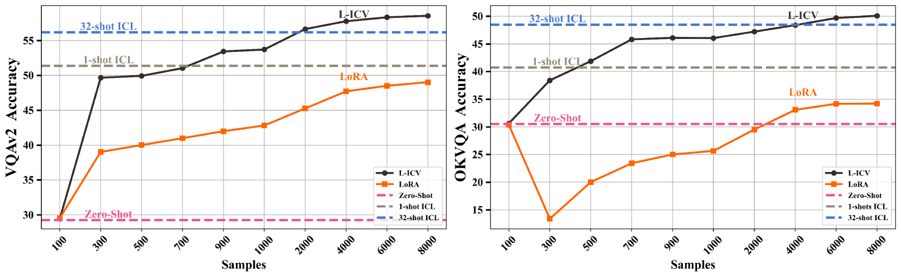

# 视觉问答中的可学习上下文向量

发布时间：2024年06月18日

`LLM应用

这篇论文主要探讨了大型多模态模型（LMMs）在情境学习（ICL）方面的应用，特别是在处理复杂多模态任务如视觉问答（VQA）时的挑战和解决方案。论文提出了可学习型情境向量（L-ICV）作为一种改进方法，以提高LMMs在ICL中的性能，并减少计算成本。这与LLM的应用紧密相关，因为它专注于改进和优化大型模型的实际应用性能，特别是在多模态环境中。因此，这篇论文应归类为LLM应用。` `视觉问答`

> Learnable In-Context Vector for Visual Question Answering

# 摘要

> 随着语言模型规模的扩大，大型语言模型（LLMs）通过在上下文中加入几个情境演示（ICDs），展现出在情境学习（ICL）方面的卓越能力，从而能够解决语言任务。这一进展激发了研究者们开发具有ICL能力的大型多模态模型（LMMs）。然而，ICL的应用面临两大难题：一是增加ICDs数量会显著延长推理时间；二是性能对ICDs的选择极为敏感。这些问题在LMMs中因数据类型多样和多模态ICDs的复杂组合而更加严峻。为此，一些NLP研究提出了非学习型情境向量（ICVs），旨在从ICDs中提取关键任务信息，并将其整合成单一向量，以辅助LLM解决任务。尽管在简单NLP任务中表现出色，但这些方法在处理视觉问答（VQA）等复杂多模态任务时显得力不从心。本研究中，我们提出了可学习型ICV（L-ICV），旨在从演示中提炼关键任务信息，从而提升LMMs中ICL的性能。实验结果显示，L-ICV不仅大幅降低了计算成本，还在VQA任务中显著提高了准确性，优于传统ICL和其他非学习型ICV方法。

> As language models continue to scale, Large Language Models (LLMs) have exhibited emerging capabilities in In-Context Learning (ICL), enabling them to solve language tasks by prefixing a few in-context demonstrations (ICDs) as context. Inspired by these advancements, researchers have extended these techniques to develop Large Multimodal Models (LMMs) with ICL capabilities. However, applying ICL usually faces two major challenges: 1) using more ICDs will largely increase the inference time and 2) the performance is sensitive to the selection of ICDs. These challenges are further exacerbated in LMMs due to the integration of multiple data types and the combinational complexity of multimodal ICDs. Recently, to address these challenges, some NLP studies introduce non-learnable In-Context Vectors (ICVs) which extract useful task information from ICDs into a single vector and then insert it into the LLM to help solve the corresponding task. However, although useful in simple NLP tasks, these non-learnable methods fail to handle complex multimodal tasks like Visual Question Answering (VQA). In this study, we propose \textbf{Learnable ICV} (L-ICV) to distill essential task information from demonstrations, improving ICL performance in LMMs. Experiments show that L-ICV can significantly reduce computational costs while enhancing accuracy in VQA tasks compared to traditional ICL and other non-learnable ICV methods.

[Arxiv](https://arxiv.org/abs/2406.13185)