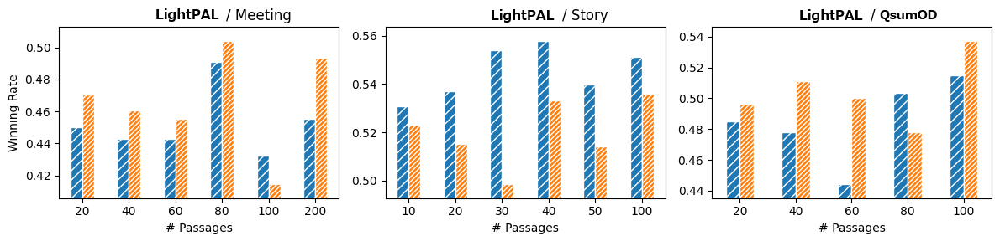
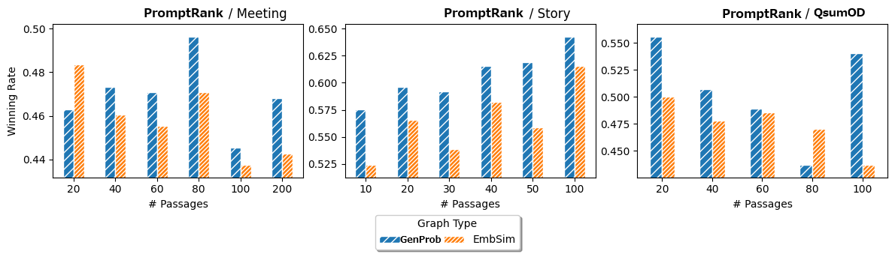

# LightPAL：开放域多文档摘要的轻量级段落检索解决方案

发布时间：2024年06月18日

`LLM应用

理由：这篇论文主要讨论了如何利用大型语言模型（LLM）来改进开放域多文档摘要（ODMDS）的过程，特别是通过提出一种新的轻量级段落检索方法（LightPAL）。这种方法利用LLM在索引时构建段落关系图，并在推理阶段采用随机漫步而非迭代检索和推理，从而提高了摘要质量和效率。因此，这项工作属于LLM在实际应用中的使用，即LLM应用类别。` `信息检索` `文档摘要`

> LightPAL: Lightweight Passage Retrieval for Open Domain Multi-Document Summarization

# 摘要

> 开放域多文档摘要（ODMDS）旨在通过整合大型文档库中多个文档的相关内容，生成满足用户查询需求的摘要，这对于应对多样化的信息需求至关重要。然而，现有的先检索相关段落再生成摘要的方法在处理开放式查询时显得力不从心，因为这类查询往往需要更多上下文来全面覆盖主题，导致初始检索难以涵盖所有相关内容。尽管迭代检索方法在多跳问题回答（MQA）中有所探索，但它们因高延迟和重复的大型语言模型（LLM）推理而不适用于ODMDS。为此，我们提出了LightPAL，一种轻量级段落检索方法，它利用LLM在索引时构建段落关系图，并在推理阶段采用随机漫步而非迭代检索和推理。实验结果显示，LightPAL不仅在摘要质量上超越了基线方法，而且在效率上远胜于迭代MQA策略。

> Open-Domain Multi-Document Summarization (ODMDS) is crucial for addressing diverse information needs, which aims to generate a summary as answer to user's query, synthesizing relevant content from multiple documents in a large collection. Existing approaches that first find relevant passages and then generate a summary using a language model are inadequate for ODMDS. This is because open-ended queries often require additional context for the retrieved passages to cover the topic comprehensively, making it challenging to retrieve all relevant passages initially. While iterative retrieval methods have been explored for multi-hop question answering (MQA), they are impractical for ODMDS due to high latency from repeated large language model (LLM) inference for reasoning. To address this issue, we propose LightPAL, a lightweight passage retrieval method for ODMDS that constructs a graph representing passage relationships using an LLM during indexing and employs random walk instead of iterative reasoning and retrieval at inference time. Experiments on ODMDS benchmarks show that LightPAL outperforms baseline retrievers in summary quality while being significantly more efficient than an iterative MQA approach.

[Arxiv](https://arxiv.org/abs/2406.12494)