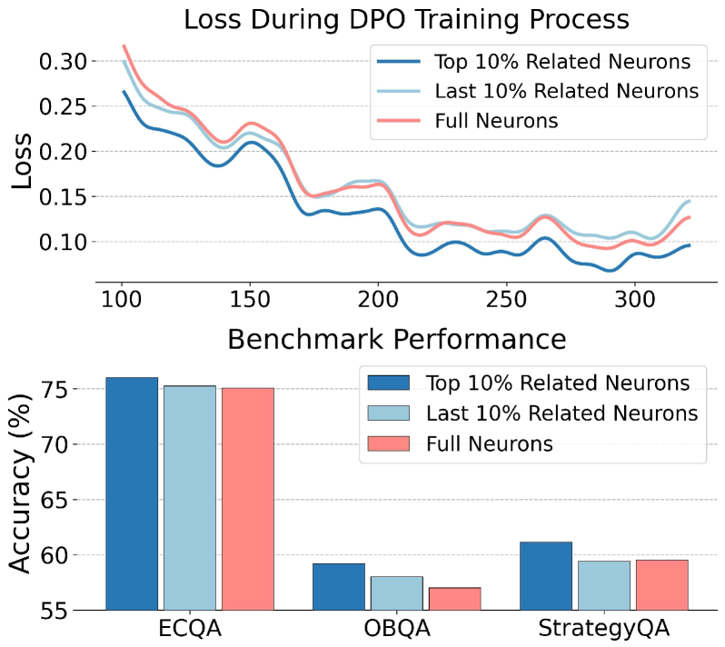
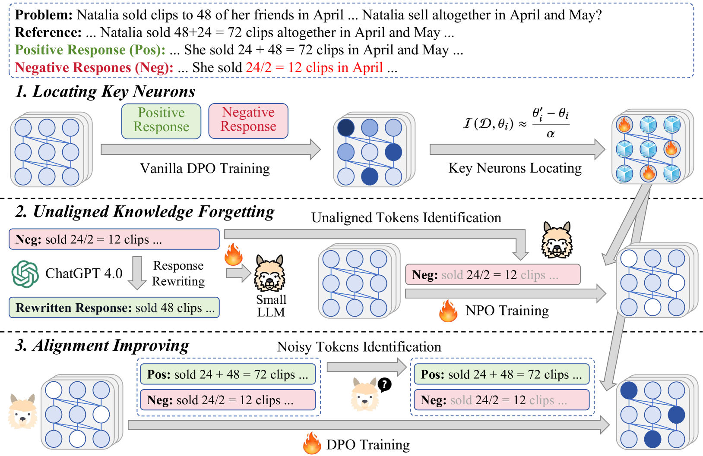
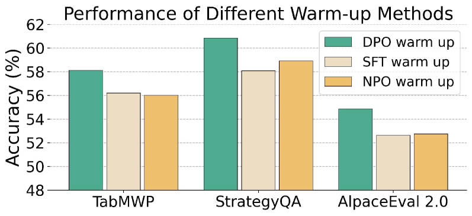
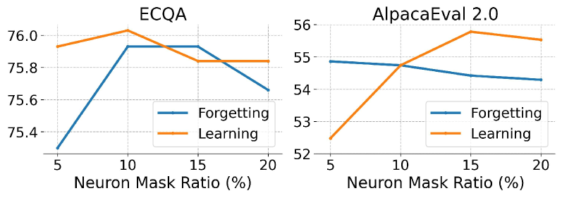

# 大型语言模型对齐的优化：追求低冗余

发布时间：2024年06月18日

`LLM理论

理由：这篇论文主要探讨了大型语言模型（LLMs）在人类偏好对齐方面的优化问题，并提出了一种新的对齐方法（ALLO）。这种方法涉及对LLMs中神经元的选择性优化，以减少冗余并提高模型与人类偏好的对齐度。论文的内容更多地关注于LLMs的理论改进和内部机制的优化，而不是具体的应用或Agent的行为，因此更适合归类为LLM理论。` `人工智能` `机器学习`

> Low-Redundant Optimization for Large Language Model Alignment

# 摘要

> 大型语言模型（LLMs）在与复杂任务和场景中的人类偏好对齐方面仍显不足，常过度拟合于训练数据中的意外模式或表面风格。为此，我们开展了一项研究，仅选取LLMs中最新的前10%参数进行对齐训练，结果显示收敛过程和最终性能均有所提升，暗示了LLMs中存在对齐训练的冗余神经元。为降低这种影响，我们提出了一种名为ALLO的低冗余对齐方法，专注于优化与人类偏好最相关的神经元。具体操作上，我们首先通过基于梯度的策略识别与人类偏好相关的神经元，再利用奖励模型识别关键令牌以计算损失。此外，我们将对齐过程细分为遗忘与学习两个阶段，先遗忘未对齐的知识，再学习对齐的知识，通过调整不同比例的神经元实现。在10个数据集上的实验验证了ALLO的有效性，相关代码和数据已公开于https://github.com/RUCAIBox/ALLO。

> Large language models (LLMs) are still struggling in aligning with human preference in complex tasks and scenarios. They are prone to overfit into the unexpected patterns or superficial styles in the training data. We conduct an empirical study that only selects the top-10\% most updated parameters in LLMs for alignment training, and see improvements in the convergence process and final performance. It indicates the existence of redundant neurons in LLMs for alignment training. To reduce its influence, we propose a low-redundant alignment method named \textbf{ALLO}, focusing on optimizing the most related neurons with the most useful supervised signals. Concretely, we first identify the neurons that are related to the human preference data by a gradient-based strategy, then identify the alignment-related key tokens by reward models for computing loss. Besides, we also decompose the alignment process into the forgetting and learning stages, where we first forget the tokens with unaligned knowledge and then learn aligned knowledge, by updating different ratios of neurons, respectively. Experimental results on 10 datasets have shown the effectiveness of ALLO. Our code and data are available at \url{https://github.com/RUCAIBox/ALLO}.

[Arxiv](https://arxiv.org/abs/2406.12606)