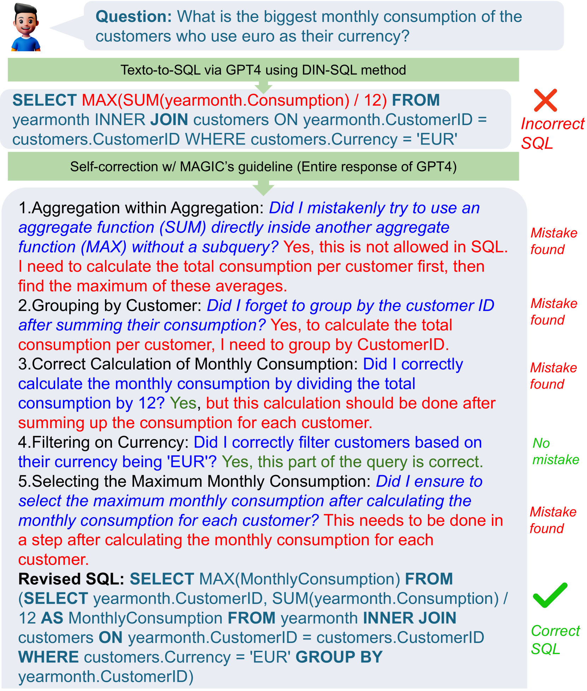
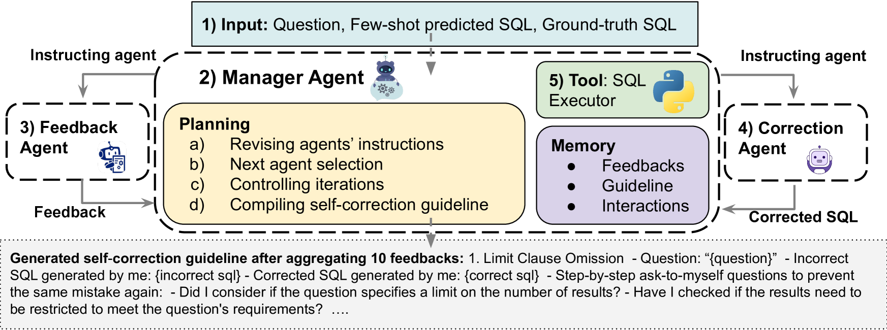
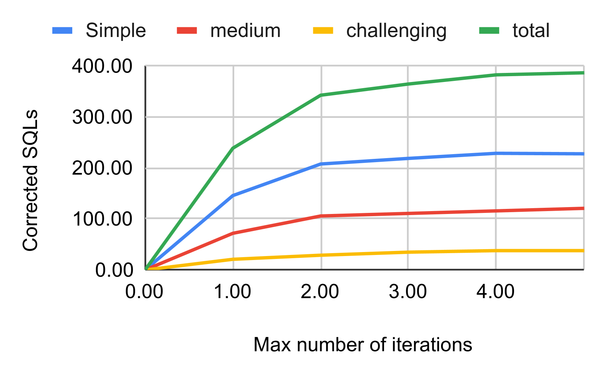
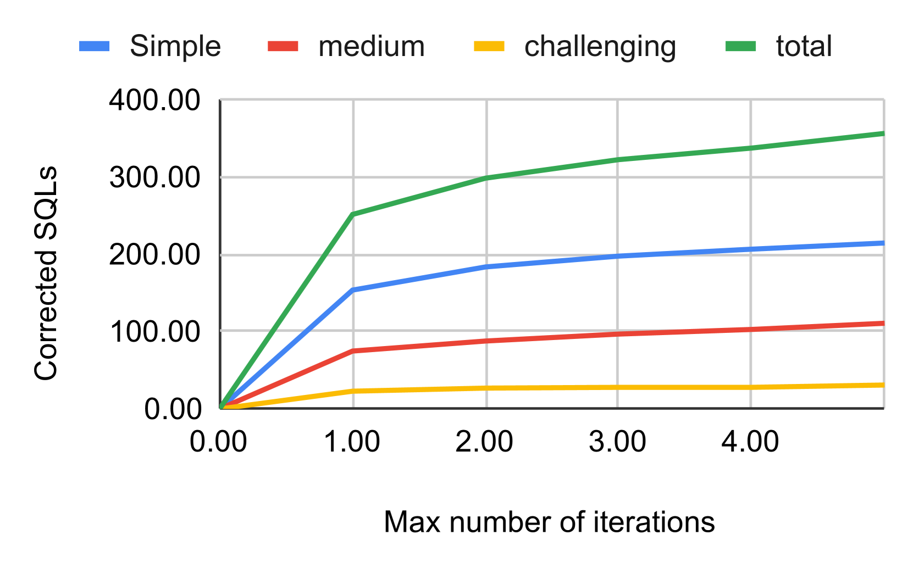
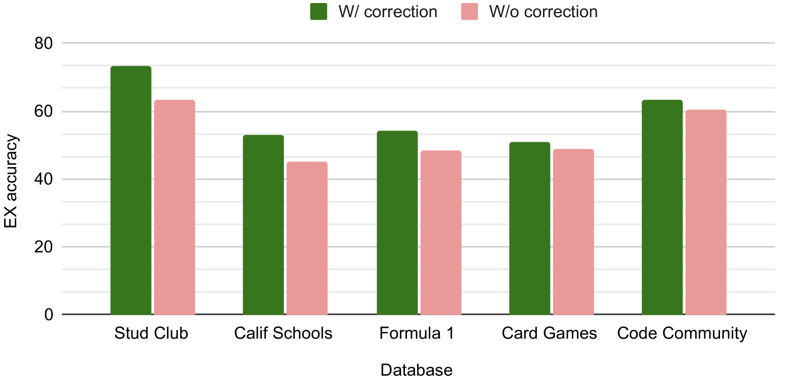
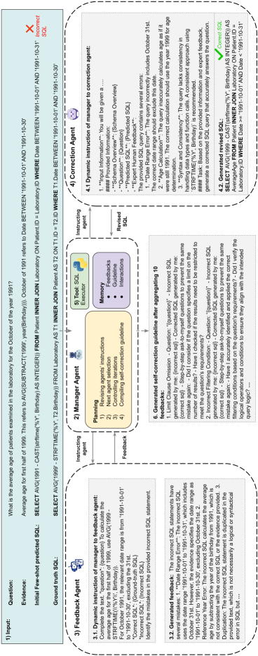
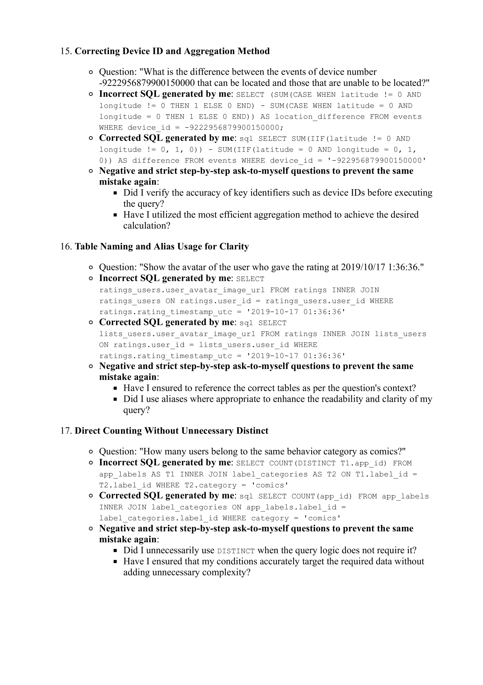

# MAGIC：打造文本至SQL的上下文自我校正指南

发布时间：2024年06月18日

`Agent

这篇论文介绍了一种名为MAGIC的多代理方法，用于自动生成文本到SQL的自校正指南。这种方法通过三个专业代理（管理员、校正员和反馈代理）的协同工作，迭代优化自校正指南，从而提高大型语言模型（LLM）的性能。这种方法的特点在于其自动化和无需人类介入的特性，以及其优于人类专家成果的性能。因此，这篇论文属于Agent分类，因为它主要关注的是通过代理系统来改进LLM的应用。` `数据库`

> MAGIC: Generating Self-Correction Guideline for In-Context Text-to-SQL

# 摘要

> 文本到SQL的自校正，即引导大型语言模型（LLM）修正其错误生成的SQL，传统上依赖于人工专家制定的自校正指南，这不仅耗时且受限于人类识别所有潜在错误模式的能力。我们推出的MAGIC，一种创新的多代理方法，能自动生成自校正指南。MAGIC包含三个专业代理：管理员、校正员和反馈代理，它们协同工作，针对LLM在训练集上的错误，迭代优化自校正指南，模拟人类流程却无需人类介入。实验证明，MAGIC生成的指南优于人类专家的成果，并增强了校正的可解释性，为理解LLM自校正的成败提供了洞见。我们公开了所有代理交互，旨在推动该领域的研究，并提供了一个合成数据集，供未来探索自动生成自校正指南。

> Self-correction in text-to-SQL is the process of prompting large language model (LLM) to revise its previously incorrectly generated SQL, and commonly relies on manually crafted self-correction guidelines by human experts that are not only labor-intensive to produce but also limited by the human ability in identifying all potential error patterns in LLM responses. We introduce MAGIC, a novel multi-agent method that automates the creation of the self-correction guideline. MAGIC uses three specialized agents: a manager, a correction, and a feedback agent. These agents collaborate on the failures of an LLM-based method on the training set to iteratively generate and refine a self-correction guideline tailored to LLM mistakes, mirroring human processes but without human involvement. Our extensive experiments show that MAGIC's guideline outperforms expert human's created ones. We empirically find out that the guideline produced by MAGIC enhance the interpretability of the corrections made, providing insights in analyzing the reason behind the failures and successes of LLMs in self-correction. We make all agent interactions publicly available to the research community, to foster further research in this area, offering a synthetic dataset for future explorations into automatic self-correction guideline generation.

[Arxiv](https://arxiv.org/abs/2406.12692)