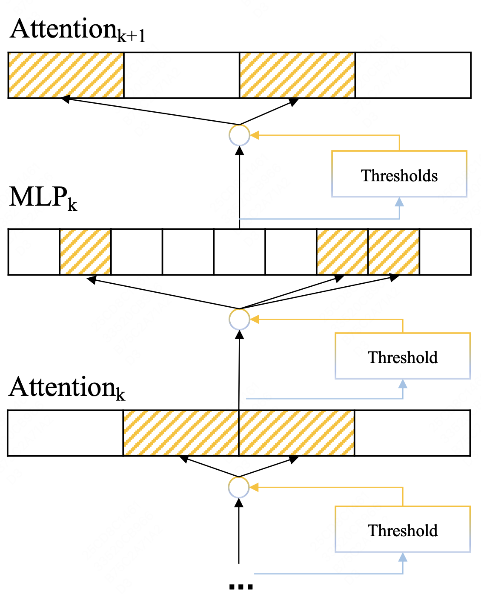
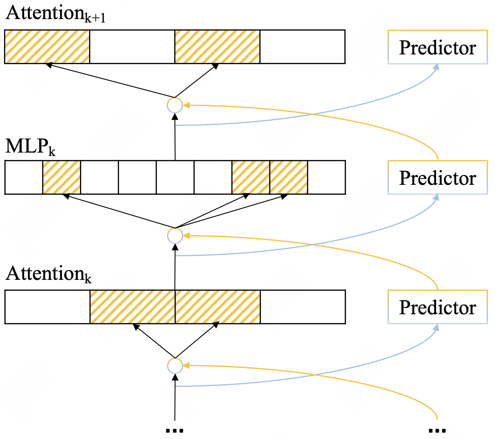
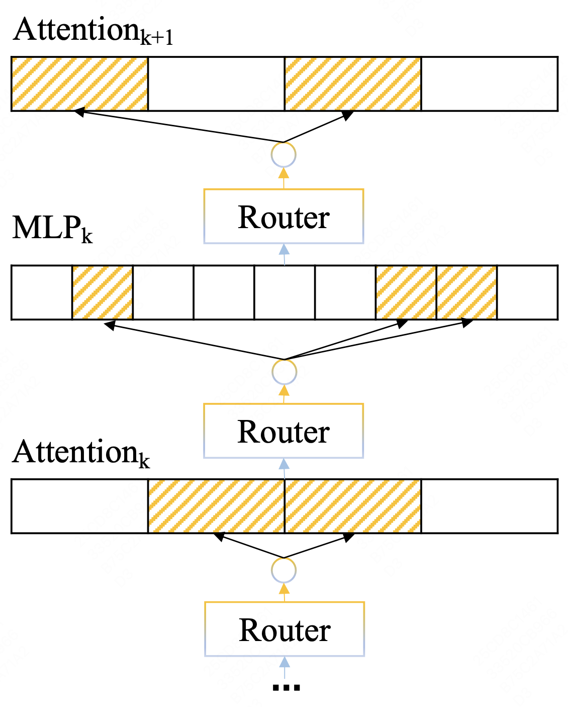
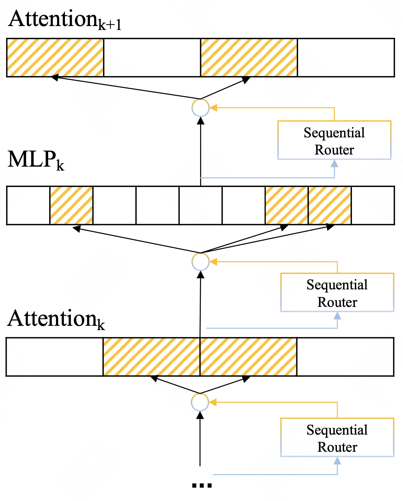
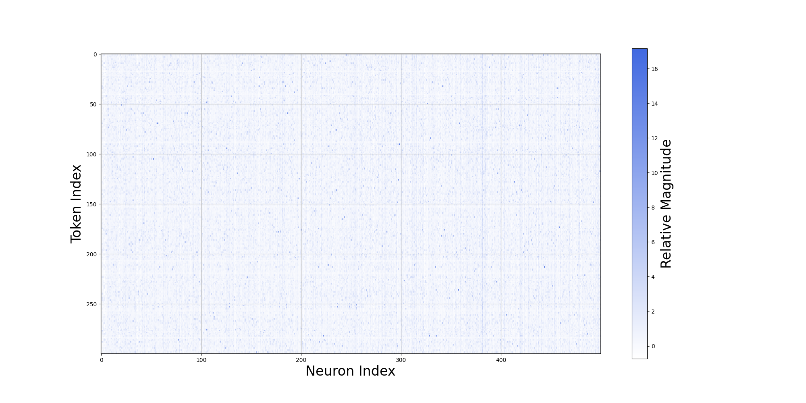
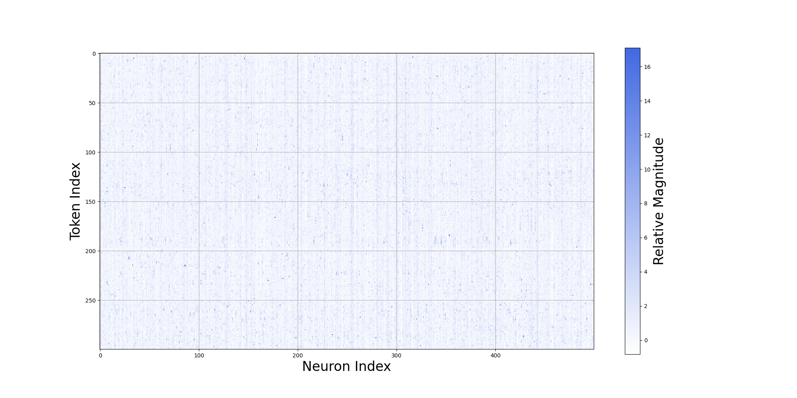
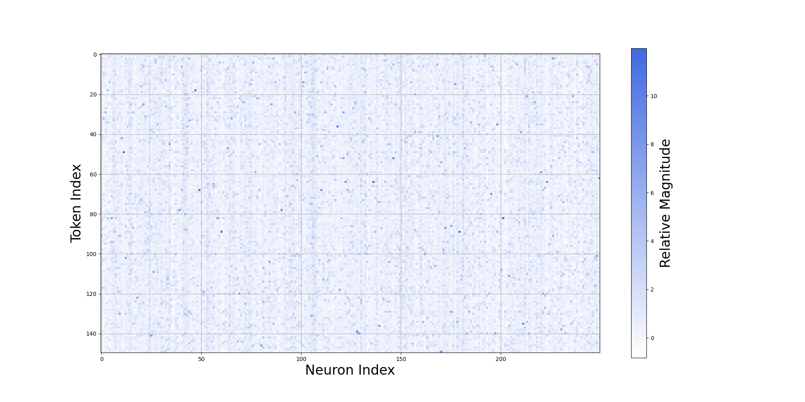
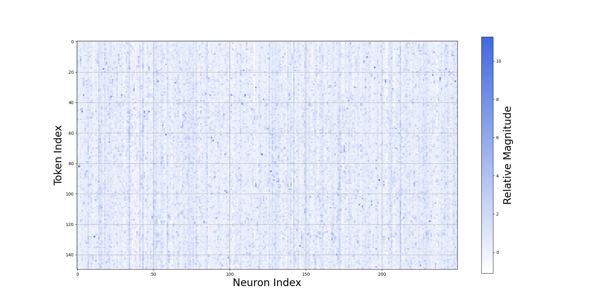

# MOYU：探究大型语言模型中大规模过度激活如何带来性能提升的理论研究

发布时间：2024年06月18日

`LLM理论

这篇论文主要探讨了大规模语言模型（LLM）的固有特性——大规模过度激活带来的提升（MOYU），并分析了动态激活（DA）策略在利用这一特性时的理论模糊性和面临的挑战。论文的内容集中在LLM的理论分析和策略优化上，而不是具体的应用或Agent行为，因此最适合归类为LLM理论。` `人工智能` `模型优化`

> MOYU: A Theoretical Study on Massive Over-activation Yielded Uplifts in LLMs

# 摘要

> 大规模语言模型的固有特性——大规模过度激活带来的提升（MOYU），催生了一种名为动态激活（DA）的策略，旨在加速推理过程。然而，这种策略尚未得到充分探索。现有方法在利用MOYU时，常陷入“不可能三角”困境：难以在保持模型性能的同时，提升推理速度并适应多种架构。本文针对MOYU的理论模糊性，揭示了其根本原因，并分析了当前DA方法面临的两大挑战：历史相关激活的不确定性和语义无关激活的惯性。我们的研究不仅指出了当前动态激活策略在大规模LLaMA模型中的局限，还为未来稀疏性设计方案的优化提供了新思路。

> Massive Over-activation Yielded Uplifts(MOYU) is an inherent property of large language models, and dynamic activation(DA) based on the MOYU property is a clever yet under-explored strategy designed to accelerate inference in these models. Existing methods that utilize MOYU often face a significant 'Impossible Trinity': struggling to simultaneously maintain model performance, enhance inference speed, and extend applicability across various architectures. Due to the theoretical ambiguities surrounding MOYU, this paper elucidates the root cause of the MOYU property and outlines the mechanisms behind two primary limitations encountered by current DA methods: 1) history-related activation uncertainty, and 2) semantic-irrelevant activation inertia. Our analysis not only underscores the limitations of current dynamic activation strategies within large-scale LLaMA models but also proposes opportunities for refining the design of future sparsity schemes.

[Arxiv](https://arxiv.org/abs/2406.12569)