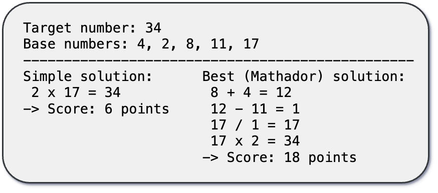

# Mathador-LM：大型语言模型数学推理能力的动态评估标杆

发布时间：2024年06月18日

`LLM应用

这篇论文介绍了Mathador-LM，一个专为大型语言模型（LLMs）设计的数学推理评估基准。它通过模拟Mathador游戏来测试和评估LLMs在数学推理方面的能力，包括规则解读、策略规划和问题解决。论文中提到，通过动态调整测试案例的难度，可以有效避免训练数据中测试集泄露的问题，并对比了当前最先进的开源与闭源LLMs在该基准上的表现与五年级学生的平均水平。这表明论文主要关注于LLM在特定应用场景（数学推理评估）的实际应用和性能评估，因此属于LLM应用分类。` `人工智能`

> Mathador-LM: A Dynamic Benchmark for Mathematical Reasoning on Large Language Models

# 摘要

> 我们推出了Mathador-LM，一个专为大型语言模型（LLMs）设计的数学推理评估新基准，它融合了规则解读、策略规划与问题解决。此基准灵感源自Mathador游戏，旨在通过一套基础数字和基本算术规则，达成特定目标数字。我们发现，在顶尖LLMs中，通过动态调整难度生成测试案例，我们能保持稳定的平均表现，有效避免了训练数据中测试集泄露的问题，这一直是其他基准的软肋。此外，我们对当前最先进的开源与闭源LLMs进行了深入评估，结果显示，这些模型在Mathador-LM上的表现远逊于五年级学生的平均水平，与它们在其他知名数学推理基准上的优异表现形成鲜明反差。

> We introduce Mathador-LM, a new benchmark for evaluating the mathematical reasoning on large language models (LLMs), combining ruleset interpretation, planning, and problem-solving. This benchmark is inspired by the Mathador game, where the objective is to reach a target number using basic arithmetic operations on a given set of base numbers, following a simple set of rules. We show that, across leading LLMs, we obtain stable average performance while generating benchmark instances dynamically, following a target difficulty level. Thus, our benchmark alleviates concerns about test-set leakage into training data, an issue that often undermines popular benchmarks. Additionally, we conduct a comprehensive evaluation of both open and closed-source state-of-the-art LLMs on Mathador-LM. Our findings reveal that contemporary models struggle with Mathador-LM, scoring significantly lower than average 5th graders. This stands in stark contrast to their strong performance on popular mathematical reasoning benchmarks.

[Arxiv](https://arxiv.org/abs/2406.12572)