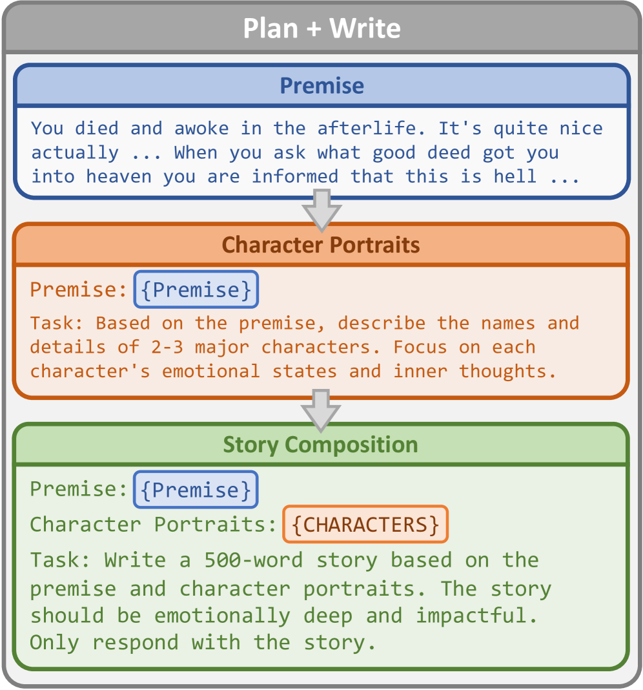

# 探究语言模型的心理深度

发布时间：2024年06月18日

`LLM应用

这篇论文主要探讨了大型语言模型（LLMs）在创作故事时对读者心理影响的主观评估，并提出了心理深度量表（PDS）来衡量这种影响。论文通过实证研究验证了PDS的有效性，并探讨了自动化评估方法。此外，论文还比较了LLMs与人类创作的故事质量。这些内容主要关注LLMs在实际应用中的表现和影响，特别是它们在文学创作和心理影响评估方面的应用，因此属于LLM应用分类。` `心理学`

> Measuring Psychological Depth in Language Models

# 摘要

> 在评估大型语言模型（LLMs）生成的创意故事时，我们往往关注文本的客观属性，如风格、连贯性和毒性。然而，这些指标虽重要，却未能捕捉到故事对读者心理的主观影响。为此，我们提出了心理深度量表（PDS），这一基于文学理论的创新框架旨在衡量LLMs创作能够触动人心、引发共情和参与的复杂叙事故事的能力。通过实证研究，我们证明了人类能够依据PDS一致地评估故事（Krippendorff的alpha值为0.72）。同时，我们也探索了自动化PDS的方法，以便未来分析的便捷扩展。结合混合人格（MoP）提示策略的GPT-4o，在与人类判断的相关性上达到了平均0.51的斯皮尔曼相关系数，而Llama-3-70B在共情方面的表现更是高达0.68。最后，我们将LLMs与人类创作的故事进行了深度比较，结果显示GPT-4的故事在质量上不仅与Reddit上的高评价人类作品相媲美，甚至在某些方面更胜一筹。心理深度量表的引入，标志着我们开始从读者的视角出发，系统地评估LLMs通过故事与人类情感连接的能力。

> Evaluations of creative stories generated by large language models (LLMs) often focus on objective properties of the text, such as its style, coherence, and toxicity. While these metrics are indispensable, they do not speak to a story's subjective, psychological impact from a reader's perspective. We introduce the Psychological Depth Scale (PDS), a novel framework rooted in literary theory that measures an LLM's ability to produce authentic and narratively complex stories that provoke emotion, empathy, and engagement. We empirically validate our framework by showing that humans can consistently evaluate stories based on PDS (0.72 Krippendorff's alpha). We also explore techniques for automating the PDS to easily scale future analyses. GPT-4o, combined with a novel Mixture-of-Personas (MoP) prompting strategy, achieves an average Spearman correlation of $0.51$ with human judgment while Llama-3-70B scores as high as 0.68 for empathy. Finally, we compared the depth of stories authored by both humans and LLMs. Surprisingly, GPT-4 stories either surpassed or were statistically indistinguishable from highly-rated human-written stories sourced from Reddit. By shifting the focus from text to reader, the Psychological Depth Scale is a validated, automated, and systematic means of measuring the capacity of LLMs to connect with humans through the stories they tell.

[Arxiv](https://arxiv.org/abs/2406.12680)