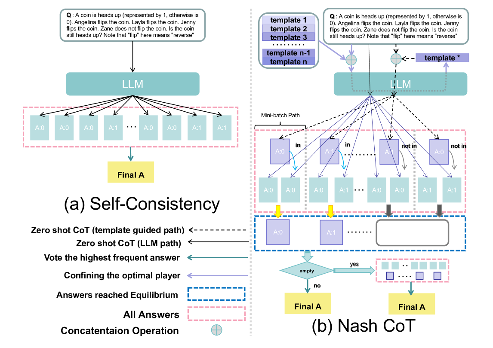
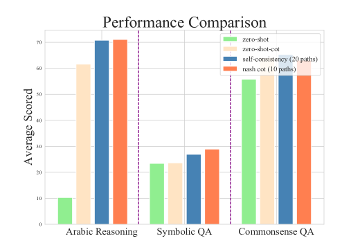
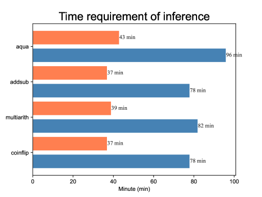
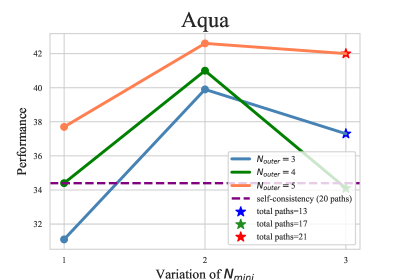
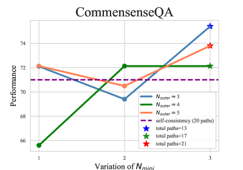
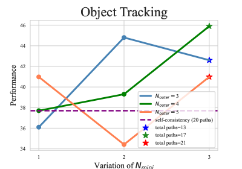

# Nash CoT：实现偏好均衡的多路径推理

发布时间：2024年06月18日

`LLM理论` `人工智能`

> Nash CoT: Multi-Path Inference with Preference Equilibrium

# 摘要

> CoT prompting 技术已成为提升 LLM 复杂问题推理能力的利器。其中，self-consistency 方法通过生成多条推理路径并投票选出最优解，简洁高效。然而，多路径推理虽提升了性能，却也增加了成本。为此，我们提出 Nash CoT，将语言解码比作双人博弈，在每条路径中寻求纳什均衡，既保持了 self-consistency 的优势，又降低了成本。实验表明，在阿拉伯推理、常识问答等任务中，Nash CoT 能以更少的推理路径，达到甚至超越 self-consistency 的性能。

> Chain-of-thought (CoT) prompting has emerged as a powerful technique for enhancing the reasoning capabilities of Large Language Models (LLMs) on complex problems. Among CoT-related studies, self-consistency (Multi-path inference with answer filtering through voting) involves generating multiple reasoning paths using the CoT framework and then selecting the most frequently produced outputs standing out as a concise yet competitive approach. While self-consistency has indeed led to the improvements in LLM inference, the use of multi-path inference also escalates deployment costs. Therefore, maintaining the performance benefits of self-consistency inherited from multi-path inference while reducing the inference costs holds significant value. In this research, we conceptualize language decoding as a preference consensus game, constructing a bi-player gaming system within each local path, and introduce Nash Chain-of-Thought (Nash CoT). Specifically, for a given question, we leverage LLM to autonomously select the contextually relevant template and generate outputs guided by this template, aiming to reach Nash Equilibrium alongside normal generation in each path. This approach allows us to achieve comparable or improved performance compared to self-consistency while using fewer inference paths on various inference tasks, including Arabic reasoning, Commonsense Question answering, and Symbolic inference.

[Arxiv](https://arxiv.org/abs/2407.07099)