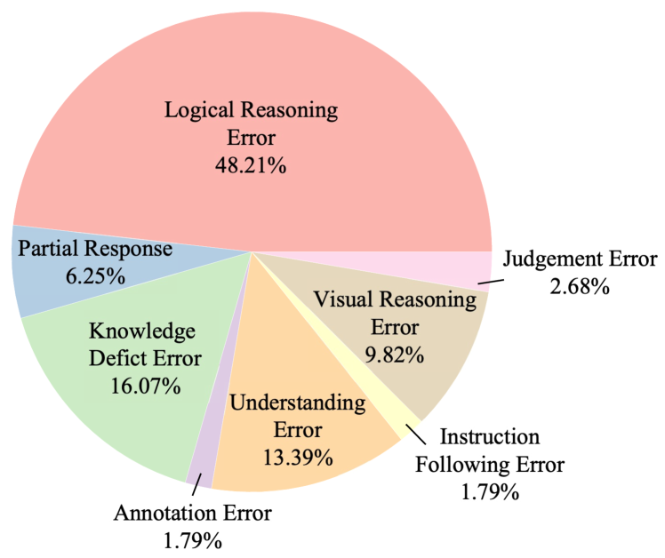

# OlympicArena：超级智能AI多学科认知推理能力的基准测试平台

发布时间：2024年06月18日

`LLM应用

这篇论文介绍了OlympicArena，一个用于评估大型语言模型（LLMs）和大型多模态模型（LMMs）认知推理能力的评估平台。它通过包含11,163个双语问题，涵盖文本和文本-图像交错模态，并横跨七个领域和62个国际奥林匹克竞赛，来评估这些模型在复杂问题解决和科学发现方面的能力。这个平台的设计和实施是为了推动AI在认知推理方面的进步，特别是在解决科学难题和推动发现方面。因此，这篇论文属于LLM应用类别，因为它专注于如何应用LLMs来解决实际问题，并评估这些应用的效果。` `科学研究` `人工智能`

> OlympicArena: Benchmarking Multi-discipline Cognitive Reasoning for Superintelligent AI

# 摘要

> 随着大型语言模型（LLMs）和大型多模态模型（LMMs）的进步，人工智能（AI）的发展迅速，开始在问题解决和科学发现（AI4Science）领域展现出曾独属于人类的认知推理能力。为了全面评估这些模型的认知推理能力，我们推出了OlympicArena，一个包含11,163个双语问题，涵盖文本和文本-图像交错模态的评估平台。这些问题横跨七个领域和62个国际奥林匹克竞赛，经过严格审查以确保数据安全。我们认为，奥林匹克竞赛问题的复杂性和跨学科性使其成为评估AI认知推理能力的理想选择，这对于解决科学难题和推动发现至关重要。除了基于答案的跨学科表现评估，我们还从多个角度进行了深入的实验和分析，探讨了模型的认知推理能力、模态间的性能差异以及过程级评估的重要性。尽管是先进的模型如GPT-4o，其总体准确率也仅为39.97%，显示出AI在复杂推理和多模态整合方面的局限。通过OlympicArena，我们旨在推动AI向超智能迈进，使其能够应对更复杂的科学挑战。此外，我们还提供了一系列资源，包括基准数据集、开源标注平台、评估工具和一个带有自动提交功能的排行榜，以支持AI研究。

> The evolution of Artificial Intelligence (AI) has been significantly accelerated by advancements in Large Language Models (LLMs) and Large Multimodal Models (LMMs), gradually showcasing potential cognitive reasoning abilities in problem-solving and scientific discovery (i.e., AI4Science) once exclusive to human intellect. To comprehensively evaluate current models' performance in cognitive reasoning abilities, we introduce OlympicArena, which includes 11,163 bilingual problems across both text-only and interleaved text-image modalities. These challenges encompass a wide range of disciplines spanning seven fields and 62 international Olympic competitions, rigorously examined for data leakage. We argue that the challenges in Olympic competition problems are ideal for evaluating AI's cognitive reasoning due to their complexity and interdisciplinary nature, which are essential for tackling complex scientific challenges and facilitating discoveries. Beyond evaluating performance across various disciplines using answer-only criteria, we conduct detailed experiments and analyses from multiple perspectives. We delve into the models' cognitive reasoning abilities, their performance across different modalities, and their outcomes in process-level evaluations, which are vital for tasks requiring complex reasoning with lengthy solutions. Our extensive evaluations reveal that even advanced models like GPT-4o only achieve a 39.97% overall accuracy, illustrating current AI limitations in complex reasoning and multimodal integration. Through the OlympicArena, we aim to advance AI towards superintelligence, equipping it to address more complex challenges in science and beyond. We also provide a comprehensive set of resources to support AI research, including a benchmark dataset, an open-source annotation platform, a detailed evaluation tool, and a leaderboard with automatic submission features.

[Arxiv](https://arxiv.org/abs/2406.12753)