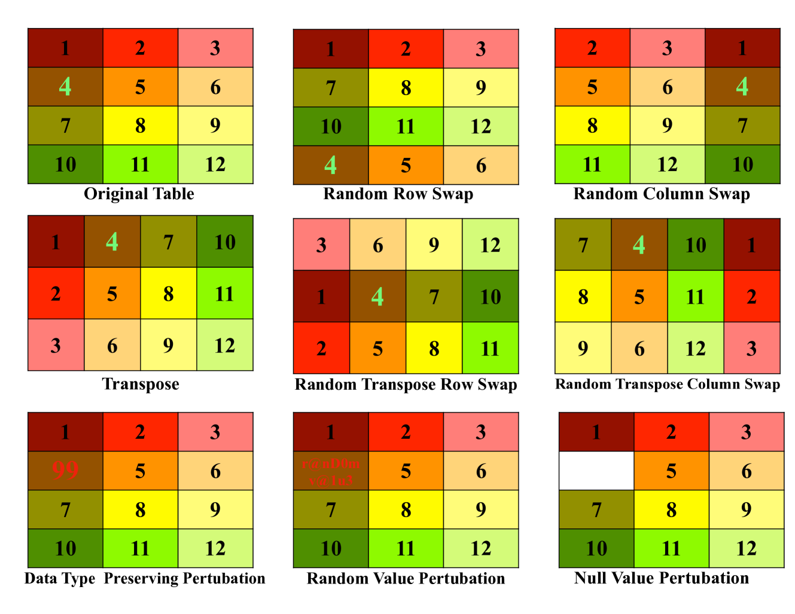
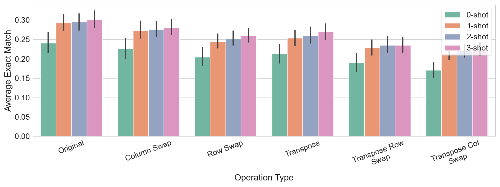
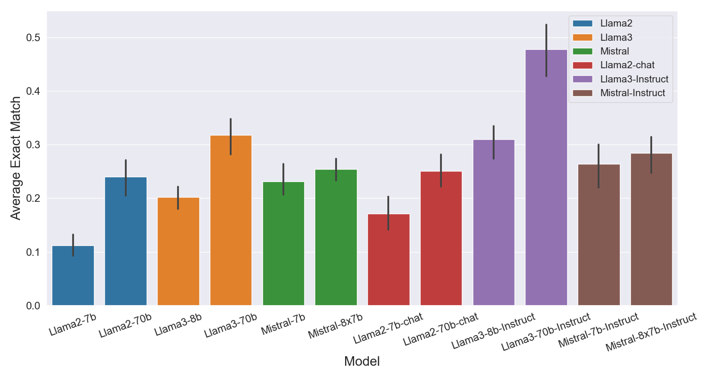
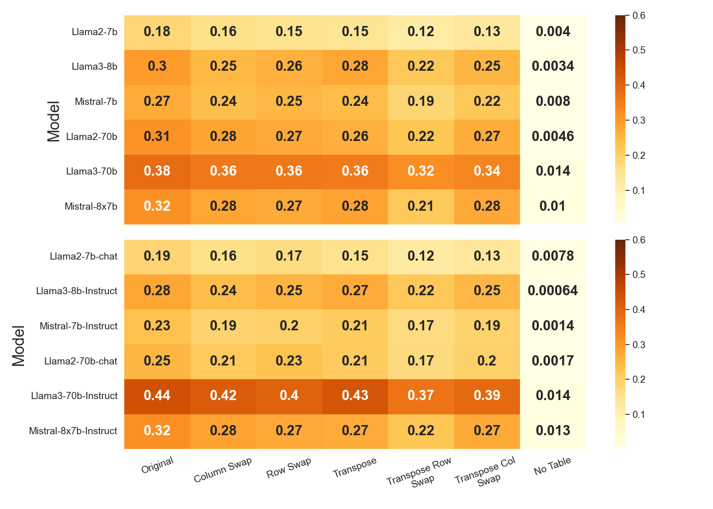
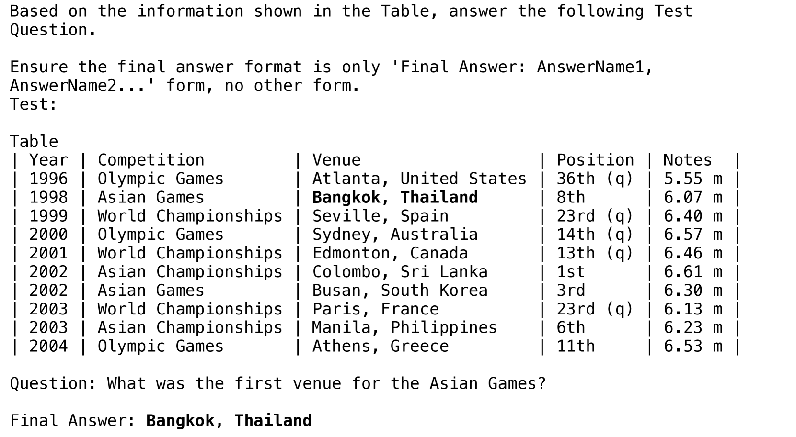
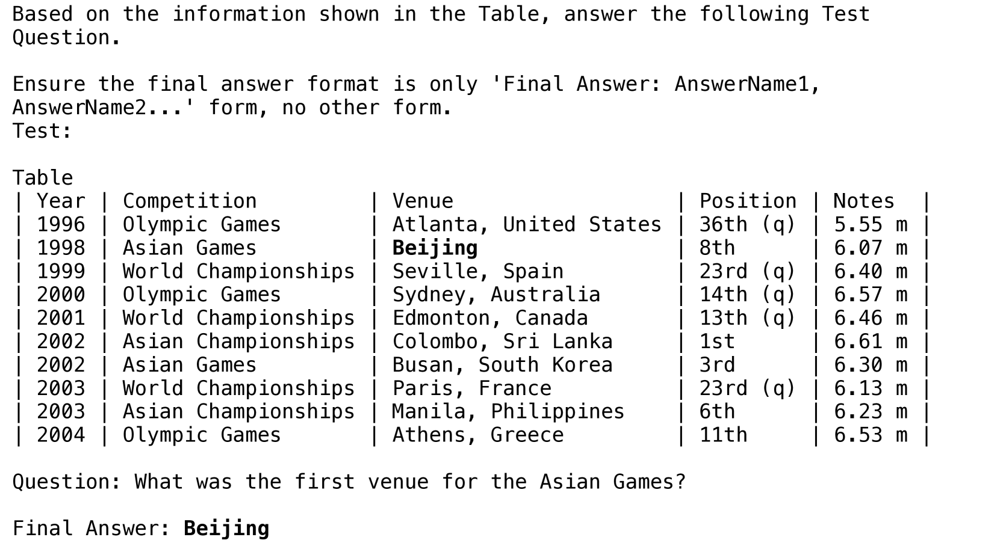
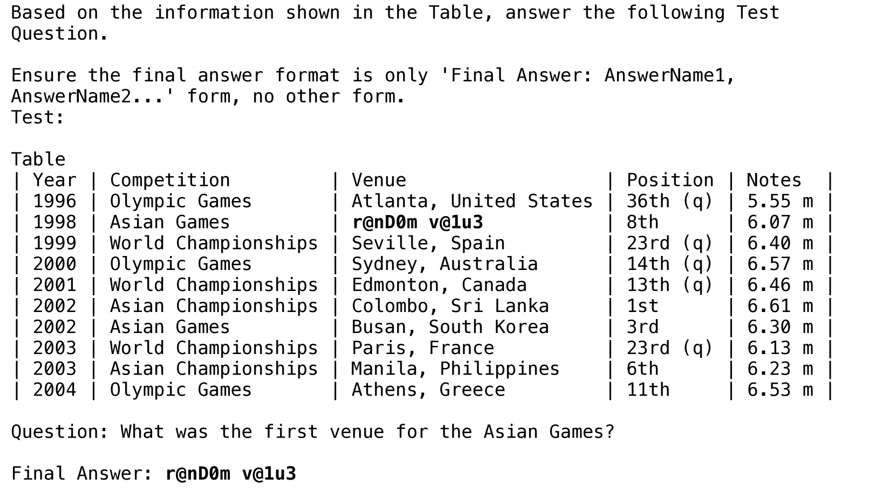
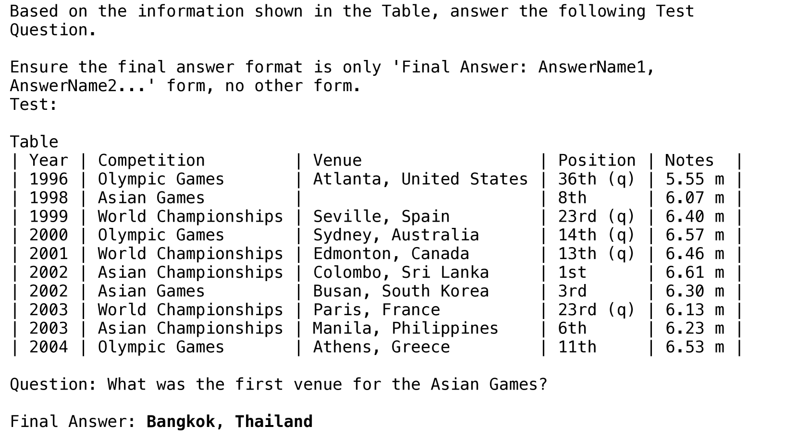
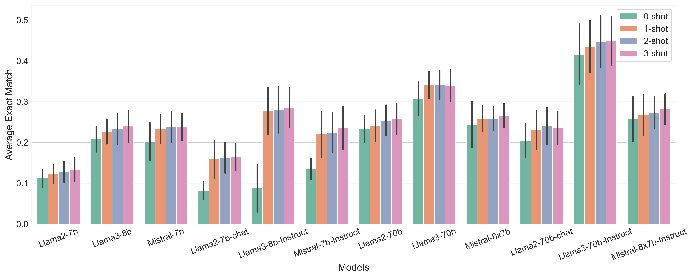

# 语言模型在表格问答中的稳健性探究

发布时间：2024年06月18日

`LLM应用

这篇论文探讨了大型语言模型（LLMs）在表格理解任务中的应用，特别是在表格问答（TQA）任务中的表现。研究关注了情境学习、模型规模、指令调优和领域偏见等因素对LLMs性能的影响，并通过在特定数据集上的测试来评估这些模型的鲁棒性。此外，论文还提出了改进建议，如采用结构感知自注意力机制和更精细的领域特定数据处理技术，以提高LLMs在实际应用中的可靠性。这些内容主要集中在LLMs的实际应用层面，因此归类为LLM应用。` `数据处理` `问答系统`

> On the Robustness of Language Models for Tabular Question Answering

# 摘要

> 大型语言模型（LLMs）不仅在文本理解任务中表现卓越，还能在没有专门训练的情况下处理表格理解任务。我们的研究深入探讨了“情境学习”、“模型规模”、“指令调优”及“领域偏见”对表格问答（TQA）的影响。通过在WTQ和TAT-QA数据集上测试LLMs的鲁棒性，我们发现指令调优显著提升了性能，尤其是新模型Llama3比旧版本更为稳健。尽管如此，数据污染和实际应用中的可靠性问题，尤其是在WTQ数据集上，仍然是一个挑战。我们呼吁采用更先进的方法，如结构感知自注意力机制和更精细的领域特定表格数据处理技术，以打造更可靠的LLMs，助力表格数据的理解。

> Large Language Models (LLMs), originally shown to ace various text comprehension tasks have also remarkably been shown to tackle table comprehension tasks without specific training. While previous research has explored LLM capabilities with tabular dataset tasks, our study assesses the influence of $\textit{in-context learning}$,$ \textit{model scale}$, $\textit{instruction tuning}$, and $\textit{domain biases}$ on Tabular Question Answering (TQA). We evaluate the robustness of LLMs on Wikipedia-based $\textbf{WTQ}$ and financial report-based $\textbf{TAT-QA}$ TQA datasets, focusing on their ability to robustly interpret tabular data under various augmentations and perturbations. Our findings indicate that instructions significantly enhance performance, with recent models like Llama3 exhibiting greater robustness over earlier versions. However, data contamination and practical reliability issues persist, especially with WTQ. We highlight the need for improved methodologies, including structure-aware self-attention mechanisms and better handling of domain-specific tabular data, to develop more reliable LLMs for table comprehension.

[Arxiv](https://arxiv.org/abs/2406.12719)