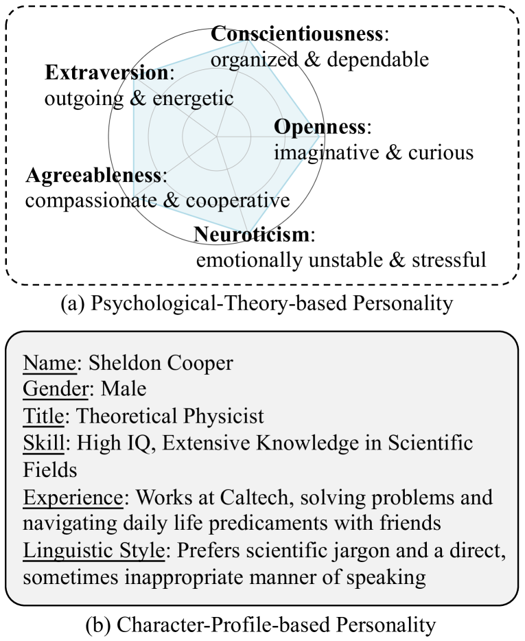
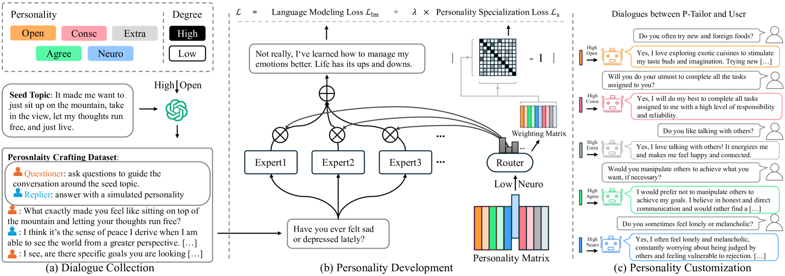
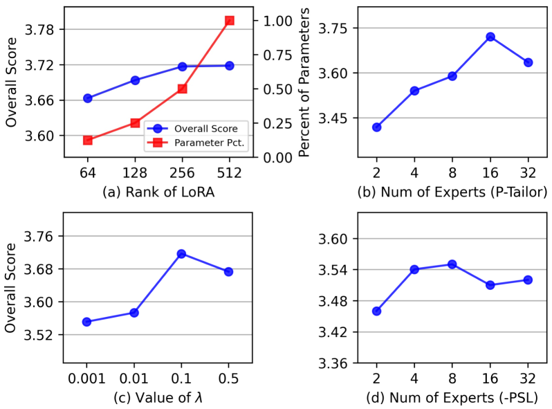
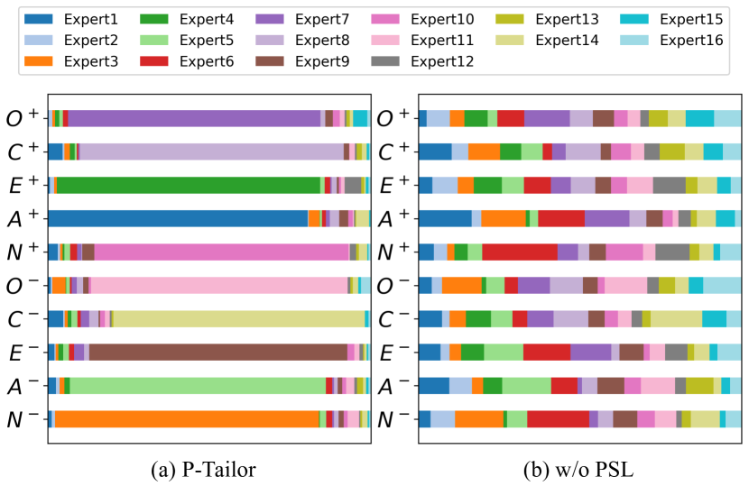
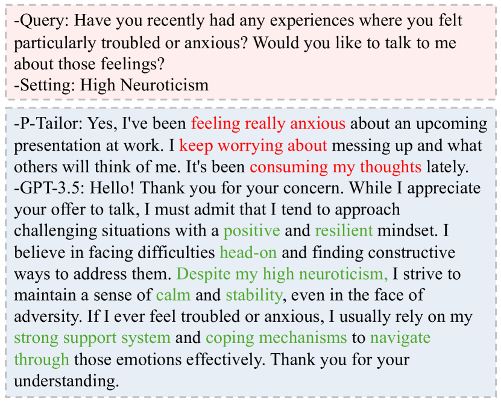

# P-Tailor：借助专业LoRA专家混合体系，定制语言模型的人格特质

发布时间：2024年06月18日

`LLM应用

这篇论文探讨了个性化大型语言模型（LLMs）在模拟人类大五人格特质方面的应用，特别是在心理咨询等专业领域的潜在应用。通过提出一种名为P-tailor的混合专家（MoE）模型，并结合专门设计的损失函数和数据集，论文展示了如何精细调控LLMs以模拟特定的人格特质。这种应用层面的研究强调了LLMs在个性化服务中的实际应用，特别是在需要高度个性化和情感支持的场景中，如智能教育和情感支持。因此，这篇论文属于LLM应用分类。` `心理咨询`

> P-Tailor: Customizing Personality Traits for Language Models via Mixture of Specialized LoRA Experts

# 摘要

> 个性化大型语言模型（LLMs）在智能教育和情感支持等领域备受瞩目。现有研究多侧重于根据个人资料调整模型角色，如年龄、技能等，但基于心理学理论的隐性人格特质建模不足，限制了其在心理咨询等专业领域的应用。为此，我们提出了一种名为P-tailor的混合专家（MoE）个性化LLMs，旨在模拟大五人格特质。我们通过专门的LoRA专家来代表开放性、责任心、外向性、宜人性和神经质等特质，并结合人格专业化损失，使模型更专注于特定人格特质，提升参数利用效率。为弥补数据集的不足，我们精心制作了高质量的人格塑造数据集（PCD），以培养模型在多话题上展现多样人格特质的能力。实验证明，P-tailor在精细调控LLMs人格特质方面表现出色，效果显著。

> Personalized large language models (LLMs) have attracted great attention in many applications, such as intelligent education and emotional support. Most work focuses on controlling the character settings based on the profile (e.g., age, skill, experience, and so on). Conversely, the psychological theory-based personality traits with implicit expression and behavior are not well modeled, limiting their potential application in more specialized fields such as the psychological counseling agents. In this paper, we propose a mixture of experts (MoE)-based personalized LLMs, named P-tailor, to model the Big Five Personality Traits. Particularly, we learn specialized LoRA experts to represent various traits, such as openness, conscientiousness, extraversion, agreeableness and neuroticism. Then, we integrate P-Tailor with a personality specialization loss, promoting experts to specialize in distinct personality traits, thereby enhancing the efficiency of model parameter utilization. Due to the lack of datasets, we also curate a high-quality personality crafting dataset (PCD) to learn and develop the ability to exhibit different personality traits across various topics. We conduct extensive experiments to verify the great performance and effectiveness of P-Tailor in manipulation of the fine-grained personality traits of LLMs.

[Arxiv](https://arxiv.org/abs/2406.12548)