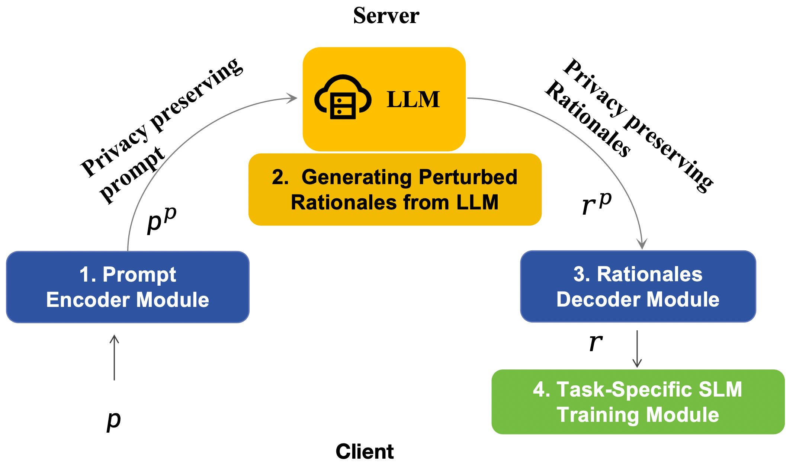
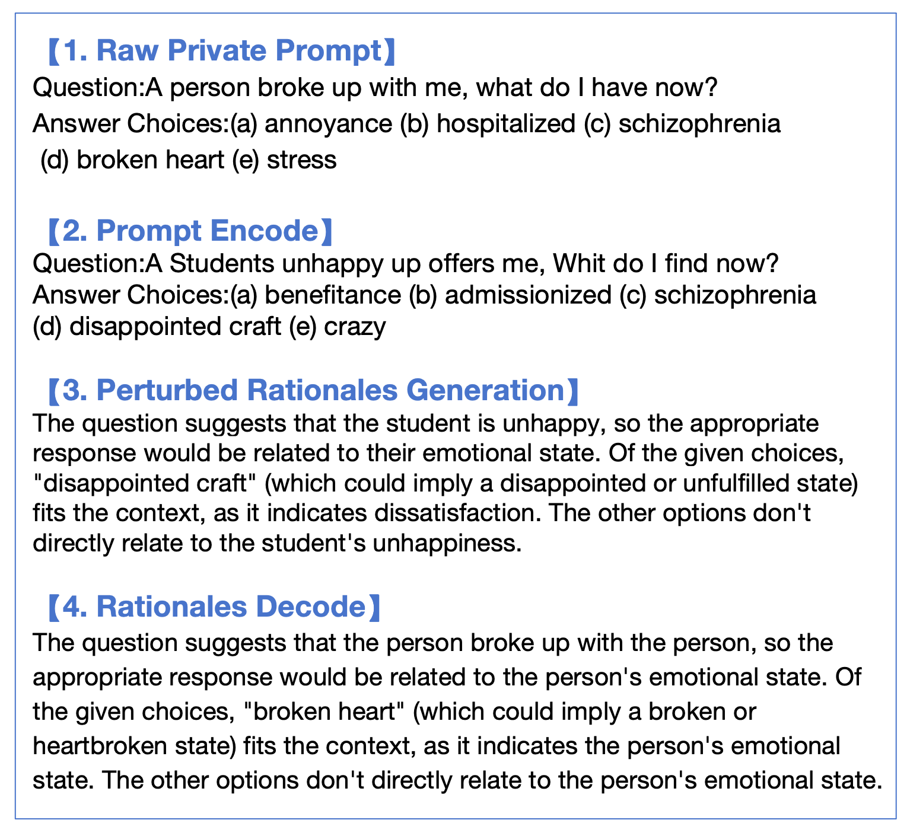
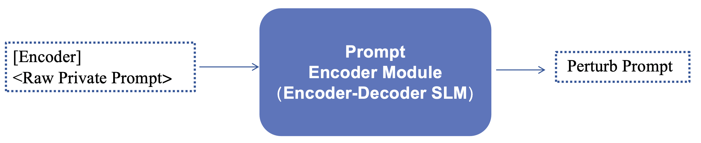
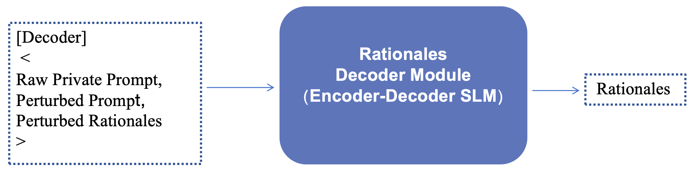
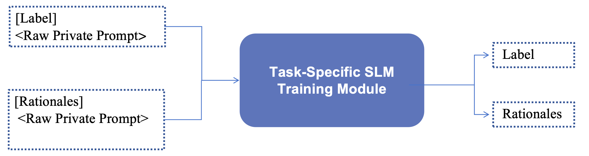
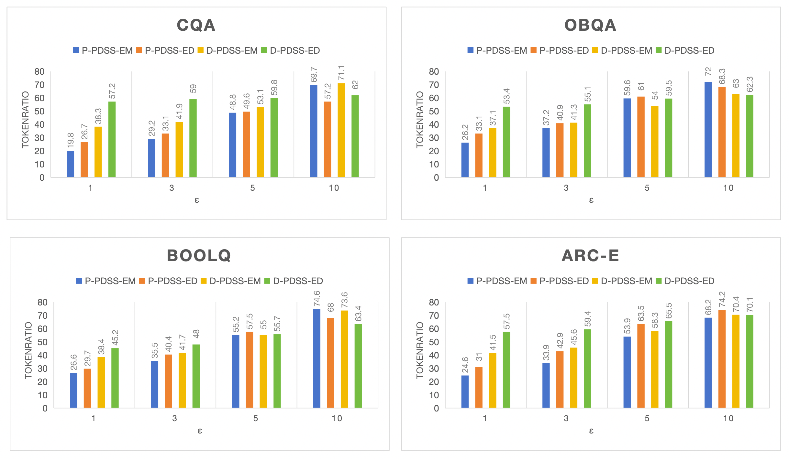

# PDSS：大型语言模型逐步蒸馏的隐私保护框架

发布时间：2024年06月18日

`Agent

理由：这篇论文介绍了一个名为PDSS的框架，该框架通过服务器-客户端架构和逐步蒸馏LLMs的方式来处理特定领域任务，并保护隐私。这个框架可以被视为一个智能代理（Agent），因为它能够自主地处理任务并做出决策，同时考虑到隐私保护。此外，PDSS框架的设计和实现涉及到对大型语言模型的应用和调整，以适应特定的任务需求，这更符合Agent的定义，即一个能够感知环境、做出决策并执行动作的系统。因此，将这篇论文归类为Agent是合适的。` `隐私保护`

> PDSS: A Privacy-Preserving Framework for Step-by-Step Distillation of Large Language Models

# 摘要

> 在实际应用中，利用大型语言模型（LLMs）处理特定领域任务时，常遇到领域知识隐私和资源限制两大难题。为此，我们设计了PDSS框架，它通过逐步蒸馏LLMs来保护隐私。PDSS基于服务器-客户端架构，客户端发送经过扰动的提示至服务器上的LLM，以生成推理依据。这些依据由客户端解码后，用于增强特定任务的小型语言模型（SLM）在多任务学习中的训练。PDSS采用指数机制策略和编码器-解码器策略，巧妙平衡了提示隐私与推理依据的实用性。实验证明，PDSS在多个文本生成任务中表现出色，既能提升特定任务SLM的性能，又严格保护了数据隐私。

> In the context of real-world applications, leveraging large language models (LLMs) for domain-specific tasks often faces two major challenges: domain-specific knowledge privacy and constrained resources. To address these issues, we propose PDSS, a privacy-preserving framework for step-by-step distillation of LLMs. PDSS works on a server-client architecture, wherein client transmits perturbed prompts to the server's LLM for rationale generation. The generated rationales are then decoded by the client and used to enrich the training of task-specific small language model(SLM) within a multi-task learning paradigm. PDSS introduces two privacy protection strategies: the Exponential Mechanism Strategy and the Encoder-Decoder Strategy, balancing prompt privacy and rationale usability. Experiments demonstrate the effectiveness of PDSS in various text generation tasks, enabling the training of task-specific SLM with enhanced performance while prioritizing data privacy protection.

[Arxiv](https://arxiv.org/abs/2406.12403)