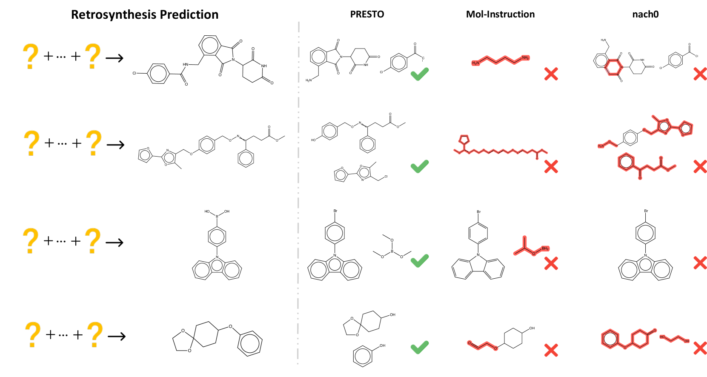

# PRESTO：通过渐进式预训练优化合成化学成果

发布时间：2024年06月18日

`LLM应用

这篇论文摘要描述了一个名为PRESTO的渐进预训练框架，该框架旨在通过融合多种预训练策略和数据集配置来弥合分子与文本之间的模态差距，并提升多模态大型语言模型（MLLMs）在合成化学任务中的性能。这种方法通过跨模态对齐和深入的多图理解来实现，并且在实验中显示出了显著的性能提升。由于论文主要关注的是MLLMs在特定应用领域（合成化学）的实际应用和性能提升，因此它属于LLM应用分类。` `合成化学` `科学研究`

> PRESTO: Progressive Pretraining Enhances Synthetic Chemistry Outcomes

# 摘要

> 多模态大型语言模型（MLLMs）在科学领域的应用日益广泛，特别是在合成化学中，这一领域致力于通过化学反应创造具有特定特性和应用的新化合物。然而，现有方法常忽略多分子图交互在理解化学反应中的关键作用，导致合成化学任务表现不佳。本研究推出的PRESTO（渐进预训练框架）通过融合多种预训练策略和数据集配置，有效弥合了分子与文本之间的模态差距，并通过跨模态对齐和深入的多图理解，显著提升了MLLMs在合成化学任务中的性能。实验结果显示，PRESTO在相关任务中表现出色。相关代码已公开于https://github.com/IDEA-XL/PRESTO。

> Multimodal Large Language Models (MLLMs) have seen growing adoption across various scientific disciplines. These advancements encourage the investigation of molecule-text modeling within synthetic chemistry, a field dedicated to designing and conducting chemical reactions to synthesize new compounds with desired properties and applications. Current approaches, however, often neglect the critical role of multiple molecule graph interaction in understanding chemical reactions, leading to suboptimal performance in synthetic chemistry tasks. This study introduces PRESTO(Progressive Pretraining Enhances Synthetic Chemistry Outcomes), a new framework that bridges the molecule-text modality gap by integrating a comprehensive benchmark of pretraining strategies and dataset configurations. It progressively improves multimodal LLMs through cross-modal alignment and multi-graph understanding. Our extensive experiments demonstrate that PRESTO offers competitive results in downstream synthetic chemistry tasks. The code can be found at https://github.com/IDEA-XL/PRESTO.

[Arxiv](https://arxiv.org/abs/2406.13193)