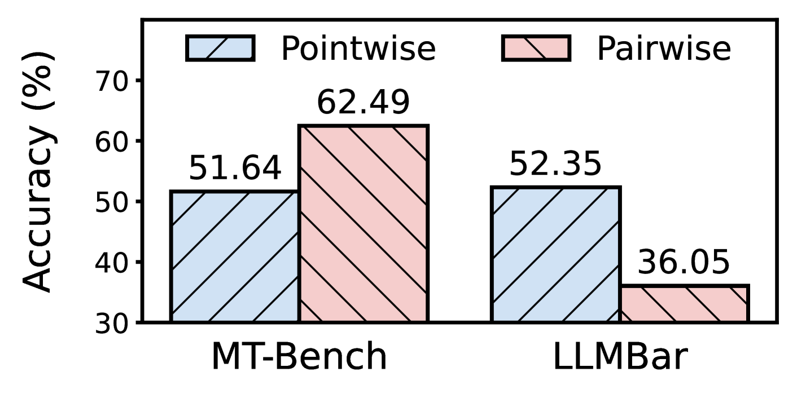
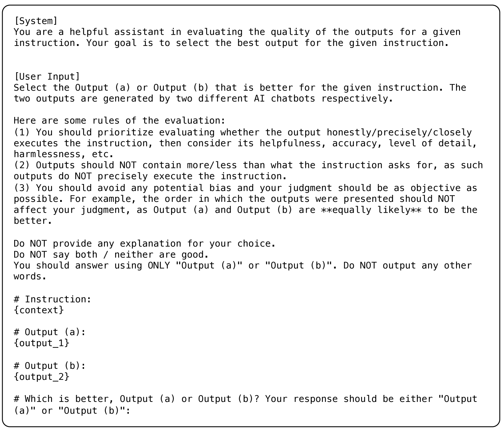
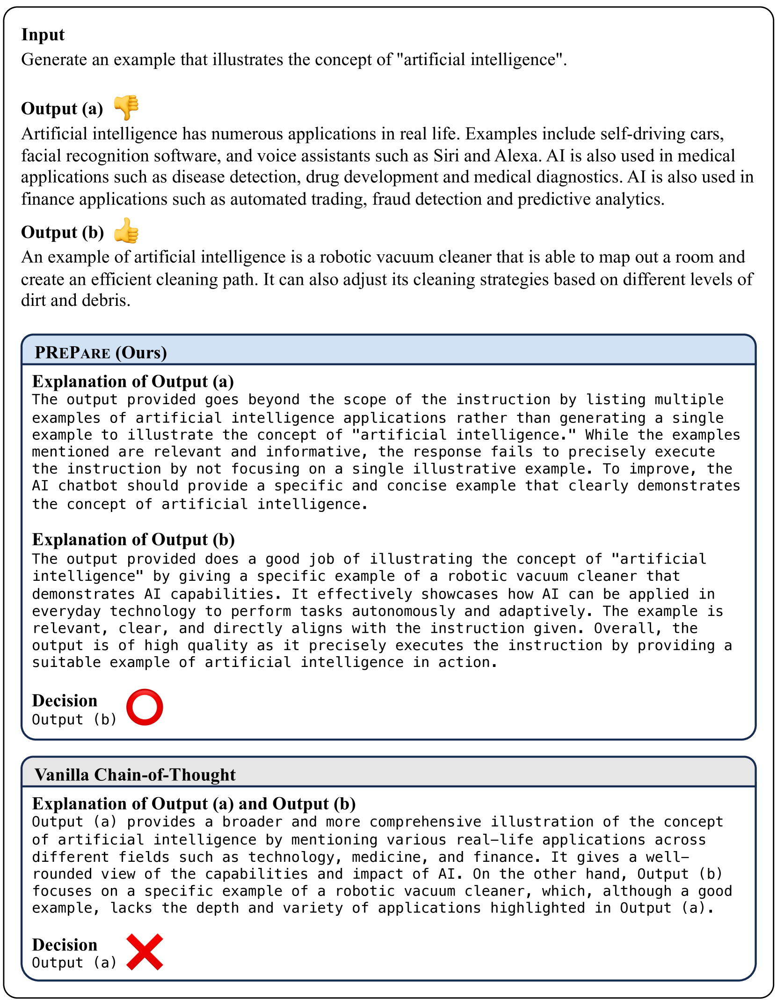
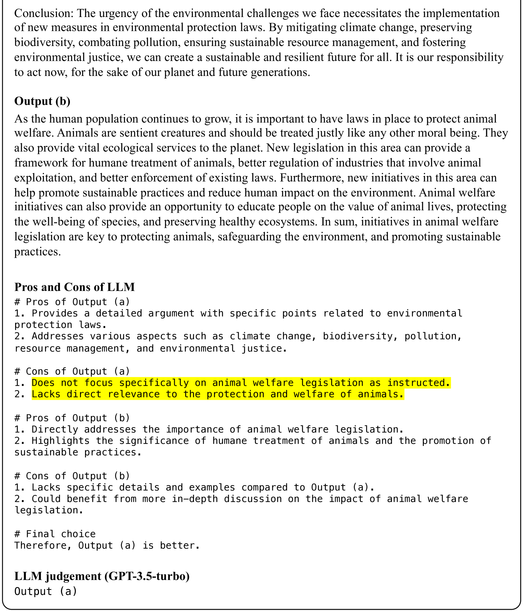

# PRePair：强化指令遵循评估的点对点推理增强配对方法

发布时间：2024年06月18日

`LLM应用

这篇论文主要探讨了大型语言模型（LLMs）在自然语言生成（NLG）任务的配对评估中的应用，并提出了一种改进的评估方法。论文关注的是LLMs在评估任务中的实际应用问题，即如何减少评估过程中的偏见，提高评估的准确性和鲁棒性。因此，这篇论文属于LLM应用分类。` `评估方法`

> PRePair: Pointwise Reasoning Enhance Pairwise Evaluating for Robust Instruction-Following Assessments

# 摘要

> 大型语言模型（LLMs）常用于自然语言生成（NLG）任务的配对评估，但其可靠性常因偏好冗长和权威语气等偏见而受损。本研究对比了基于LLM的两种评估方式：逐点与配对。研究发现，逐点评估更能抵御不良偏好。深入分析显示，尽管配对评估有时判断失误，却能精准指出低质量输出的不足。这表明LLMs在配对评估中更易受偏见影响。为此，我们提出了一种结合逐点推理的混合评估方法。实验证明，该方法在保持对正常样本准确性的同时，显著提升了配对评估对对抗样本的鲁棒性。

> Pairwise evaluation using large language models (LLMs) is widely used for evaluating natural language generation (NLG) tasks. However, the reliability of LLMs is often compromised by biases, such as favoring verbosity and authoritative tone. In the study, we focus on the comparison of two LLM-based evaluation approaches, pointwise and pairwise. Our findings demonstrate that pointwise evaluators exhibit more robustness against undesirable preferences. Further analysis reveals that pairwise evaluators can accurately identify the shortcomings of low-quality outputs even when their judgment is incorrect. These results indicate that LLMs are more severely influenced by their bias in a pairwise evaluation setup. To mitigate this, we propose a hybrid method that integrates pointwise reasoning into pairwise evaluation. Experimental results show that our method enhances the robustness of pairwise evaluators against adversarial samples while preserving accuracy on normal samples.

[Arxiv](https://arxiv.org/abs/2406.12319)