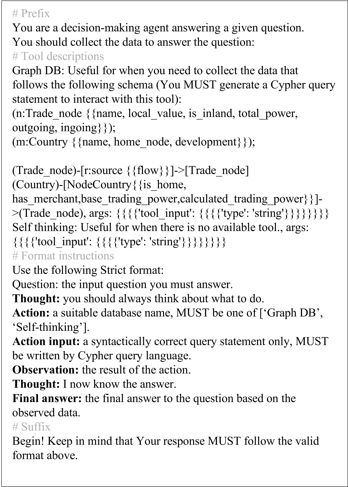

# PlanRAG：大型生成语言模型决策者的规划先行检索增强生成策略

发布时间：2024年06月18日

`RAG

理由：这篇论文介绍了一种名为PlanRAG的技术，该技术结合了迭代计划和检索增强生成，用于解决决策QA任务。虽然这项工作涉及大型语言模型（LLMs），但其核心贡献在于开发了一种新的技术（PlanRAG）来处理特定的数据分析和决策问题，这与RAG分类下的研究内容更为契合，即通过检索和生成技术增强模型的性能。因此，将其归类为RAG。` `数据分析` `决策支持`

> PlanRAG: A Plan-then-Retrieval Augmented Generation for Generative Large Language Models as Decision Makers

# 摘要

> 本文探讨了如何运用大型语言模型（LLMs）解决涉及复杂数据分析的决策问题。我们定义了决策QA任务，即在业务规则和数据库的约束下，为特定问题找出最佳决策。为此，我们创建了决策QA基准DQA，包含两个源自视频游戏的场景：定位与建设。针对这一挑战，我们开发了迭代计划后检索增强生成技术（PlanRAG），该技术先制定决策计划，再进行数据分析查询。实验表明，PlanRAG在两个场景中分别超越了现有技术15.8%和7.4%。相关代码和基准已公开于https://github.com/myeon9h/PlanRAG。

> In this paper, we conduct a study to utilize LLMs as a solution for decision making that requires complex data analysis. We define Decision QA as the task of answering the best decision, $d_{best}$, for a decision-making question $Q$, business rules $R$ and a database $D$. Since there is no benchmark that can examine Decision QA, we propose Decision QA benchmark, DQA. It has two scenarios, Locating and Building, constructed from two video games (Europa Universalis IV and Victoria 3) that have almost the same goal as Decision QA. To address Decision QA effectively, we also propose a new RAG technique called the iterative plan-then-retrieval augmented generation (PlanRAG). Our PlanRAG-based LM generates the plan for decision making as the first step, and the retriever generates the queries for data analysis as the second step. The proposed method outperforms the state-of-the-art iterative RAG method by 15.8% in the Locating scenario and by 7.4% in the Building scenario, respectively. We release our code and benchmark at https://github.com/myeon9h/PlanRAG.

[Arxiv](https://arxiv.org/abs/2406.12430)