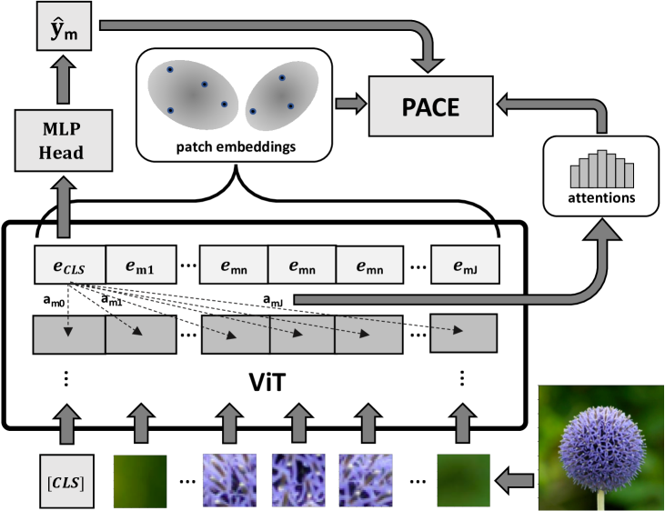
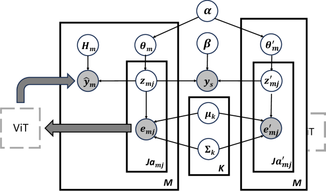
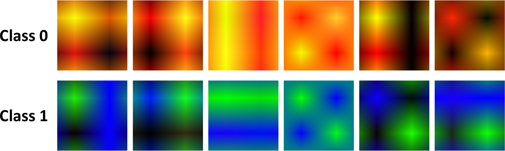
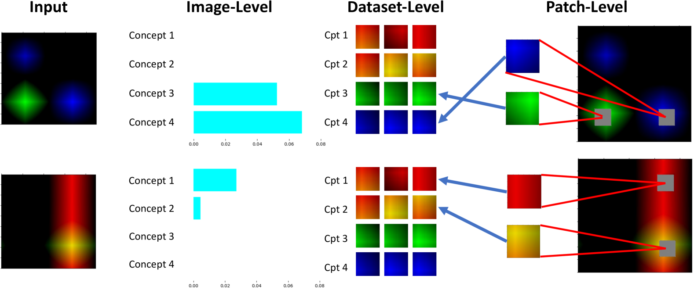
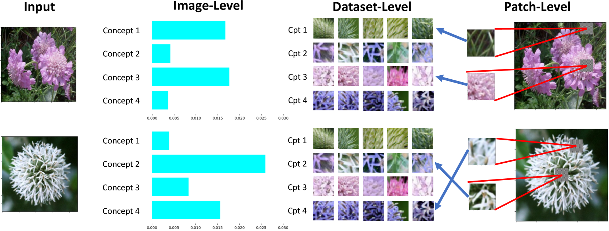
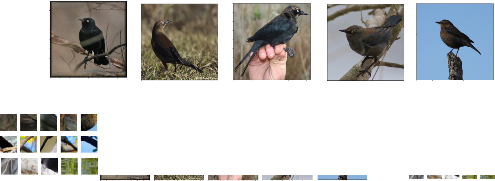
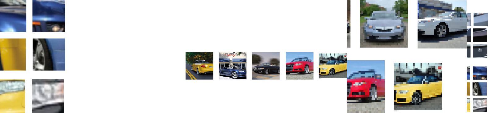

# 概率性概念解释：为视觉基础模型提供可靠的概念解释

发布时间：2024年06月18日

`LLM应用

理由：这篇论文主要关注的是视觉变换器（ViTs）的解释方法，特别是在与大型语言模型（LLM）联合训练的背景下。论文提出了一种新的解释框架（概率概念解释器PACE），旨在提高ViTs解释的忠实性、稳定性、稀疏性、多级结构和简洁性。虽然这种方法涉及到与LLM的联合训练，但其核心贡献在于提供了一种新的解释工具，用于理解和解释ViTs的行为，这更偏向于LLM的应用层面，即如何应用LLM技术来改进和解释其他类型的模型（如ViTs）。因此，将其归类为LLM应用是合适的。` `计算机视觉` `人工智能`

> Probabilistic Conceptual Explainers: Trustworthy Conceptual Explanations for Vision Foundation Models

# 摘要

> 视觉变换器（ViTs）因其与大型语言模型联合训练的能力和作为强大视觉基础模型的潜力而备受关注。然而，对于ViTs的事后预测解释，可信的解释方法发展缓慢。现有的子图像选择方法，如特征归属和概念模型，在这方面表现不佳。本文提出了ViTs解释的五个关键标准：忠实性、稳定性、稀疏性、多级结构和简洁性，并指出当前方法在这些标准上的不足。我们提出了一种名为概率概念解释器（PACE）的变分贝叶斯框架，通过模拟块嵌入的分布，为ViTs提供可信的事后概念解释。定性分析显示，PACE通过模拟块嵌入与ViT预测的联合分布，有效揭示了ViTs的工作原理。此外，PACE的块级解释连接了图像级与数据集级解释，完善了其多级结构。实验结果表明，PACE在满足这些关键标准方面优于现有技术。

> Vision transformers (ViTs) have emerged as a significant area of focus, particularly for their capacity to be jointly trained with large language models and to serve as robust vision foundation models. Yet, the development of trustworthy explanation methods for ViTs has lagged, particularly in the context of post-hoc interpretations of ViT predictions. Existing sub-image selection approaches, such as feature-attribution and conceptual models, fall short in this regard. This paper proposes five desiderata for explaining ViTs -- faithfulness, stability, sparsity, multi-level structure, and parsimony -- and demonstrates the inadequacy of current methods in meeting these criteria comprehensively. We introduce a variational Bayesian explanation framework, dubbed ProbAbilistic Concept Explainers (PACE), which models the distributions of patch embeddings to provide trustworthy post-hoc conceptual explanations. Our qualitative analysis reveals the distributions of patch-level concepts, elucidating the effectiveness of ViTs by modeling the joint distribution of patch embeddings and ViT's predictions. Moreover, these patch-level explanations bridge the gap between image-level and dataset-level explanations, thus completing the multi-level structure of PACE. Through extensive experiments on both synthetic and real-world datasets, we demonstrate that PACE surpasses state-of-the-art methods in terms of the defined desiderata.

[Arxiv](https://arxiv.org/abs/2406.12649)