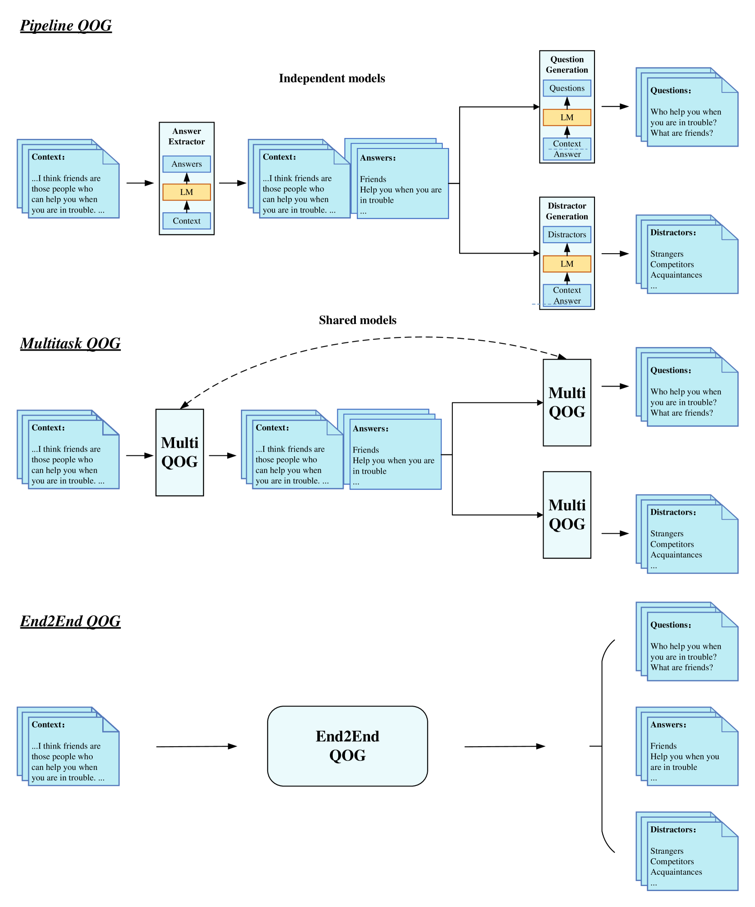
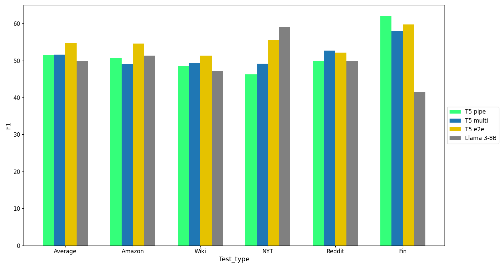
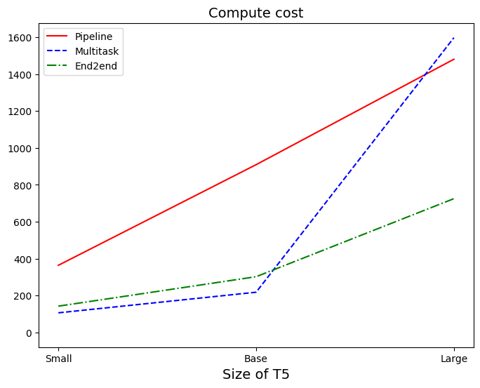
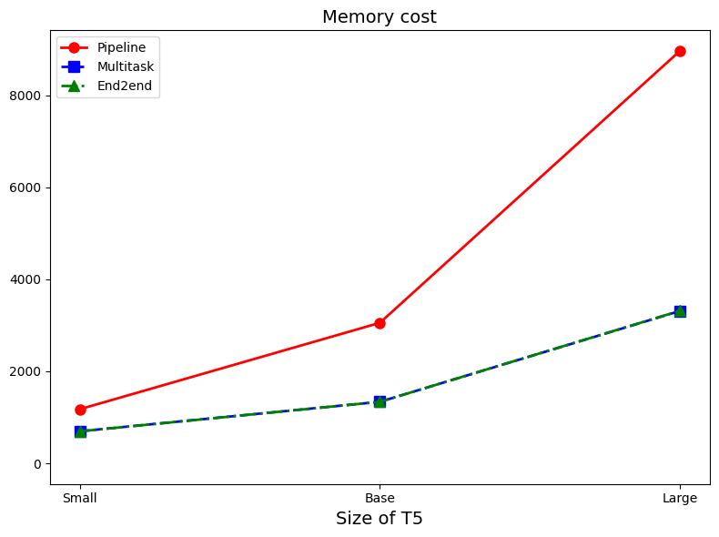

# 基于语言模型的问题与选项生成技术（QOG）

发布时间：2024年06月18日

`LLM应用

这篇论文摘要描述了一个特定任务——问题选项生成（QOG），并介绍了如何通过微调序列到序列语言模型来开发QOG模型。这个任务与大型语言模型（LLM）的应用直接相关，特别是在模型微调、信息检索和教育领域的应用。因此，这篇论文属于LLM应用分类。` `信息检索`

> QOG:Question and Options Generation based on Language Model

# 摘要

> 问题选项生成（QOG）任务旨在根据上下文生成问题与选项对，广泛应用于模型微调、信息检索及教育领域的自动多项选择题生成。本文采用三种策略微调序列到序列语言模型，开发了QOG模型。实验结果显示，这些模型在训练与推理阶段均表现出高效与稳定性，超越了其他方法。分析进一步证实，我们的QOG模型在性能上与大型语言模型Llama 3-8B不相上下。

> Question-Options Generation (QOG) is a task that involves generating a set of question-options pairs given context. This task has various applications, including fine-tuning large models, information retrieval, and automated multiple-choice question generation for education. In this paper, we develop QOG models using three different methods based on fine-tuning sequence-to-sequence language models (LMs). Experiments demonstrate that the end-to-end QOG model is computationally efficient and stable during both training and inference, outperforming other methods. Furthermore, our analysis indicates that our QOG models are competitive on the QOG task compared to the large language model Llama 3-8B.

[Arxiv](https://arxiv.org/abs/2406.12381)