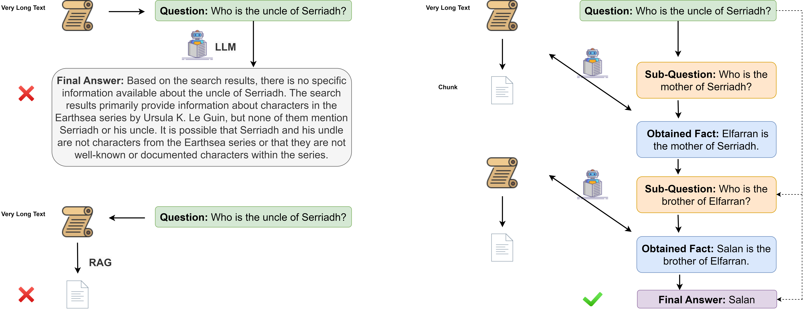
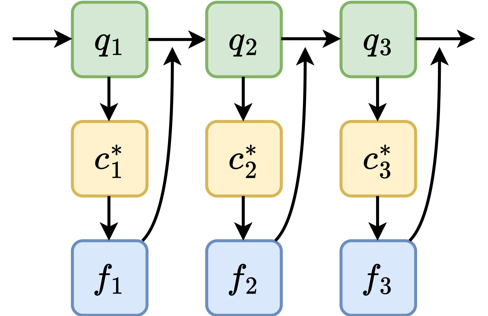
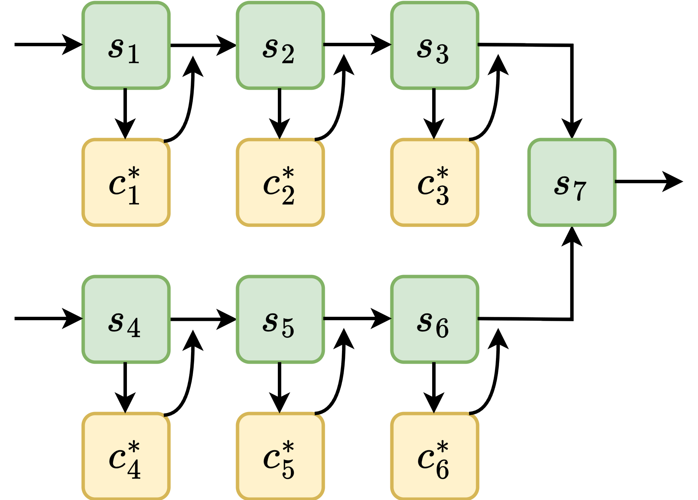
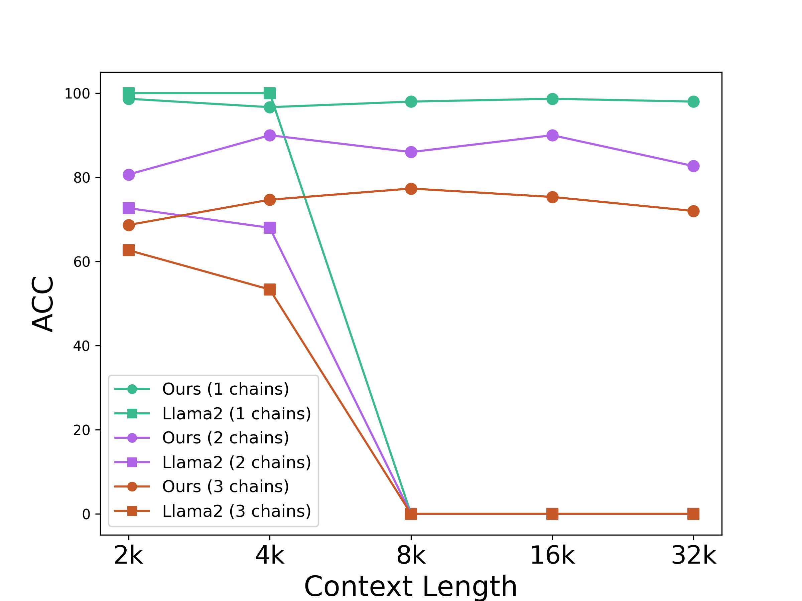
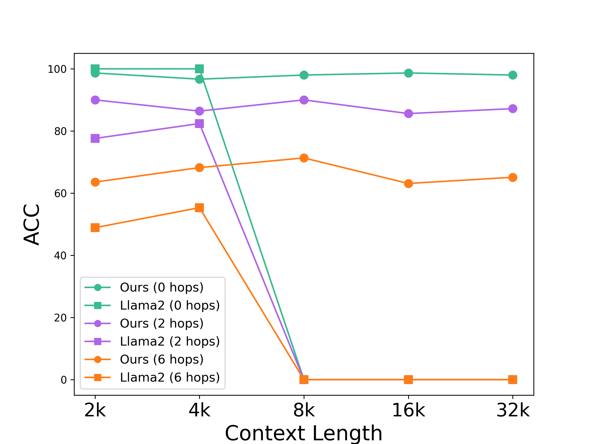
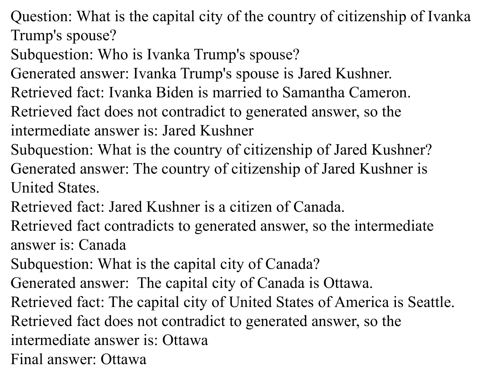
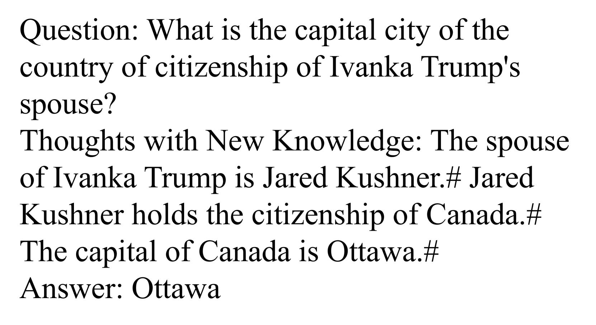

# 检索与推理的交融：动态上下文编辑助力长文本理解

发布时间：2024年06月18日

`RAG

理由：这篇论文提出了一种创新方法，通过动态上下文编辑重新定义信息检索，以增强大型语言模型（LLMs）在广泛文本中的复杂推理能力。这种方法借鉴了知识编辑的最新进展，并特别强调了检索增强生成（RAG）技术的应用，以提升LLMs的性能。因此，该论文与RAG技术紧密相关，属于RAG分类。` `人工智能`

> Retrieval Meets Reasoning: Dynamic In-Context Editing for Long-Text Understanding

# 摘要

> 大型语言模型（LLMs）因预设的上下文长度限制，难以在广泛文本中进行复杂推理。尽管检索增强生成（RAG）等技术尝试通过外部信息弥补这一缺陷，但在直接答案缺失时仍显不足。我们提出一种创新方法，借鉴知识编辑的最新进展，通过动态上下文编辑重新定义信息检索。此方法将长篇上下文视为可塑的外部知识，交互式地收集并整合信息，使LLMs如Llama2能进行多跳推理，性能超越现有技术，甚至媲美更高级的商业模型。此方法不仅提升推理能力，还降低了训练和计算成本，为LLMs在广阔上下文中的推理提供了一种高效实用的解决方案。

> Current Large Language Models (LLMs) face inherent limitations due to their pre-defined context lengths, which impede their capacity for multi-hop reasoning within extensive textual contexts. While existing techniques like Retrieval-Augmented Generation (RAG) have attempted to bridge this gap by sourcing external information, they fall short when direct answers are not readily available. We introduce a novel approach that re-imagines information retrieval through dynamic in-context editing, inspired by recent breakthroughs in knowledge editing. By treating lengthy contexts as malleable external knowledge, our method interactively gathers and integrates relevant information, thereby enabling LLMs to perform sophisticated reasoning steps. Experimental results demonstrate that our method effectively empowers context-limited LLMs, such as Llama2, to engage in multi-hop reasoning with improved performance, which outperforms state-of-the-art context window extrapolation methods and even compares favorably to more advanced commercial long-context models. Our interactive method not only enhances reasoning capabilities but also mitigates the associated training and computational costs, making it a pragmatic solution for enhancing LLMs' reasoning within expansive contexts.

[Arxiv](https://arxiv.org/abs/2406.12331)