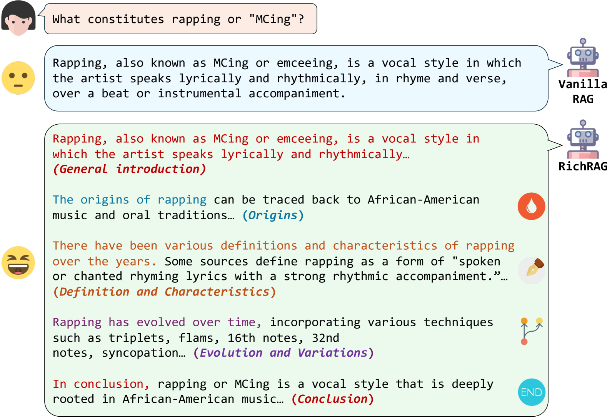

# RichRAG：打造检索增强生成中的多面手，精准回应复杂查询

发布时间：2024年06月18日

`RAG

理由：这篇论文介绍了一种名为RichRAG的新框架，该框架专注于改进Retrieval-augmented generation (RAG) 技术，以处理更广泛、开放式的查询，并生成涵盖多个相关方面的丰富长篇答案。RichRAG通过引入子方面探索器、多面体检索器和生成式列表排序器来优化文档检索和生成过程，这与RAG技术的核心目标和方法紧密相关。因此，这篇论文应归类于RAG。` `问答系统`

> RichRAG: Crafting Rich Responses for Multi-faceted Queries in Retrieval-Augmented Generation

# 摘要

> Retrieval-augmented generation (RAG) 技术有效解决了大型语言模型中的静态知识和幻觉问题。然而，现有研究多聚焦于用户意图明确、答案简洁的问题场景，而忽视了用户常提出的广泛、开放式查询，他们期望得到涵盖多个相关方面的丰富长篇答案。为此，我们创新性地提出了RichRAG框架，它通过子方面探索器识别问题潜在子方面，利用多面体检索器构建相关外部文档候选池，并借助生成式列表排序器精选出前k个最有价值的文档，以满足生成器的偏好，从而产出丰富全面的回答。我们的排序器训练结合了监督微调与强化学习，确保文档覆盖全面且与LLM偏好对齐。实验证明，RichRAG能高效提供令用户满意的全面回答。

> Retrieval-augmented generation (RAG) effectively addresses issues of static knowledge and hallucination in large language models. Existing studies mostly focus on question scenarios with clear user intents and concise answers. However, it is prevalent that users issue broad, open-ended queries with diverse sub-intents, for which they desire rich and long-form answers covering multiple relevant aspects. To tackle this important yet underexplored problem, we propose a novel RAG framework, namely RichRAG. It includes a sub-aspect explorer to identify potential sub-aspects of input questions, a multi-faceted retriever to build a candidate pool of diverse external documents related to these sub-aspects, and a generative list-wise ranker, which is a key module to provide the top-k most valuable documents for the final generator. These ranked documents sufficiently cover various query aspects and are aware of the generator's preferences, hence incentivizing it to produce rich and comprehensive responses for users. The training of our ranker involves a supervised fine-tuning stage to ensure the basic coverage of documents, and a reinforcement learning stage to align downstream LLM's preferences to the ranking of documents. Experimental results on two publicly available datasets prove that our framework effectively and efficiently provides comprehensive and satisfying responses to users.

[Arxiv](https://arxiv.org/abs/2406.12566)