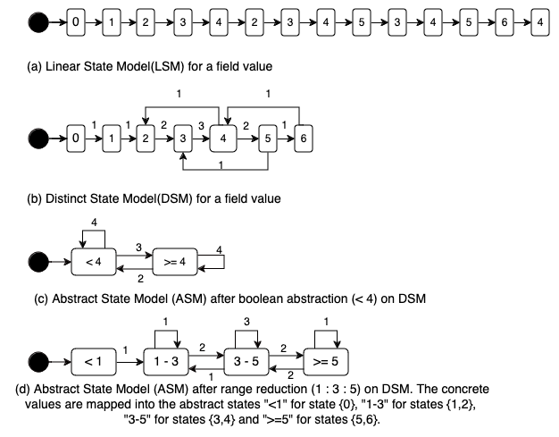

# 抽象有限状态模型的运行时监控

发布时间：2024年06月18日

`Agent

理由：这篇论文主要探讨了从多线程Java程序中提取有限状态模型，并实时验证其正确性的方法。这种方法涉及到构建和验证软件系统的模型，特别是在并发系统中的应用，这与Agent的研究领域相吻合，因为Agent通常涉及到系统的行为建模和验证。此外，论文中提到的实时验证和运行时可视化也符合Agent技术中对系统行为进行监控和调整的特点。因此，这篇论文更适合归类于Agent。` `并发系统` `软件验证`

> Runtime Verification on Abstract Finite State Models

# 摘要

> 有限状态模型在并发系统研究中极为常见，特别是在那些循环操作的控制器和服务器中。本文探讨了如何从多线程Java程序中提取这些模型，并实时验证其正确性。这些验证涵盖了数据和控制两个方面：前者确保对象数据字段的正确性，后者则关注软件模块间控制流的准确性。面对长时间运行可能导致的模型膨胀，本文聚焦于构建简化模型，通过用户定义的抽象函数将大域空间映射至小域空间，确保抽象模型上的属性验证同样适用于具体模型。本文的核心贡献在于展示了通过在线属性检查，在保持属性的抽象模型上进行运行时验证的高效性。我们使用了一种类似于命题线性时序逻辑的属性规范语言，并增加了简单的数据类型和操作符。通过多旋翼无人机控制器和OAuth协议等案例研究，验证了我们技术的实用性，并将其集成到Eclipse插件中，实现了Java程序的运行时可视化和验证。

> Finite-state models are ubiquitous in the study of concurrent systems, especially controllers and servers that operate in a repetitive cycle. In this paper, we show how to extract finite state models from a run of a multi-threaded Java program and carry out runtime verification of correctness properties. These properties include data-oriented and control-oriented properties; the former express correctness conditions over the data fields of objects, while the latter are concerned with the correct flow of control among the modules of larger software. As the extracted models can become very large for long runs, the focus of this paper is on constructing reduced models with user-defined abstraction functions that map a larger domain space to a smaller one. The abstraction functions should be chosen so that the resulting model is property preserving, i.e., proving a property on the abstract model carries over to the concrete model. The main contribution of this paper is in showing how runtime verification can be made efficient through online property checking on property-preserving abstract models. The property specification language resembles a propositional linear temporal logic augmented with simple datatypes and operators. Classic concurrency examples and larger case studies (Multi-rotor Drone Controller, OAuth Protocol) are presented in order to demonstrate the usefulness of our proposed techniques, which are incorporated in an Eclipse plug-in for runtime visualization and verification of Java programs.

[Arxiv](https://arxiv.org/abs/2406.12715)